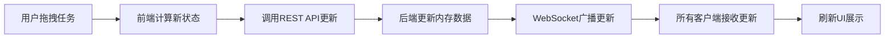

## 1. 产品概述

团队敏捷看板应用是一款轻量级的可视化任务管理工具，旨在替代Jira等重量级工具，为敏捷开发团队提供直观的任务看板、Sprint规划和燃尽图追踪功能。

- 核心目标：提供轻量、可视化、快速迭代的敏捷开发管理体验
- 目标用户：敏捷开发团队成员、Scrum Master、产品经理
- 产品价值：降低团队协作工具的学习成本，提升任务可视化和实时同步效率

## 2. 核心功能

### 2.1 用户角色

| 角色 | 注册方式 | 核心权限 |
|------|----------|----------|
| 团队成员 | 自动加入 | 查看看板、拖拽任务、编辑任务详情 |
| 管理员 | 自动加入 | 管理Sprint、管理任务、查看所有数据 |

### 2.2 功能模块

1. **看板主页面**：多泳道任务展示、拖拽排序、任务卡片交互
2. **Sprint规划面板**：Sprint信息展示、燃尽图可视化
3. **任务详情弹窗**：任务编辑、状态变更、属性修改
4. **在线用户列表**：实时显示在线用户和操作日志

### 2.3 页面详情

| 页面名称 | 模块名称 | 功能描述 |
|----------|----------|----------|
| 看板主页面 | 泳道区域 | 三个竖排泳道（待办/进行中/已完成），支持任务卡片拖拽切换 |
| 看板主页面 | 任务卡片 | 显示标题、负责人、优先级标签，点击打开详情弹窗 |
| 看板主页面 | 左侧栏 | Sprint面板展示、全局操作按钮 |
| 看板主页面 | 右侧栏 | 在线用户列表、操作日志 |
| Sprint规划面板 | Sprint信息 | Sprint名称、起止日期、总故事点数 |
| Sprint规划面板 | 燃尽图 | 折线图展示理想线与实际剩余点数 |
| 任务详情弹窗 | 任务编辑 | 修改标题、描述、优先级、负责人 |

## 3. 核心流程

### 3.1 任务拖拽流程
用户从待办泳道拖拽任务卡片到进行中泳道，系统更新任务状态，通过WebSocket广播至所有在线用户，所有用户的看板实时更新。

### 3.2 任务编辑流程
用户点击任务卡片打开详情弹窗，修改任务属性后保存，系统通过REST API更新后端数据，后端通过WebSocket广播更新事件。

### 3.3 Sprint燃尽图更新流程
每当有任务状态变更为"已完成"时，系统计算当前剩余故事点数，更新燃尽图数据，所有用户实时看到图表更新。

## 4. 用户界面设计

### 4.1 设计风格
- 设计理念：极简主义，强调内容聚焦和操作效率
- 主色调：蓝灰色（#2c3e50）和白色（#ffffff）
- 强调色：柔和蓝色（#3498db）用于按钮和标签
- 优先级标签：绿色（低优先级）、黄色（中优先级）、红色（高优先级）圆形标识
- 分隔线：细腻的#e0e0e0灰色分隔线
- 卡片阴影：拖拽时 box-shadow: 0 6px 12px rgba(0,0,0,0.15)
- 弹窗动画：淡入效果 transition: opacity 0.3s

### 4.2 页面布局
- 三栏响应式布局：左侧栏20%、中间看板60%、右侧栏20%
- 小屏幕（<768px）：左右侧栏折叠为顶栏按钮，点击侧滑抽屉展示
- 看板泳道：三等分垂直排列，等宽布局

### 4.3 视觉元素
| 页面名称 | 模块名称 | UI元素 |
|----------|----------|--------|
| 看板主页面 | 泳道标题 | 粗体16px，蓝灰色，带任务计数徽标 |
| 看板主页面 | 任务卡片 | 白色背景，圆角8px，浅边框，hover轻微上浮 |
| 看板主页面 | 优先级标识 | 8px圆形色块，卡片左上角 |
| 看板主页面 | 在线用户 | 头像+用户名列表，绿色圆点表示在线 |
| Sprint面板 | 燃尽图 | 虚线理想线 + 实线实际线，柔和配色 |
| 任务弹窗 | 表单控件 | 简洁输入框，柔和蓝色按钮 |

### 4.4 响应式设计
- 桌面端（>1024px）：三栏完整布局
- 平板端（768px-1024px）：左右侧栏压缩宽度，保持三栏
- 移动端（<768px）：左右侧栏折叠为顶部菜单按钮，点击抽屉滑出

### 4.5 交互动效
- 卡片拖拽：半透明跟随效果，平滑过渡动画
- 弹窗打开：背景模糊 + 淡入缩放
- 按钮hover：背景色加深 + 轻微缩放
- 数据更新：新数据平滑淡入，高度过渡动画
