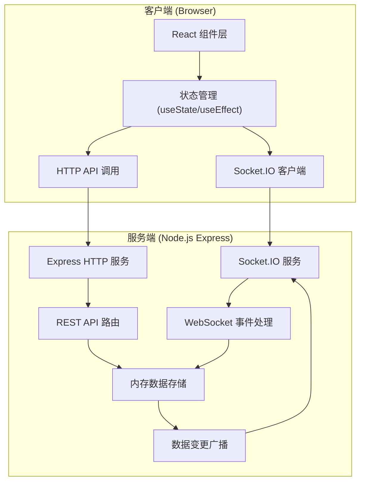

## 1. 架构设计



## 2. 技术描述

- **前端框架**：React 18 + TypeScript
- **构建工具**：Vite
- **状态管理**：React Hooks (useState, useEffect)
- **拖拽库**：react-beautiful-dnd
- **图表库**：recharts
- **实时通信**：socket.io-client
- **后端框架**：Express 4 + TypeScript
- **WebSocket**：Socket.IO
- **数据存储**：内存存储（开发/演示用）
- **唯一ID**：uuid

## 3. 项目结构

```
.
├── package.json              # 项目依赖与脚本
├── vite.config.js            # Vite 配置（含代理）
├── tsconfig.json             # TypeScript 配置
├── index.html                # 入口 HTML
├── server/
│   └── index.ts              # 后端入口（Express + Socket.IO）
└── src/
    ├── main.tsx              # 前端入口
    ├── components/
    │   ├── Board.tsx         # 看板主组件
    │   ├── SprintPanel.tsx   # Sprint 规划面板
    │   ├── TaskCard.tsx      # 任务卡片组件
    │   ├── TaskModal.tsx     # 任务详情弹窗
    │   ├── LaneColumn.tsx    # 泳道列组件
    │   ├── OnlineUsers.tsx   # 在线用户列表
    │   └── ActivityLog.tsx   # 操作日志组件
    └── utils/
        └── socket.ts         # Socket.IO 客户端封装
```

## 4. 数据模型

### 4.1 任务 (Task)

```typescript
interface Task {
  id: string;
  title: string;
  description: string;
  status: 'todo' | 'in-progress' | 'done';
  priority: 'high' | 'medium' | 'low';
  assignee: string;
  storyPoints: number;
  order: number;
  createdAt: number;
  updatedAt: number;
}
```

### 4.2 Sprint

```typescript
interface Sprint {
  id: string;
  name: string;
  startDate: string;
  endDate: string;
  totalStoryPoints: number;
  dailyBurndown: { date: string; remainingPoints: number }[];
}
```

### 4.3 用户

```typescript
interface User {
  id: string;
  name: string;
  avatar?: string;
  online: boolean;
}
```

### 4.4 操作日志

```typescript
interface ActivityLog {
  id: string;
  userId: string;
  userName: string;
  action: string;
  taskId?: string;
  taskTitle?: string;
  timestamp: number;
}
```

## 5. API 定义

### 5.1 REST API

| 方法 | 路径 | 描述 | 请求体 | 响应 |
|------|------|------|--------|------|
| GET | /api/tasks | 获取所有任务 | - | Task[] |
| POST | /api/tasks | 创建新任务 | { title, description, priority, assignee, storyPoints } | Task |
| PUT | /api/tasks/:id | 更新任务 | Partial<Task> | Task |
| DELETE | /api/tasks/:id | 删除任务 | - | { success: boolean } |
| POST | /api/tasks/:id/update | 更新任务状态和排序 | { status, order } | Task |
| GET | /api/sprint | 获取当前Sprint | - | Sprint |
| POST | /api/sprint | 创建Sprint | { name, startDate, endDate, totalStoryPoints } | Sprint |
| GET | /api/users | 获取在线用户 | - | User[] |
| GET | /api/activity | 获取操作日志 | - | ActivityLog[] |

### 5.2 WebSocket 事件

| 事件名 | 方向 | 数据 | 描述 |
|--------|------|------|------|
| task:created | Server → Client | Task | 任务创建广播 |
| task:updated | Server → Client | Task | 任务更新广播 |
| task:deleted | Server → Client | { id: string } | 任务删除广播 |
| task:moved | Server → Client | { id: string, status: string, order: number } | 任务移动广播 |
| sprint:updated | Server → Client | Sprint | Sprint更新广播 |
| user:joined | Server → Client | User | 用户加入广播 |
| user:left | Server → Client | { id: string } | 用户离开广播 |
| activity:new | Server → Client | ActivityLog | 新操作日志广播 |

## 6. 数据流向

### 6.1 任务拖拽数据流

```
Board组件(拖拽结束)
    ↓
计算新 status 和 order
    ↓
调用 POST /api/tasks/:id/update
    ↓
后端更新内存数据
    ↓
Socket.IO 广播 task:moved
    ↓
所有客户端 socket.on('task:moved')
    ↓
更新本地任务状态
    ↓
重新渲染看板
```

### 6.2 任务编辑数据流

```
TaskModal(保存修改)
    ↓
调用 PUT /api/tasks/:id
    ↓
后端更新内存数据
    ↓
Socket.IO 广播 task:updated
    ↓
所有客户端接收更新
    ↓
刷新UI展示
```

## 7. 性能指标

- 交互响应时间（拖拽、弹窗打开）：< 100ms
- WebSocket端到端延迟：< 50ms（网络正常条件下）
- 首次渲染时间：< 2s
- 单页任务卡片支持：> 200张流畅拖拽
