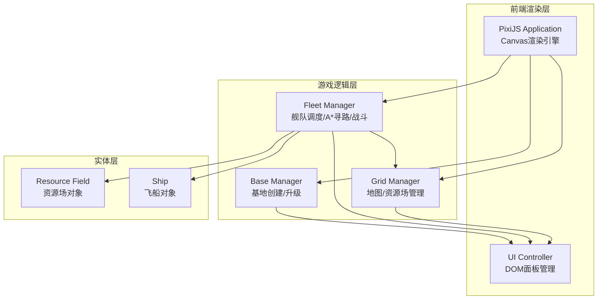

## 1. 架构设计



## 2. 技术说明
- 前端：TypeScript + PixiJS@7 + Vite
- 初始化工具：Vite
- 后端：无（纯前端沙盒应用）
- 数据库：无（内存数据，无需持久化）

## 3. 路由定义
| 路由 | 用途 |
|------|------|
| / | 主游戏页面，包含全屏Canvas和UI覆盖层 |

## 4. API定义
无后端API，所有数据在客户端内存中管理。

## 5. 数据模型

### 5.1 数据模型定义

```mermaid
erDiagram
    "\"网格地图\"" ||--o{ "\"资源场\"" : contains
    "\"网格地图\"" ||--o{ "\"障碍物\"" : contains
    "\"基地\"" ||--o{ "\"舰队\"" : builds
    "\"舰队\"" ||--|{ "\"飞船\"" : consists_of
    "\"舰队\"" }o--o| "\"资源场\"" : targets
    "\"舰队\"" }o--o| "\"基地\"" : returns_to
    "\"海盗\"" ||--|| "\"飞船\"" : uses_stats

    "\"资源场\"" {
        string type
        number reserve
        number efficiency
        number x
        number y
        boolean depleted
    }

    "\"飞船\"" {
        number x
        number y
        number speed
        number hp
        number firepower
        number armor
        number cargoCapacity
    }

    "\"基地\"" {
        number level
        number warehouseCapacity
        number buildSpeed
        number ironStored
        number crystalStored
        number gasStored
        number x
        number y
    }

    "\"舰队\"" {
        string state
        number targetX
        number targetY
        number baseId
        number speedCoefficient
    }

    "\"海盗\"" {
        number hp
        number firepower
        number armor
        number x
        number y
    }
```

### 5.2 核心数据结构

**资源场类型枚举**：IRON（铁矿）、CRYSTAL（水晶）、GAS（气体）

**舰队状态枚举**：IDLE（空闲）、MOVING_TO_RESOURCE（前往资源场）、COLLECTING（采集中）、RETURNING（返回基地）、IN_COMBAT（战斗中）、RETURNING_DAMAGED（战败返回）

**基地升级消耗**：
| 等级 | 铁矿 | 水晶 | 气体 | 仓库容量 | 建造速度 |
|------|------|------|------|----------|----------|
| 1→2 | 100 | 50 | 30 | 500 | 1.0x |
| 2→3 | 300 | 150 | 80 | 1200 | 1.2x |
| 3→4 | 800 | 400 | 200 | 2500 | 1.5x |
| 4→5 | 2000 | 1000 | 500 | 5000 | 2.0x |

**A*寻路**：在100x100网格上使用A*算法，障碍物和已占位格子为不可通行，考虑其他舰队位置作为动态避让权重。

**战斗计算**：战斗力 = (火力总和 × 1.2) + (护甲总和 × 0.8)，与海盗战斗力对比，概率胜负判定加入随机因素。
