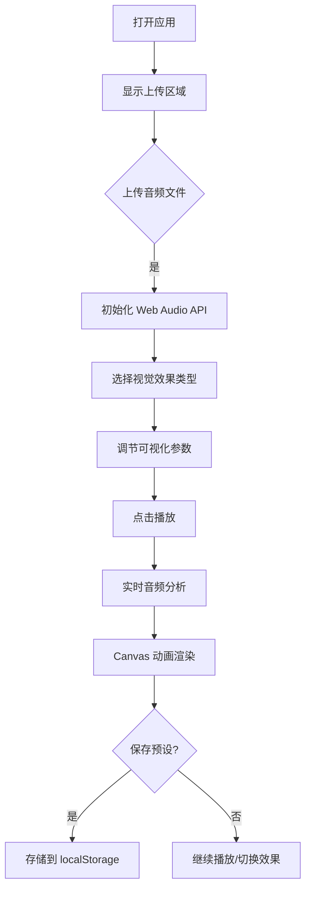

## 1. 产品概述

交互式音乐可视化应用，允许用户上传音频文件并实时生成动态频谱动画与波形图，支持多种视觉效果切换与参数调节。

- 主要用途：为音乐爱好者和创作者提供沉浸式的音频可视化体验
- 核心价值：将抽象的音频信号转化为直观、美观的动态视觉效果

## 2. 核心功能

### 2.1 功能模块

1. **音频控制模块**：文件上传、播放/暂停/停止、音量调节、进度控制
2. **可视化渲染模块**：柱状频谱图、波形折线图、环形粒子扩散图
3. **参数调节模块**：粒子速度、频谱灵敏度、颜色主题
4. **性能监控模块**：FPS、采样率、切换耗时实时显示
5. **预设管理模块**：效果参数保存、加载、本地存储

### 2.2 功能详情

| 页面/模块 | 子模块 | 功能描述 |
|-----------|--------|----------|
| 主界面 | Canvas 画布 | 自适应窗口大小（最小 800x500），居中显示动画 |
| 音频控制 | 文件上传 | 支持点击/拖拽上传 mp3/wav 文件 |
| 音频控制 | 播放控制 | 播放、暂停、停止按钮 |
| 音频控制 | 音量控制 | 滑块调节音量（0-100%） |
| 音频控制 | 进度控制 | 可拖拽进度条，显示当前播放位置 |
| 可视化 | 柱状频谱 | 频率条高度动态变化，蓝色到粉色渐变 |
| 可视化 | 波形折线 | 实时采样波形，流动发光效果 |
| 可视化 | 环形粒子 | 200 个粒子围绕圆心扩散，大小颜色随强度变化 |
| 参数面板 | 粒子速度 | 滑块调节（0.1x - 3x） |
| 参数面板 | 灵敏度 | 低/中/高三档切换 |
| 参数面板 | 颜色主题 | 霓虹紫/海洋蓝/极光绿 |
| 性能面板 | 数据显示 | FPS、采样率、效果切换耗时 |
| 预设管理 | 保存预设 | 最多保存 5 个预设到 localStorage |
| 预设管理 | 切换预设 | 下拉菜单快速切换预设 |

## 3. 核心流程

用户打开应用 → 上传音频文件 → 选择视觉效果 → 调节参数 → 播放音频 → 实时观看可视化动画 → 可保存/切换预设

## 4. 用户界面设计

### 4.1 设计风格

- 主色调：深蓝背景 (#0a0e27)，霓虹紫高亮 (#8a2be2)
- 按钮样式：半透明玻璃质感，圆角 16px，悬停缩放 1.05 + 发光阴影
- 字体：系统无衬线字体
- 背景：深色半透明毛玻璃效果
- 过渡动画：所有交互 0.2s 平滑过渡

### 4.2 页面布局

| 区域 | 位置 | UI 元素 |
|------|------|---------|
| Canvas 画布 | 居中 | 自适应大小的动画渲染区 |
| 上传区域 | 居中（未加载时） | 虚线边框，上传提示文字 |
| 控制面板 | 底部固定 | 播放控制、进度条、音量、效果切换按钮 |
| 参数面板 | 左侧边栏 | 滑块控件、主题选择、预设管理 |
| 性能面板 | 右上角 | FPS、采样率、切换耗时数据 |

### 4.3 响应式设计

- 桌面优先设计，Canvas 最小 800x500
- 控制面板固定在底部，边栏可在小屏幕上折叠
- 所有触控元素保持足够的可点击区域
