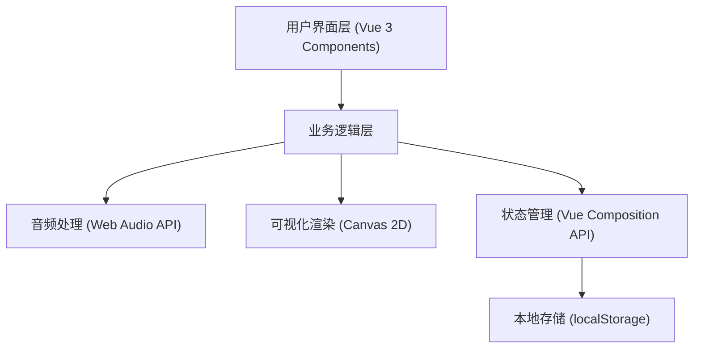

## 1. 架构设计



## 2. 技术描述

- 前端框架：Vue 3 + TypeScript
- 构建工具：Vite 5
- 音频处理：Web Audio API（AnalyserNode、AudioContext）
- 可视化渲染：HTML5 Canvas 2D
- 状态管理：Vue 3 Composition API（ref、reactive）
- 本地存储：localStorage

## 3. 项目文件结构

```
d:\P\tasks\auto33/
├── package.json
├── vite.config.js
├── tsconfig.json
├── index.html
└── src/
    ├── main.ts
    ├── App.vue
    ├── components/
    │   ├── AudioController.ts
    │   └── VisualizationPanel.ts
    └── types/
        └── index.ts
```

## 4. 核心模块说明

### 4.1 AudioController

负责音频加载、播放控制和实时频谱数据生成：
- 使用 AudioContext 管理音频上下文
- 通过 AnalyserNode 获取频域和时域数据
- 事件驱动模式，向可视化组件传递数据
- 支持播放、暂停、停止、音量调节、进度跳转

### 4.2 VisualizationPanel

负责接收频谱数据并渲染 Canvas 动画：
- 三种渲染模式：柱状频谱、波形折线、环形粒子
- 动画循环使用 requestAnimationFrame
- 支持粒子系统（200 个粒子）
- 平滑过渡效果切换

### 4.3 数据结构

```typescript
interface VisualizationPreset {
  id: string;
  name: string;
  effectType: 'bars' | 'waveform' | 'particles';
  particleSpeed: number;
  sensitivity: 'low' | 'medium' | 'high';
  colorTheme: 'neon' | 'ocean' | 'aurora';
  createdAt: number;
}

interface AudioData {
  frequencyData: Uint8Array;
  timeData: Uint8Array;
  sampleRate: number;
}

interface PerformanceMetrics {
  fps: number;
  sampleRate: number;
  switchTime: number;
}
```

## 5. 性能优化策略

- 使用 requestAnimationFrame 进行动画渲染
- 复用 TypedArray 避免频繁 GC
- 粒子对象池化，避免重复创建
- Canvas 尺寸自适应但限制最大像素数
- 效果切换预加载，保证 < 16ms 切换时间
- 帧率监控与自适应降级
