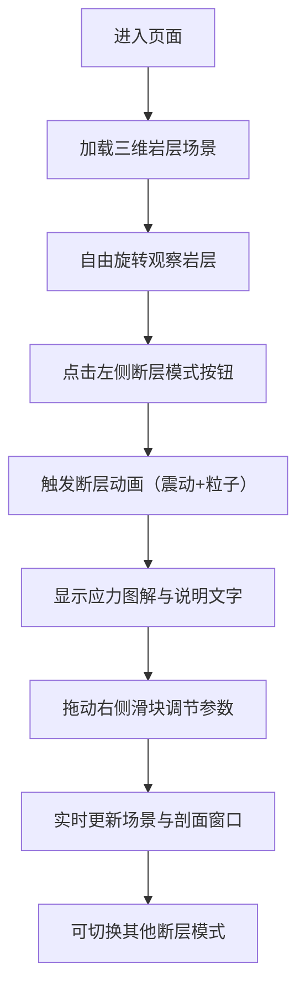

## 1. 产品概述

地质断层构造可视化演示系统，通过交互式三维场景帮助用户直观理解正断层、逆断层、平移断层三种地质构造在应力作用下的形成过程。目标用户为地质专业学生、科研人员及科普爱好者。

- 核心价值：将抽象的地质力学概念转化为可交互、可调节的三维可视化体验
- 市场定位：教育类科学可视化工具，兼具教学演示与科普展示功能

## 2. 核心功能

### 2.1 用户角色

| 角色 | 注册方式 | 核心权限 |
|------|----------|----------|
| 访客用户 | 无需注册 | 浏览场景、切换断层模式、调节参数 |

### 2.2 功能模块

1. **主场景页面**：三维岩层可视化、断层动画演示、视角交互控制
2. **左侧控制面板**：三种断层模式预设按钮、当前模式应力方向图解、构造说明文字
3. **右侧参数面板**：倾角/位移/滑动速度滑块、3D剖面切片实时预览窗口

### 2.3 页面详情

| 页面名称 | 模块名称 | 功能描述 |
|----------|----------|----------|
| 主场景 | 三维岩层块体 | 30层彩色地层，支持鼠标拖拽旋转视角、滚轮缩放 |
| 主场景 | 断层线高亮 | 白色脉冲发光线条标示断层位置 |
| 主场景 | 动画效果 | 切换断层模式时的岩层变形动画、震动、粒子飞溅 |
| 左侧面板 | 模式选择 | 正断层/逆断层/平移断层三种预设按钮 |
| 左侧面板 | 应力图解 | 顶部显示当前断层的应力方向示意图 |
| 左侧面板 | 说明文字 | 当前断层类型的构造特征描述 |
| 右侧面板 | 参数滑块 | 断层倾角、位移量、滑动速度三个独立调节滑块 |
| 右侧面板 | 剖面窗口 | 实时显示当前断层的3D剖面切片图 |

## 3. 核心流程

用户进入页面后默认展示完整岩层块体，可自由旋转观察。点击左侧模式按钮触发断层形成动画，动画结束后可通过右侧滑块精细调节参数，所有调整实时反馈到三维场景和剖面窗口。

## 4. 用户界面设计

### 4.1 设计风格

- **主色调**：深地层暗棕色（#2D1F14）为背景，岩层使用暖黄（#E8B86D）、橙红（#C97B4B）、深褐（#6B4423）、土灰（#8B8178）渐变区分地质年代
- **强调色**：断层线使用脉冲流动的白色光带（#FFFFFF + 发光效果）
- **按钮风格**：岩石质感纹理背景，3D微浮雕效果，圆角8px，悬停时上浮+阴影加深
- **字体**：标题使用衬线字体（Georgia），正文使用无衬线字体，大小层级分明
- **布局风格**：左中右三栏布局，左侧控制面板和右侧参数面板采用毛玻璃（backdrop-filter: blur）半透明效果
- **动效**：按钮点击和滑块拖动带有平滑缓动回弹动画，数值变化0.5秒过渡缓冲

### 4.2 页面设计概览

| 页面名称 | 模块名称 | UI元素 |
|----------|----------|--------|
| 主场景 | 左侧控制面板 | 毛玻璃面板、岩石纹理按钮、应力示意图、说明文字区 |
| 主场景 | 中央3D画布 | 全屏自适应Canvas、地层颜色分层、白色发光断层线 |
| 主场景 | 右侧参数面板 | 毛玻璃面板、三个滑块控件、剖面预览小窗口 |

### 4.3 响应式

桌面端优先设计，三栏固定比例布局（左20% - 中60% - 右20%），窗口缩放时中央3D画布自适应填充，左右面板保持最小宽度280px。

### 4.4 3D场景指导

- **环境与氛围**：暗棕色环境光模拟地下深处，配合聚光灯突出岩层层次
- **光照设置**：主光源从斜上方45度照射，辅助光勾勒岩层侧面轮廓，环境光提供基础照明
- **相机设置**：PerspectiveCamera，初始距离适中，OrbitControls支持自由旋转、缩放、平移，限制最小/最大缩放距离
- **构图与焦点**：岩层块体位于场景中心，断层线作为视觉焦点通过发光效果突出
- **交互与动画**：模式切换时岩层顶点平滑位移过渡，配合相机轻微震动，粒子系统从断层处喷发
- **后期处理**：Bloom泛光效果增强断层线发光感，FXAA抗锯齿
- **性能预算**：30层地层共约15万顶点，目标帧率30 FPS以上
