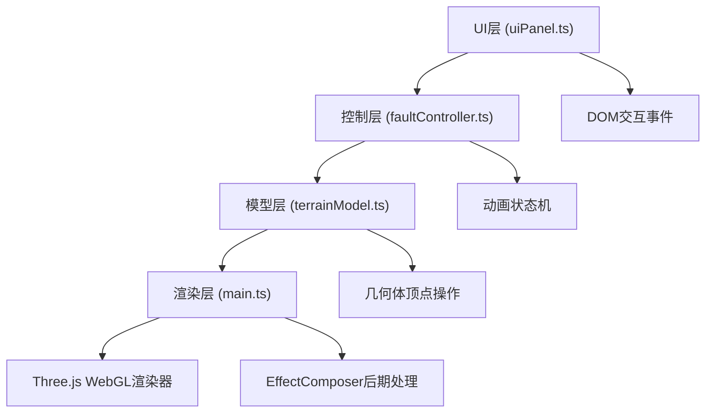

## 1. 架构设计



## 2. 技术描述

- **前端框架**：原生 TypeScript + Three.js，不使用React/Vue框架（用户明确要求模块拆分方式）
- **构建工具**：Vite 5.x，配置 HTTPS 模式用于 WebGL 兼容性
- **3D引擎**：Three.js 最新版本，包含 OrbitControls、EffectComposer、UnrealBloomPass、FXAAShader
- **类型系统**：TypeScript 严格模式，ESNext 模块系统

## 3. 模块文件结构

| 文件路径 | 职责 |
|----------|------|
| package.json | 依赖管理（three、@types/three、typescript、vite、@vitejs/plugin-basic-ssl） |
| vite.config.js | Vite构建配置，启用HTTPS |
| tsconfig.json | TypeScript严格模式配置 |
| index.html | 全屏Canvas入口，包含三栏DOM结构 |
| src/main.ts | 场景初始化、相机控制、主循环渲染、生命周期管理 |
| src/terrainModel.ts | 多层地层块体几何体生成、材质、断层切割顶点位移逻辑 |
| src/faultController.ts | FaultAnimator类，三种断层模式参数计算、动画驱动、滑块输入处理 |
| src/uiPanel.ts | 左侧按钮、右侧滑块、剖面窗口的DOM创建与事件绑定 |

## 4. 核心类与接口定义

### 4.1 TerrainModel

```typescript
interface LayerConfig {
  thickness: number;
  color: THREE.Color;
  name: string;
}

interface FaultParameters {
  type: 'normal' | 'reverse' | 'strike-slip';
  dipAngle: number;      // 倾角 0-90度
  displacement: number;  // 位移量 0-1
  slipSpeed: number;     // 滑动速度 0.1-2
}

class TerrainModel {
  public group: THREE.Group;
  public faultLine: THREE.Line;
  
  constructor(layerCount: number, verticesPerLayer: number);
  public applyFault(params: FaultParameters, progress: number): void;
  public reset(): void;
  public getSliceGeometry(): THREE.BufferGeometry;
  public update(dt: number): void;
}
```

### 4.2 FaultAnimator

```typescript
class FaultAnimator {
  private terrain: TerrainModel;
  private currentParams: FaultParameters;
  private animationProgress: number;
  
  constructor(terrain: TerrainModel);
  public triggerFault(type: FaultParameters['type']): Promise<void>;
  public setDipAngle(value: number): void;
  public setDisplacement(value: number): void;
  public setSlipSpeed(value: number): void;
  public update(dt: number): void;
  public onProgress(callback: (p: number) => void): void;
}
```

### 4.3 UIPanel

```typescript
interface UIEventHandlers {
  onFaultSelect: (type: 'normal' | 'reverse' | 'strike-slip') => void;
  onDipChange: (value: number) => void;
  onDisplacementChange: (value: number) => void;
  onSlipSpeedChange: (value: number) => void;
}

class UIPanel {
  constructor(handlers: UIEventHandlers);
  public setActiveFault(type: string): void;
  public setFaultDescription(text: string): void;
  public updateSliceView(geometry: THREE.BufferGeometry): void;
}
```

## 5. 性能优化策略

- **几何体复用**：地层使用 BufferGeometry，通过修改 position 属性而非重建网格实现形变
- **顶点更新优化**：仅更新断层影响范围内的顶点，使用局部脏标记减少 GPU 数据上传
- **粒子系统**：使用 Points + ShaderMaterial 实现高性能粒子渲染，粒子总数控制在2000以内
- **后期处理**：Bloom效果仅作用于断层线发光层，使用 RenderTarget 分离渲染通道
- **帧率控制**：主循环使用 requestAnimationFrame，dt 时间步长限制最大帧间隔防止跳变
