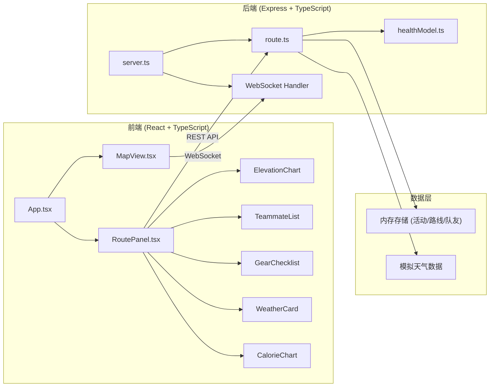
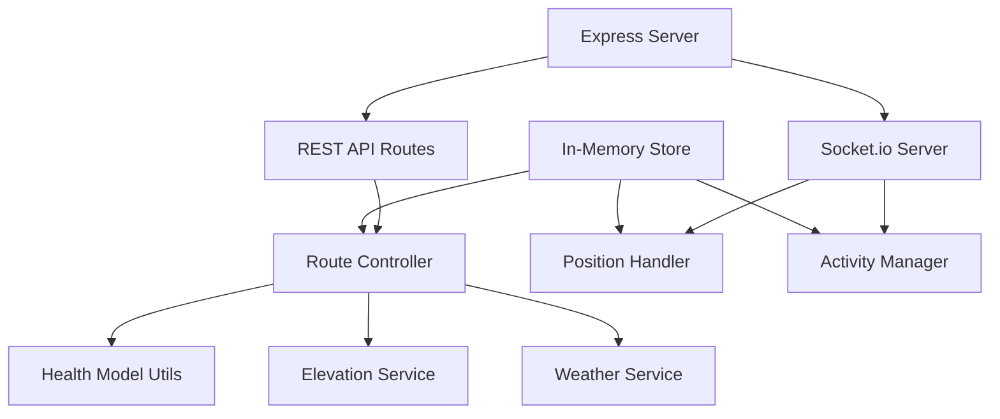
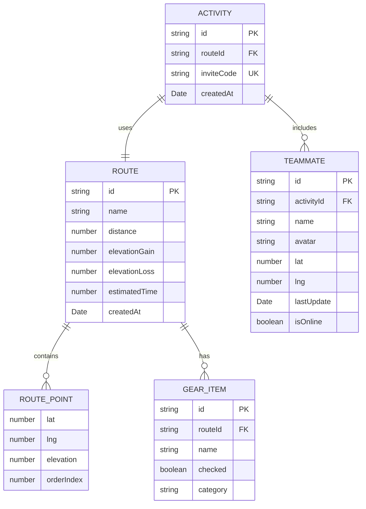

## 1. 架构设计



## 2. 技术描述

- **前端**：React 18 + TypeScript 5 + Vite 5 + Zustand 状态管理
- **地图**：Leaflet 1.9 + React-Leaflet 4
- **图表**：Recharts 2
- **实时通信**：Socket.io 4
- **后端**：Express 4 + TypeScript 5 + Socket.io
- **HTTP客户端**：Axios 1
- **工具库**：uuid 9

## 3. 路由定义

| 路由 | 方法 | 用途 |
|------|------|------|
| / | - | 应用主页面 |
| /api/routes | POST | 创建新路线 |
| /api/routes/:id | GET | 获取路线详情 |
| /api/routes/:id/elevation | GET | 获取路线海拔数据 |
| /api/routes/:id/weather | GET | 获取路线区域天气 |
| /api/activities | POST | 创建活动，生成邀请码 |
| /api/activities/:code | GET | 通过邀请码加入活动 |
| /api/routes/:id/calories | POST | 计算卡路里消耗 |

## 4. API 定义

### TypeScript 类型定义

```typescript
interface RoutePoint {
  lat: number;
  lng: number;
  elevation?: number;
}

interface Route {
  id: string;
  name: string;
  points: RoutePoint[];
  distance: number;
  elevationGain: number;
  elevationLoss: number;
  estimatedTime: number;
  createdAt: Date;
}

interface Activity {
  id: string;
  routeId: string;
  inviteCode: string;
  teammates: Teammate[];
  createdAt: Date;
}

interface Teammate {
  id: string;
  name: string;
  avatar: string;
  lat: number;
  lng: number;
  lastUpdate: Date;
  isOnline: boolean;
}

interface GearItem {
  id: string;
  name: string;
  checked: boolean;
  category: 'essentials' | 'clothing' | 'food' | 'emergency';
}

interface WeatherData {
  date: string;
  condition: string;
  tempHigh: number;
  tempLow: number;
  rainProbability: number;
}

interface CalorieData {
  distance: number;
  calories: number;
  slope: number;
  isDifficult: boolean;
}
```

### WebSocket 事件

| 事件 | 方向 | 数据 |
|------|------|------|
| position:update | 客户端→服务端 | { activityId, teammateId, lat, lng } |
| position:broadcast | 服务端→客户端 | { teammateId, lat, lng, timestamp } |
| activity:join | 客户端→服务端 | { inviteCode, teammateId } |
| teammate:joined | 服务端→客户端 | Teammate |
| teammate:left | 服务端→客户端 | { teammateId } |

## 5. 服务器架构图



## 6. 数据模型

### 6.1 数据模型定义



### 6.2 目录结构

```
auto35/
├── src/
│   ├── frontend/
│   │   ├── App.tsx
│   │   ├── components/
│   │   │   ├── MapView.tsx
│   │   │   ├── RoutePanel.tsx
│   │   │   ├── ElevationChart.tsx
│   │   │   ├── TeammateList.tsx
│   │   │   ├── GearChecklist.tsx
│   │   │   ├── WeatherCard.tsx
│   │   │   └── CalorieChart.tsx
│   │   ├── store/
│   │   │   └── useRouteStore.ts
│   │   ├── types/
│   │   │   └── index.ts
│   │   └── utils/
│   │       └── naismith.ts
│   └── backend/
│       ├── server.ts
│       ├── routes/
│       │   └── route.ts
│       └── utils/
│           └── healthModel.ts
├── package.json
├── vite.config.js
├── tsconfig.json
└── index.html
```
