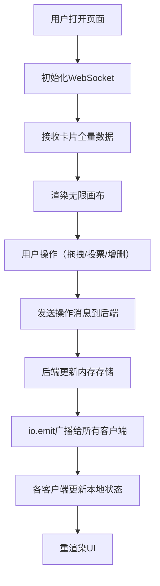

## 1. 产品概述
创意看板是一款在线协作设计工具，为团队提供拖拽式卡片排列、无限画布缩放平移和实时投票功能，支持创意灵感的视觉化整理与筛选。
- 目标用户：产品设计团队、创意工作者、项目协作团队
- 核心价值：通过可视化协作降低沟通成本，快速收敛优秀创意方案

## 2. 核心功能

### 2.1 用户角色
| 角色 | 注册方式 | 核心权限 |
|------|----------|----------|
| 协作用户 | 自动分配用户ID | 查看看板、创建/编辑/删除卡片、拖拽定位、投票（非自己创建的卡片） |

### 2.2 功能模块
1. **看板主界面**：无限画布、网格点阵背景、标签筛选栏、添加卡片按钮
2. **卡片组件**：拖拽定位、内容编辑（标题/描述/图片/标签色）、删除确认、投票按钮
3. **实时通信**：WebSocket双向同步、操作广播、状态一致性
4. **画布操作**：滚轮缩放（0.5x-5x）、右键拖拽平移、中心点保持

### 2.3 页面详情
| 页面名称 | 模块名称 | 功能描述 |
|----------|----------|----------|
| 看板主页 | 标签筛选栏 | 8色标签按钮，点击筛选/取消筛选，带弹跳动画 |
| 看板主页 | 无限画布 | 6x6点阵网格背景，支持缩放平移，transform+transition平滑动画 |
| 看板主页 | 添加卡片按钮 | 右上角固定，点击弹出毛玻璃表单浮层 |
| 看板主页 | 卡片列表 | 显示所有卡片，支持淡入淡出筛选过渡，未选中卡片透明度0.2 |
| 卡片组件 | 内容区域 | 标题、描述文本、图片URL展示，最大宽300px，高度自适应 |
| 卡片组件 | 拖拽手柄 | 单点/多点触控拖拽，位置实时同步，使用immer不可变更新 |
| 卡片组件 | 投票按钮 | 右下角点赞图标，灰色→金色切换，粒子爆散动画，每人每卡一票 |
| 卡片组件 | 删除按钮 | 悬浮显示右上角，带二次确认提示 |

## 3. 核心流程
用户打开应用 → 建立WebSocket连接 → 接收全量卡片数据 → 渲染无限画布
1. 创建卡片：点击添加按钮 → 填写表单 → 提交到后端 → 后端广播 → 所有客户端画布中央出现新卡片
2. 拖拽卡片：鼠标按下卡片 → 拖拽移动 → 实时发送位置更新 → 后端广播 → 所有客户端同步位置
3. 投票操作：点击投票按钮 → 校验权限（非自己创建、未投过）→ 更新后端 → 广播投票数 → 动画反馈
4. 标签筛选：点击颜色标签 → 本地过滤卡片列表 → 淡入淡出动画过渡

## 4. 用户界面设计
### 4.1 设计风格
- **主色调**：暗色系现代风，背景色 `#1a1a2e`，网格点 `#2a2a3e`
- **卡片样式**：白色半透明毛玻璃（`backdrop-filter: blur(8px)`），1px半透明边框，最大宽300px
- **悬浮状态**：卡片放大1.05倍，加深阴影，底部微弱光晕
- **按钮风格**：圆角毛玻璃，筛选项按下时弹跳动画（0.9→1.05→1）
- **字体**：使用现代无衬线字体，标题加粗，描述常规
- **预设标签色系**：8种（珊瑚红、琥珀橙、柠檬黄、薄荷绿、天空蓝、薰衣草紫、玫瑰粉、石板灰）

### 4.2 页面设计概述
| 页面名称 | 模块名称 | UI元素 |
|----------|----------|--------|
| 看板主页 | 顶部筛选栏 | 半透明渐变毛玻璃，8个圆形色标按钮 + 全部按钮，左侧留60px边距 |
| 看板主页 | 画布区域 | 6x6点阵网格，transform控制缩放平移，transition:ease-out 200-400ms |
| 看板主页 | 添加卡片浮层 | 圆角毛玻璃背景，表单字段：标题、描述、图片URL、颜色选择器 |
| 卡片组件 | 卡片主体 | 顶部色条，标题区，描述区，可选图片，右下角投票按钮，右上角删除按钮 |
| 卡片组件 | 投票动效 | CSS关键帧，5个微粒子从中心向外扩散 |
| 卡片组件 | 删除确认 | 轻量弹窗，确认/取消按钮 |

### 4.3 响应式
- 桌面端优先设计，顶部筛选栏高度自适应
- 窗口缩放时画布保持中心点不变
- 触控设备支持单指拖拽卡片、双指缩放画布

### 4.4 动效规范
- 所有动画时长：200-400ms，缓动函数 `ease-out`
- 筛选切换：卡片 `opacity` 过渡，未选中降至0.2并禁用拖拽
- 投票反馈：图标金色 + 粒子爆散关键帧动画
- 拖拽中：卡片缩放1.05 + 阴影加深 + 底部光晕
