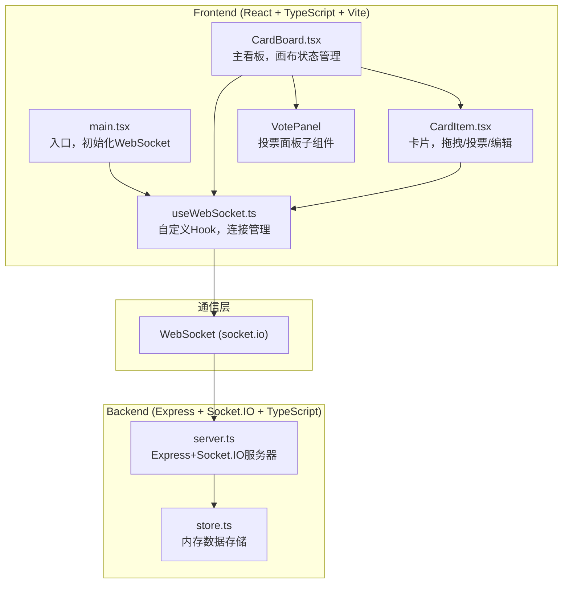
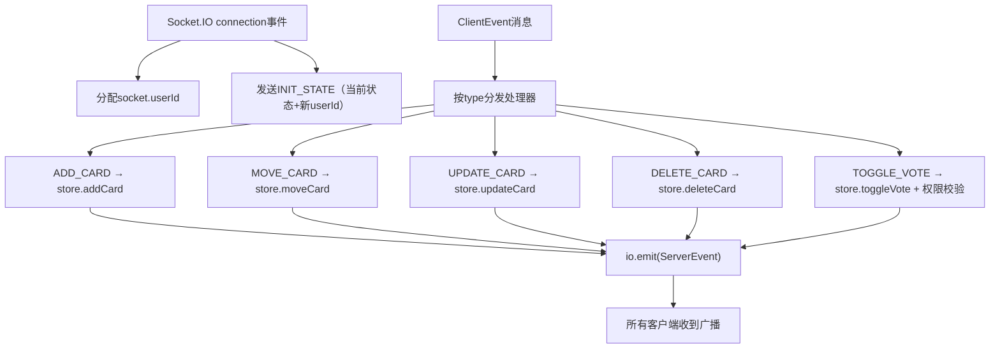
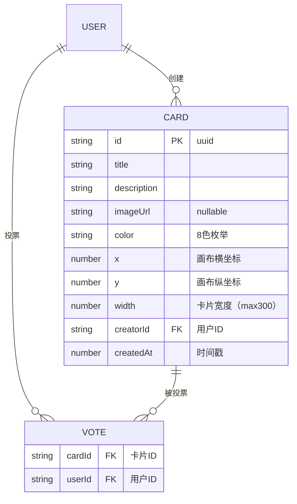

## 1. 架构设计



**数据流向说明**：
1. 前端用户操作 → `CardBoard`/`CardItem` 状态变更 → `useWebSocket.send()` 发送JSON消息
2. `server.ts` 监听 `connection` → 接收消息事件 → 调用 `store.ts` 方法更新内存
3. `store.ts` 返回最新状态 → `server.ts` 调用 `io.emit()` 广播给所有客户端
4. 各客户端 `useWebSocket.onMessage` → 触发状态更新回调 → React重渲染

## 2. 技术描述
- **前端框架**：React 18 + TypeScript 5 + Vite 5
- **前端插件**：@vitejs/plugin-react
- **状态管理**：React useState/useReducer + immer（不可变更新）
- **WebSocket客户端**：socket.io-client
- **工具库**：uuid（生成卡片/用户ID）
- **样式方案**：原生CSS + CSS变量（暗色主题）
- **后端框架**：Express 4 + TypeScript
- **实时通信**：Socket.IO 4
- **数据存储**：内存对象（模拟）
- **包管理器**：npm
- **启动方式**：`npm run dev` 同时启动前后端（concurrently）

## 3. 路由定义
| 路由 | 用途 |
|------|------|
| / | 看板主页（Vite静态资源） |
| /socket.io | Socket.IO端点（由Socket.IO中间件自动处理） |

## 4. API定义（WebSocket事件）

### 4.1 TypeScript类型定义
```typescript
// 共享类型
type CardColor = 'coral' | 'amber' | 'lemon' | 'mint' | 'sky' | 'lavender' | 'rose' | 'slate';

interface Card {
  id: string;
  title: string;
  description: string;
  imageUrl?: string;
  color: CardColor;
  x: number;      // 画布坐标（平移后）
  y: number;
  width: number;  // 当前宽度（自适应，max 300）
  creatorId: string;
  createdAt: number;
}

interface Vote {
  cardId: string;
  userId: string;
}

interface BoardState {
  cards: Card[];
  votes: Vote[];
  userId: string;  // 当前连接用户ID（服务端分配）
}

// WebSocket事件类型
type ClientEvent =
  | { type: 'ADD_CARD'; payload: Omit<Card, 'id' | 'creatorId' | 'createdAt'> }
  | { type: 'MOVE_CARD'; payload: { id: string; x: number; y: number } }
  | { type: 'UPDATE_CARD'; payload: Partial<Card> & { id: string } }
  | { type: 'DELETE_CARD'; payload: { id: string } }
  | { type: 'TOGGLE_VOTE'; payload: { cardId: string } };

type ServerEvent =
  | { type: 'INIT_STATE'; payload: BoardState }
  | { type: 'CARD_ADDED'; payload: Card }
  | { type: 'CARD_MOVED'; payload: { id: string; x: number; y: number } }
  | { type: 'CARD_UPDATED'; payload: Card }
  | { type: 'CARD_DELETED'; payload: { id: string } }
  | { type: 'VOTE_TOGGLED'; payload: { cardId: string; userId: string; voted: boolean; total: number } }
  | { type: 'ERROR'; payload: { message: string } };
```

### 4.2 事件交互规范
| 客户端发送 | 服务端处理 | 广播内容 |
|-----------|-----------|----------|
| ADD_CARD | store.addCard() → 生成id/时间 | CARD_ADDED 给所有人 |
| MOVE_CARD | store.moveCard() → immer更新位置 | CARD_MOVED 给所有人 |
| UPDATE_CARD | store.updateCard() → 合并字段 | CARD_UPDATED 给所有人 |
| DELETE_CARD | store.deleteCard() → 移除卡片+对应投票 | CARD_DELETED 给所有人 |
| TOGGLE_VOTE | 校验：非创建者+未投过 → store.toggleVote() | VOTE_TOGGLED 给所有人 |

## 5. 服务器架构图



## 6. 数据模型

### 6.1 内存数据模型



### 6.2 内存存储实现（store.ts 接口）
```typescript
interface Store {
  getCards(): Card[];
  getVotes(): Vote[];
  getVoteCount(cardId: string): number;
  hasUserVoted(cardId: string, userId: string): boolean;
  addCard(input, creatorId): Card;
  moveCard(id, x, y): Card | null;
  updateCard(id, patch): Card | null;
  deleteCard(id): boolean;
  toggleVote(cardId, userId): { voted: boolean; total: number } | null;
}
```
使用 immer 保证所有更新操作不可变，避免引用冲突。
