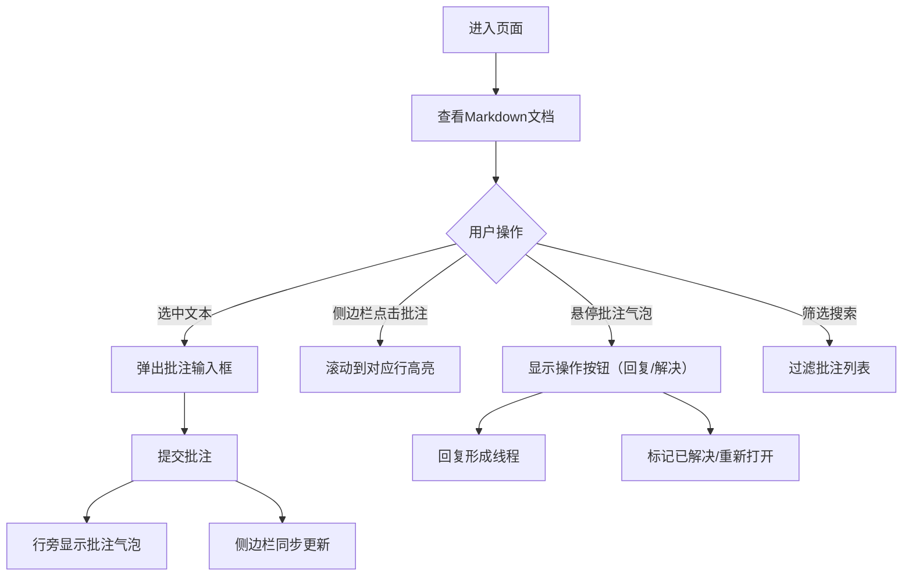

## 1. 产品概述
在线协作文档批注工具，为团队提供轻量级的文档协作批注体验，支持多人在同一份文档上实时添加、回复和解决批注。
- 主要目的：提升团队文档协作效率，降低沟通成本
- 目标用户：产品、研发、设计团队成员
- 市场价值：填补Google Docs与纯Markdown编辑器之间的轻量协作工具空白

## 2. 核心功能

### 2.1 用户角色
无需注册登录，使用模拟多用户协作数据，所有用户拥有同等权限。

| 角色 | 注册方式 | 核心权限 |
|------|----------|----------|
| 协作用户 | 模拟数据 | 查看文档、添加/回复/解决批注、筛选搜索批注 |

### 2.2 功能模块
1. **文档渲染模块**：Markdown/纯文本渲染、带行号显示、文本选中检测
2. **批注交互模块**：选中文本创建批注、气泡式批注展示、回复线程、解决/重开批注
3. **侧边栏模块**：批注列表汇总、章节/关键词筛选、全局搜索、点击跳转高亮
4. **协作模拟模块**：多用户光标展示、批注实时更新模拟

### 2.3 页面详情
| 页面名称 | 模块名称 | 功能描述 |
|----------|----------|----------|
| 主页面 | 顶部工具栏 | 上传文档按钮、当前协作用户头像展示、侧边栏收起按钮 |
| 主页面 | 文档渲染区 | 带行号的文档内容展示、支持文本选择、高亮批注关联行 |
| 主页面 | 行旁批注气泡 | 悬停显示操作按钮、淡入动画、回复输入框、解决状态标识 |
| 主页面 | 批注侧边栏 | 批注列表、章节筛选、关键词筛选、作者/内容全局搜索 |

## 3. 核心流程

### 主流程
用户进入页面 → 查看预设Markdown文档 → 选中任意文本 → 弹出批注输入框 → 提交批注 → 批注气泡显示在行旁 + 侧边栏同步更新 → 其他用户可回复/解决批注 → 通过侧边栏筛选搜索定位批注 → 点击跳转高亮对应文档行

## 4. 用户界面设计

### 4.1 设计风格
- **主色调**：柔和雾霾蓝（#7EB8D8 ～ #A8D0E6）、白色（#FFFFFF）
- **辅助色**：浅灰底色（#F5F7FA）、边框灰（#E2E8F0）、文字深灰（#4A5568）
- **成功态**：薄荷绿（#9AE6B4）用于已解决批注标识
- **按钮风格**：圆角8px，无3D效果，悬停时背景色微变 + 淡入过渡
- **字体**：主字体 "PingFang SC" / "Helvetica Neue"，等宽代码区 "SF Mono" / "Menlo"
- **布局**：左侧文档70%、右侧批注面板30%，面板可收起（文档占满100%）
- **图标风格**：极简线性图标，尺寸统一16px

### 4.2 页面设计概览
| 页面名称 | 模块名称 | UI元素 |
|----------|----------|--------|
| 主页面 | 文档区 | 浅灰背景卡片、行号左侧栏、选中高亮层、批注行标记线 |
| 主页面 | 批注气泡 | 白色圆角卡片、轻微阴影、悬停时阴影加深淡入、回复按钮渐显 |
| 主页面 | 侧边栏 | 半透明白背景、滑入动画（右侧→左）、筛选标签胶囊样式 |
| 主页面 | 搜索框 | 底部固定、圆角输入框、搜索图标前缀 |
| 主页面 | 用户光标 | 彩色小方块 + 用户名标签、轻微浮动动画 |

### 4.3 响应式
- **桌面优先**：1280px以上完整双栏布局
- **1024px - 1279px**：比例微调（65% / 35%）
- **1024px以下**：侧边栏默认收起，通过按钮呼出覆盖层

### 4.4 性能要求
- 5000字文档 + 50个批注时，滚动帧率 ≥ 60fps
- 批注高亮动画使用 GPU 加速（transform + opacity）
- 侧边栏滑动使用 CSS transition，避免 layout thrashing
