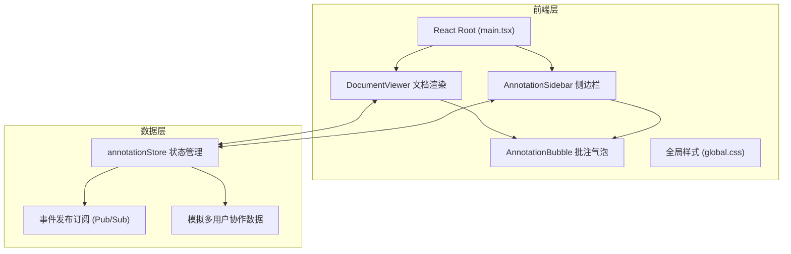
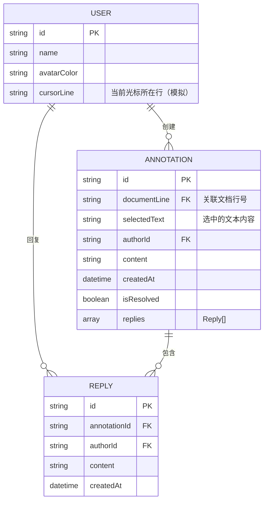

## 1. 架构设计



## 2. 技术说明
- **前端框架**：React 18 + TypeScript（严格模式）
- **构建工具**：Vite 5 + @vitejs/plugin-react
- **状态管理**：自研 annotationStore（发布订阅模式，避免引入额外依赖）
- **样式方案**：原生 CSS + CSS Variables（按用户要求使用 global.css）
- **Markdown 解析**：无需额外库，按行分割渲染（保持轻量）
- **无后端**：所有数据为前端模拟

## 3. 路由定义
| 路由 | 用途 |
|------|------|
| / | 唯一页面，承载文档 + 批注侧边栏全部功能 |

## 4. 文件结构
```
auto38/
├── package.json
├── vite.config.js
├── tsconfig.json
├── index.html
└── src/
    ├── main.tsx
    ├── styles/
    │   └── global.css
    ├── components/
    │   ├── DocumentViewer.tsx
    │   ├── AnnotationSidebar.tsx
    │   └── AnnotationBubble.tsx
    └── utils/
        └── annotationStore.ts
```

## 5. 数据模型

### 5.1 数据模型定义


### 5.2 TypeScript 类型定义
```typescript
interface User {
  id: string;
  name: string;
  avatarColor: string;
  cursorLine: number;
}

interface Reply {
  id: string;
  annotationId: string;
  authorId: string;
  content: string;
  createdAt: Date;
}

interface Annotation {
  id: string;
  documentLine: number;
  selectedText: string;
  authorId: string;
  content: string;
  createdAt: Date;
  isResolved: boolean;
  replies: Reply[];
}

type EventType =
  | 'annotation:created'
  | 'annotation:updated'
  | 'annotation:resolved'
  | 'annotation:reply'
  | 'cursor:moved'
  | 'sidebar:scrollTo';
```

## 6. 核心实现要点

### 6.1 文档渲染（DocumentViewer）
- 将 Markdown 按 `\n` 分割为行数组
- 每行渲染为独立 DOM 节点，附加 `data-line` 属性
- 行号使用 `::before` 伪元素或独立 `<span>` 渲染
- 监听 `mouseup` + `window.getSelection()` 检测文本选择
- 选中文本后在选择位置上方浮动批注输入框

### 6.2 批注气泡定位（AnnotationBubble）
- 使用 `position: absolute` + `data-line` 计算 top 偏移
- 每行可存在多个批注时，使用横向排列或竖向堆叠
- `transform: translateY(0)` → `translateY(-2px)` 实现悬停上浮

### 6.3 侧边栏性能（AnnotationSidebar）
- 批注列表使用 CSS `will-change: transform` 优化滚动
- 搜索/筛选状态变更使用 requestAnimationFrame 防抖
- 点击跳转使用 `scrollIntoView({ behavior: 'smooth', block: 'center' })`

### 6.4 协作模拟
- `annotationStore` 内置 `setInterval` 每 3-8 秒随机移动模拟用户光标
- 新创建批注触发事件，模拟其他用户延迟 1-2 秒后自动回复（概率触发）
- 用户光标使用独立定位层，不干扰文档滚动

### 6.5 性能优化清单
- 所有动画使用 transform/opacity（GPU 合成层）
- 行高固定，避免频繁 layout reflow
- 批注数量超过 20 时侧边栏使用虚拟滚动备用方案
- CSS `contain: layout paint` 标记独立渲染区域
