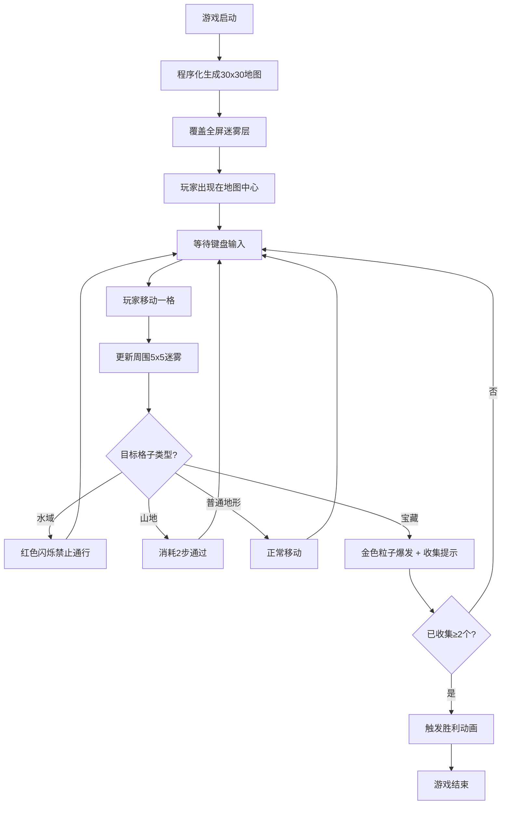

## 1. 产品概述

迷雾之岛探秘是一款2D网格探索类游戏，玩家在神秘的迷雾笼罩岛屿上逐步探索未知区域，揭开迷雾并收集隐藏的宝藏。游戏采用中世纪羊皮纸手绘地图风格，带来沉浸式的复古探险体验。

- 核心玩法：程序化生成的30x30网格地图探索，迷雾逐渐消散机制，宝藏收集挑战
- 目标用户：喜欢休闲探索类游戏的玩家，欣赏复古手绘美学风格的用户
- 产品价值：提供短平快的探险游戏体验，精美的视觉效果和流畅的操作反馈

## 2. 核心功能

### 2.1 用户角色

| 角色 | 注册方式 | 核心权限 |
|------|----------|----------|
| 玩家 | 直接进入 | 探索地图、移动角色、收集宝藏、查看统计 |

### 2.2 功能模块

1. **游戏主场景**：30x30网格地图渲染、迷雾系统、地形绘制
2. **玩家控制**：WASD/方向键移动、视野范围、平滑移动动画
3. **宝藏系统**：宝藏生成、收集特效、胜利判定
4. **HUD界面**：探索进度显示、宝藏收集统计、操作提示

### 2.3 页面详情

| 页面名称 | 模块名称 | 功能描述 |
|----------|----------|----------|
| 游戏主界面 | 地图渲染层 | 绘制5种地形（森林、山地、水域、沙漠、草地），支持不同通行属性 |
| 游戏主界面 | 迷雾层 | 初始完全覆盖，玩家周围5x5范围径向渐变消散动画，已探索区域半透明覆盖 |
| 游戏主界面 | 玩家角色 | 键盘控制移动，0.3秒平滑滑行，水域阻挡反馈 |
| 游戏主界面 | 宝藏系统 | 3个随机宝藏点，收集粒子特效，收集2个后触发胜利动画 |
| 游戏主界面 | HUD显示 | 左上探索百分比、右上宝藏计数、底部操作说明，羊皮纸风格 |

## 3. 核心流程

游戏启动后自动生成地图并覆盖迷雾，玩家从地图中心出发使用键盘探索。移动时揭开周围迷雾，遇到水域显示红色闪烁警告，收集宝藏触发金色粒子特效。当收集到2个宝藏时触发胜利画面。

## 4. 用户界面设计

### 4.1 设计风格

- **主色调**：棕褐色(#8B7355)为主色，暗金色(#B8860B)为强调色，深绿色(#2F4F2F)为辅助色
- **整体风格**：中世纪羊皮纸手绘地图质感，深色木纹边框包裹
- **字体**：衬线字体(Georgia/Times New Roman)，HUD文字带旧纸纹理背景
- **动效**：迷雾径向渐变淡出(0.8秒)、玩家平滑滑行(0.3秒)、粒子特效、合成音效

### 4.2 页面设计概述

| 页面名称 | 模块名称 | UI元素 |
|----------|----------|--------|
| 游戏主界面 | 外层边框 | 深色木纹纹理边框，有质感阴影 |
| 游戏主界面 | 画布区域 | 全屏游戏渲染，网格地形，迷雾遮罩 |
| 游戏主界面 | HUD左上 | 羊皮纸底纹，探索进度条+百分比数字 |
| 游戏主界面 | HUD右上 | 羊皮纸底纹，宝藏图标+收集计数 |
| 游戏主界面 | HUD底部 | 固定操作说明文字，半透明羊皮纸背景 |
| 游戏主界面 | 反馈提示 | 红色禁止通行闪烁、金色收集成功提示 |
| 游戏主界面 | 胜利画面 | 画面渐亮、金色光晕扩散、恭喜文字居中 |

### 4.3 响应式

桌面端全屏游戏体验，画布自适应窗口尺寸，保持1:1像素网格比例。

### 4.4 性能要求

- 主循环稳定60FPS
- 迷雾更新和粒子系统每帧开销≤3ms
- 地图初始生成耗时≤500ms
