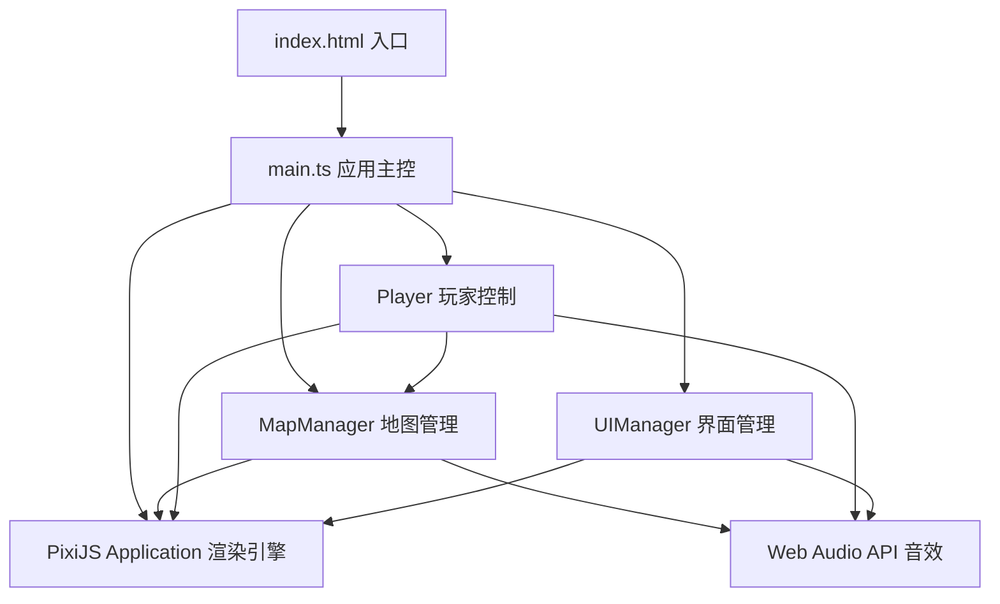

## 1. 架构设计



## 2. 技术描述

- **前端框架**：无额外UI框架，纯PixiJS渲染
- **渲染引擎**：pixi.js@7（2D WebGL渲染）
- **开发语言**：TypeScript（严格模式，ES模块）
- **构建工具**：Vite
- **音效**：Web Audio API原生合成
- **性能优化**：对象池管理粒子、迷雾层批量渲染、脏矩形更新

## 3. 文件结构

```
.
├── package.json          # 依赖配置：pixi.js@7, typescript, vite
├── vite.config.js        # Vite配置 + TypeScript插件
├── tsconfig.json         # TS严格模式，ES模块
├── index.html            # 全屏入口页面
└── src/
    ├── main.ts           # 应用入口：Pixi初始化、场景管理、主循环
    ├── MapManager.ts     # 网格地图、迷雾层、坐标转换、可见性查询
    ├── Player.ts         # 玩家移动、视野范围、交互行为
    └── UIManager.ts      # HUD渲染、进度条、收集列表、操作提示
```

## 4. 核心模块设计

### 4.1 MapManager

**职责**：程序化生成30x30网格地图，管理迷雾层，提供坐标转换和可见性查询。

**类型定义**：
```typescript
enum TerrainType {
  FOREST = 'forest',    // 森林
  MOUNTAIN = 'mountain', // 山地（2步）
  WATER = 'water',      // 水域（不可通行）
  DESERT = 'desert',    // 沙漠
  GRASSLAND = 'grassland' // 草地
}

interface TerrainConfig {
  color: number;        // Pixi颜色值
  passable: boolean;    // 是否可通行
  moveCost: number;     // 移动步数消耗
  name: string;         // 地形名称
}

interface Cell {
  terrain: TerrainType;
  hasTreasure: boolean;
  explored: boolean;    // 是否已探索
  visible: boolean;     // 当前是否可见
  fogAlpha: number;     // 迷雾透明度(0-1)
}
```

**关键方法**：
- `generateMap(seed?)`：程序化生成地图
- `worldToGrid(x, y)` / `gridToWorld(gx, gy)`：坐标转换
- `getCell(gx, gy)`：获取格子信息
- `revealArea(centerX, centerY, radius)`：揭开指定范围迷雾
- `isPassable(gx, gy)`：查询可通行性
- `getExploredPercent()`：获取探索百分比

### 4.2 Player

**职责**：控制玩家角色移动、视野范围、交互行为。

**关键属性**：
- `gridX / gridY`：网格坐标
- `targetGridX / targetGridY`：目标网格坐标（用于平滑移动）
- `renderX / renderY`：实际渲染坐标（插值计算）
- `viewRadius`：视野半径（2格，即5x5范围）
- `treasureCount`：已收集宝藏数
- `isMoving`：是否正在移动

**关键方法**：
- `move(dx, dy)`：尝试移动
- `update(delta)`：每帧更新（平滑动画）
- `getViewCells()`：获取视野内格子列表
- `onTreasureCollected()`：宝藏收集回调

### 4.3 UIManager

**职责**：渲染HUD界面、探索进度条、物品收集列表和操作提示。

**关键组件**：
- HUD容器（左上角探索进度、右上角宝藏计数）
- 底部操作说明栏
- 临时提示（禁止通行、收集成功）
- 胜利画面层

### 4.4 main.ts

**职责**：应用入口，初始化Pixi应用、场景管理和主循环。

**流程**：
1. 创建Pixi Application，自适应窗口
2. 实例化MapManager、Player、UIManager
3. 绑定键盘事件
4. 启动主循环(ticker)
5. 主循环中依次调用各模块update，处理胜利判定

## 5. 性能优化策略

### 5.1 迷雾渲染优化
- 使用单个RenderTexture作为迷雾层，而非900个独立Sprite
- 仅在玩家移动后更新迷雾纹理（脏区域更新）
- 径向渐变使用预计算alpha矩阵

### 5.2 粒子系统优化
- 对象池复用粒子对象，避免频繁GC
- 单粒子容器统一更新渲染
- 最大粒子数限制（同时≤200个）

### 5.3 地图渲染优化
- 地形使用TilingSprite或预渲染Texture
- 仅在视图范围内的格子参与渲染
- 网格线使用Graphics一次性绘制

## 6. 音效设计

使用Web Audio API合成简单音效：
- **移动**：短促低频方波，衰减包络
- **禁止通行**：高频锯齿波，快速颤音
- **收集宝藏**：正弦波上行琶音，金色质感
- **胜利**：多声部和弦，渐强渐慢
