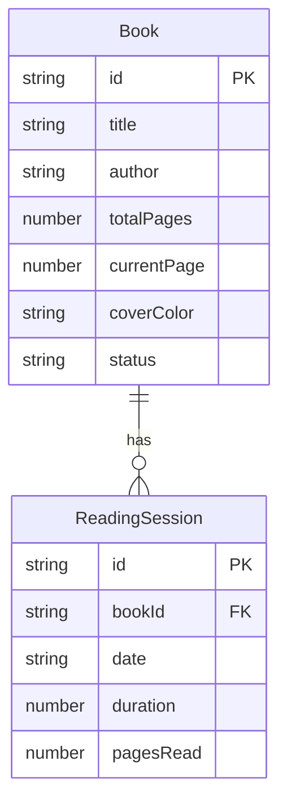

## 1. 架构设计

```mermaid
flowchart TB
    "前端 React + Vite" --> "Express API 服务"
    "Express API 服务" --> "内存数据存储"
    "前端 React + Vite" --> "Zustand 状态管理"
```

## 2. 技术说明

- 前端：React 18 + TypeScript + Tailwind CSS + Vite
- 初始化工具：vite-init（react-express-ts 模板）
- 后端：Express 4 + TypeScript（ESM）
- 数据库：内存存储模拟（无持久化）
- 状态管理：Zustand

## 3. 路由定义

| 路由 | 用途 |
|------|------|
| / | 书架页面，展示书籍网格 |
| /reading | 阅读计时器页面，支持查询参数 ?bookId= |
| /calendar | 日历页面，展示阅读日历 |

## 4. API 定义

### 4.1 TypeScript 类型定义

```typescript
interface Book {
  id: string;
  title: string;
  author: string;
  totalPages: number;
  currentPage: number;
  coverColor: string;
  status: 'unread' | 'reading' | 'finished';
}

interface ReadingSession {
  id: string;
  bookId: string;
  date: string; // YYYY-MM-DD
  duration: number; // 秒
  pagesRead: number;
}

interface CalendarDay {
  date: string; // YYYY-MM-DD
  totalDuration: number;
  totalPages: number;
  goalCompleted: boolean;
  sessions: ReadingSession[];
}
```

### 4.2 请求/响应模式

| 方法 | 路径 | 请求体 | 响应 |
|------|------|--------|------|
| GET | /api/user/books | - | Book[] |
| POST | /api/user/books | { title, author, totalPages, coverColor } | Book |
| PATCH | /api/user/books/:id | { currentPage, status } | Book |
| GET | /api/user/readings | - | ReadingSession[] |
| POST | /api/user/readings | { bookId, duration, pagesRead } | ReadingSession |
| GET | /api/calendar?year=2026&month=6 | - | CalendarDay[] |

## 5. 服务端架构图

```mermaid
flowchart LR
    "Router 路由层" --> "Controller 控制层"
    "Controller 控制层" --> "内存数据 Store"
```

## 6. 数据模型

### 6.1 数据模型定义



### 6.2 数据定义语言

内存存储，使用 TypeScript Map/Array：

```typescript
const books: Book[] = [];
const readings: ReadingSession[] = [];
```
