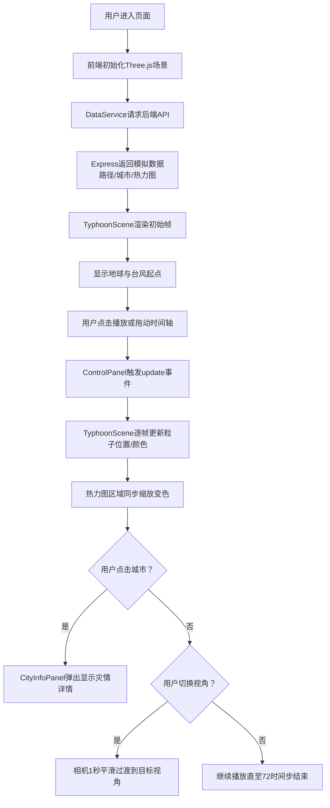

## 1. 产品概述

三维台风动态模拟与灾情可视化工具，面向气象科普教育场景，通过交互式3D地球直观展示台风路径、强度变化及沿海城市受灾情况。

- 主要解决台风气象数据的可视化呈现问题，帮助学习者理解台风形成、移动、增强/减弱的完整生命周期
- 目标用户：气象科普学习者、学生、教师及对气象灾害感兴趣的公众
- 市场价值：填补国内交互式3D台风科普工具的空白，提供沉浸式学习体验

## 2. 核心功能

### 2.1 用户角色
无需注册，所有访客拥有完整功能访问权限。

### 2.2 功能模块
1. **3D台风模拟场景**：地球渲染、大气光晕、台风粒子云、路径轨迹线、城市标记、热力图叠加
2. **时间轴控制**：播放/暂停、重置、倍速调节（0.5x-3x）、时间步滑块跳转（72个时间步）
3. **城市灾情面板**：城市名称、风力等级（12级制）、降雨量、预警图标、受灾人口预估
4. **视角切换**：3D透视视角 ↔ 2D俯视视角平滑过渡，2D模式显示经纬度网格与城市名称
5. **交互控制**：热力图开关、模拟速度控制、城市点击交互

### 2.3 页面详情

| 页面名称 | 模块名称 | 功能描述 |
|-----------|-------------|---------------------|
| 主页面 | 3D渲染区域 | 全屏Three.js场景，地球+台风粒子+路径线+城市标记+热力图 |
| 主页面 | 底部控制面板 | 时间轴滑块、播放按钮、倍速选择、视角切换、热力图开关、重置按钮 |
| 主页面 | 城市信息浮动面板 | 点击城市后弹出，包含灾情详情和预警图标，底部滑入动画 |
| 主页面 | 星空背景 | CSS渐变+粒子效果，深空蓝到暗紫渐变 |

## 3. 核心流程

## 4. 用户界面设计

### 4.1 设计风格
- **主色调**：深空蓝渐变 `#0a0a2e → #1a1a3e`，点缀警示色红 `#ef4444`、橙 `#f97316`、黄 `#eab308`
- **辅助色**：浅蓝 `#00b4d8 → #0077b6` 渐变色用于按钮和滑块
- **按钮风格**：圆角8px，线性渐变填充，hover时产生光晕box-shadow
- **字体**：主标题使用富有科技感的衬线/几何字体，正文使用现代无衬线字体
- **布局风格**：沉浸式全屏布局，底部毛玻璃控制栏，浮动信息面板采用backdrop-blur
- **图标风格**：线性风格Lucide图标，粗细统一2px

### 4.2 页面设计概览

| 页面/模块 | 设计元素 |
|-----------|----------|
| 背景层 | CSS径向渐变深空蓝，随机分布小尺寸白色圆点模拟星空，缓慢闪烁动画 |
| 3D场景 | 低多边形地球（深蓝海洋+浅色大陆），浅蓝色半透明大气光晕，台风粒子半透明发光additive blending |
| 底部控制面板 | `rgba(255,255,255,0.08)` + `backdrop-filter: blur(10px)`，圆角16px，内边距20px |
| 城市信息面板 | 从底部translateY滑入，cubic-bezier(0.34, 1.56, 0.64, 1)弹性曲线，毛玻璃背景 |
| 预警图标 | 红/橙/黄圆形徽章，内置Lucide AlertTriangle图标，脉冲动画 |

### 4.3 响应式设计
- **大屏（>1200px）**：完整三栏布局-左侧信息、中央3D、右侧图例；底部控制栏全功能展开
- **中屏（768-1200px）**：底部控制面板折叠为图标栏，hover展开；城市面板宽度自适应60%
- **小屏（<768px）**：控制面板切换为左侧抽屉式（默认收起，汉堡按钮展开）；城市面板全屏半屏显示；文字整体缩放至90%

### 4.4 3D场景指导
- **环境与氛围**：黑色背景无HDR，自发光粒子营造发光效果，PointLight位于台风中心
- **光照布置**：AmbientLight(0x404060, 0.5) 基础环境光 + DirectionalLight(0xffffff, 1.0) 模拟太阳光
- **相机动画**：PerspectiveCamera → OrthographicCamera切换时使用lerp线性插值，1秒过渡动画
- **构图焦点**：地球居中占屏幕60%，台风路径沿地球表面弧线运动
- **交互与动画**：OrbitControls允许拖拽旋转/缩放；台风粒子沿圆周切线方向自旋，整体绕路径点公转
- **后期处理**：粒子使用Additive Blending实现发光；城市热力球使用透明材质叠加
- **性能预算**：粒子数2000-3000（Points/BufferGeometry），单帧更新<10ms，目标60FPS
