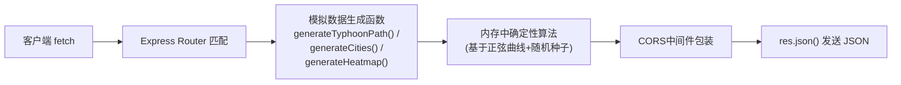

## 1. 架构设计

```mermaid
graph TD
    subgraph "Browser 浏览器端"
        UI["src/ui/ 模块
        ├─ ControlPanel.ts (控制栏)
        └─ CityInfoPanel.ts (灾情面板)"]

        VIZ["src/scene/ 可视化模块
        ├─ TyphoonScene.ts (场景管理器)
        └─ TyphoonParticle.ts (粒子单元)"]

        DATA["src/data/ 数据层
        └─ DataService.ts (HTTP客户端)"]

        MAIN["src/main.ts (入口编排)"]

        MAIN --> UI
        MAIN --> VIZ
        VIZ -->|事件回调| UI
        UI -->|update调用| VIZ
        DATA -->|DataPoint[]| VIZ
        DATA -->|CityImpact[]| UI
    end

    subgraph "Express 服务端"
        SRV["src/server/server.ts
        ├─ GET /api/typhoon/path
        ├─ GET /api/typhoon/cities
        └─ GET /api/typhoon/heatmap"]
    end

    DATA -->|fetch GET + CORS| SRV
```

## 2. 技术栈说明

| 层级 | 选型 | 版本约束 | 用途 |
|------|------|---------|------|
| 前端渲染 | three + @types/three | ^0.160.0 | WebGL 3D渲染：地球、粒子、路径线 |
| 前端语言 | typescript | ^5.3.0 | 严格模式类型安全 |
| 构建工具 | vite | ^5.0.0 | ESBuild打包 + HMR热更新 |
| 后端 | express | ^4.18.0 | HTTP API模拟数据服务 |
| 后端插件 | cors + express-async-errors | latest | 跨域访问 + 异步错误兜底 |
| 包管理 | npm | — | 匹配用户 `npm run dev` 要求 |

**项目初始化方式**：不使用 `vite-init` 脚手架（因用户指定的是 vanilla-ts + Three.js 而非 React/Vue），采用手动创建文件结构并写入 package.json 直接指定依赖。

## 3. 构建脚本定义

| 命令 | 说明 |
|------|------|
| `npm run dev` | **同时启动**：① Vite前端开发服务器（端口5173）② Express后端（端口3001）——使用concurrently库或双终端方案，实际采用`node --loader ts-node/esm src/server/server.ts` 与 `vite` 并行 |
| `npm run build` | tsc 类型检查 → vite build 打包前端静态资源到 dist/ |
| `npm run check` | `tsc --noEmit` 类型检查，确保类型安全 |

## 4. API接口定义

### 类型契约
```typescript
// 台风路径点
interface DataPoint {
  timeStep: number;      // 0~71
  lat: number;           // 纬度 -90~90
  lng: number;           // 经度 -180~180
  windSpeed: number;     // 风速 km/h
  pressure: number;      // 气压 hPa
  category: number;      // 台风等级 0-5
}

// 城市灾情信息
interface CityImpact {
  cityId: string;
  name: string;
  lat: number;
  lng: number;
  size: 'small' | 'large';   // 城市规模（决定热力半径）
  // 按时间步的动态数据（长度72）
  timeline: Array<{
    windLevel: number;        // 1~12 蒲福风级
    rainfall: number;         // mm
    disasterLevel: 1 | 2 | 3; // 1黄/2橙/3红
    affectedPopulation: number; // 人
  }>;
}

// 热力图网格（用于地面可视化）
interface HeatmapGrid {
  timeStep: number;
  cells: Array<{ lat: number; lng: number; intensity: number }>;
}
```

### 端点清单

| 方法 | 路径 | 请求参数 | 响应 |
|------|------|---------|------|
| GET | `/api/typhoon/path` | — | `{ data: DataPoint[] }` (72条) |
| GET | `/api/typhoon/cities` | — | `{ data: CityImpact[] }` (8个沿海城市) |
| GET | `/api/typhoon/heatmap` | `time=${number}` (0~71) | `{ data: HeatmapGrid }` |

所有端点均启用 CORS (`Access-Control-Allow-Origin: *`)，响应时间目标 < 50ms。

## 5. 服务端数据流


**模拟数据算法**：台风路径使用螺旋贝塞尔曲线从太平洋西北向东南沿海移动，风速先升后降（峰值时间步36），城市灾害等级与台风距离成反比。

## 6. 关键文件结构

```
auto42/
├── package.json
├── vite.config.js            (配置 @/ 别名 + TypeScript)
├── tsconfig.json             (strict + paths + ESNext)
├── index.html                (全屏入口，内联星空背景样式)
├── src/
│   ├── main.ts               (入口，串起所有模块)
│   ├── scene/
│   │   ├── TyphoonScene.ts   (Three.js场景管理类)
│   │   └── TyphoonParticle.ts (粒子单元逻辑)
│   ├── data/
│   │   └── DataService.ts    (fetch封装 + 类型守卫)
│   ├── ui/
│   │   ├── ControlPanel.ts   (底部控制栏DOM操作)
│   │   └── CityInfoPanel.ts  (城市浮动面板DOM操作)
│   └── server/
│       └── server.ts         (Express + 3个API路由)
```

## 7. 性能优化策略

| 优化点 | 手段 |
|--------|------|
| 粒子渲染 | 使用 THREE.Points + BufferGeometry，单次drawcall而非2000个Mesh |
| 粒子更新 | Float32Array直接操作 position/color attribute，避免对象分配 |
| 热力图纹理 | 预计算 Sprite 圆形渐变贴图，避免运行期Canvas重绘 |
| 相机过渡 | 帧循环中使用 THREE.MathUtils.lerp 逐帧插值，不使用tween库 |
| API响应 | 数据在进程启动时**一次性生成**并缓存，每次请求仅序列化数组 |
| 类型检查 | 开发期 `tsc --noEmit` 与 vite 并行，构建流程不产生冲突 |
