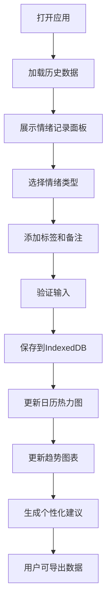

## 1. 产品概述

交互式情绪追踪与可视化仪表盘应用，帮助用户记录每日心情变化、查看情绪趋势并获得个性化建议。通过科学的情绪管理，提升用户心理健康水平。

- **核心价值**：让用户直观了解自己的情绪模式，通过数据驱动的建议改善心理状态
- **目标用户**：关注心理健康、希望进行情绪管理的普通用户

## 2. 核心功能

### 2.1 用户角色
| 角色 | 注册方式 | 核心权限 |
|------|----------|----------|
| 普通用户 | 无需注册，本地存储 | 记录情绪、查看图表、获取建议、导出数据 |

### 2.2 功能模块
1. **情绪记录模块**：情绪选择面板、标签选择、备注输入、卡片翻转动画
2. **日历热力图模块**：月视图展示、情绪强度着色、日期详情弹窗、月份切换动画
3. **趋势统计模块**：多时间范围切换、折线图展示、交互图例、图表动画
4. **建议生成模块**：AI建议算法、卡片展示、交错弹入动画、发光效果
5. **数据导出模块**：JSON导出、加载动画、成功提示

### 2.3 页面详情
| 页面名称 | 模块名称 | 功能描述 |
|----------|----------|----------|
| 主仪表盘 | 情绪记录面板 | 6种情绪选择（快乐、悲伤、愤怒、平静、焦虑、惊喜），标签选择，文字备注，提交动画 |
| 主仪表盘 | 日历热力图 | 月视图网格，每日平均情绪强度着色，点击查看详情，按情绪筛选 |
| 主仪表盘 | 趋势统计图 | 7/30/90天切换，recharts折线图，图例交互，悬停详情，淡入动画 |
| 主仪表盘 | 建议卡片 | 基于7天数据分析，3条个性化建议，交错动画，发光效果 |
| 主仪表盘 | 数据导出 | 当前月份数据导出为JSON，加载动画，自动下载 |

## 3. 核心流程

用户打开应用 → 查看今日情绪记录状态 → 选择当前情绪 → 添加标签和备注 → 提交保存（IndexedDB）→ 查看日历热力图更新 → 切换时间范围查看趋势 → 阅读个性化建议 → 导出数据（可选）

## 4. 用户界面设计

### 4.1 设计风格
- **主色调**：柔和蓝紫色系（天蓝色到淡紫色渐变背景）
- **色彩系统**：
  - 快乐：#FFD93D（黄色）
  - 悲伤：#6B8EFC（蓝色）
  - 愤怒：#FF6B6B（红色）
  - 平静：#6BCB77（绿色）
  - 焦虑：#9B59B6（紫色）
  - 惊喜：#FF9F43（橙色）
- **卡片风格**：毛玻璃效果（backdrop-filter: blur(20px) + 半透明白色背景），圆角12px，柔和阴影
- **字体**：系统无衬线字体（-apple-system, BlinkMacSystemFont, 'Segoe UI', sans-serif）
- **动画**：所有交互300ms ease-out过渡，情绪按钮弹跳动画，卡片翻转效果，交错弹入动画
- **图标风格**：使用emoji作为情绪图标，配合装饰性小图标

### 4.2 页面设计概述
| 页面名称 | 模块名称 | UI元素 |
|----------|----------|--------|
| 主仪表盘 | 情绪记录面板 | 2×3网格布局，emoji大图标，选中放大弹跳，卡片翻转提交动画 |
| 主仪表盘 | 日历热力图 | 7列网格，日期格子根据情绪强度着色，装饰图标标题，滑动过渡动画 |
| 主仪表盘 | 趋势统计图 | 白色半透明背景，recharts折线图，图例可点击，淡入绘制动画，装饰图标标题 |
| 主仪表盘 | 建议卡片 | 三张卡片交错从底部弹入，微弱发光效果，毛玻璃质感 |
| 主仪表盘 | 导出按钮 | 圆角按钮，悬停上浮，点击旋转加载动画，成功提示 |

### 4.3 响应式设计
- **设计策略**：桌面端优先，移动端自适应
- **断点**：768px以下切换为单列布局
- **移动端优化**：所有组件宽度100%，字体放大120%，按钮最小触控区域48×48px，间距适当增加
- **触控优化**：移除:hover依赖，改用:active状态反馈

### 4.4 动效设计原则
- **入场动画**：页面加载时模块按优先级顺序淡入，建议卡片使用staggered延迟动画
- **交互反馈**：所有可点击元素有scale变换反馈，情绪选中使用spring弹性动画
- **转场动画**：月份切换使用左右滑动过渡，图表数据更新使用平滑过渡
- **性能目标**：动画帧率保持在50-60fps，优先使用transform和opacity属性
