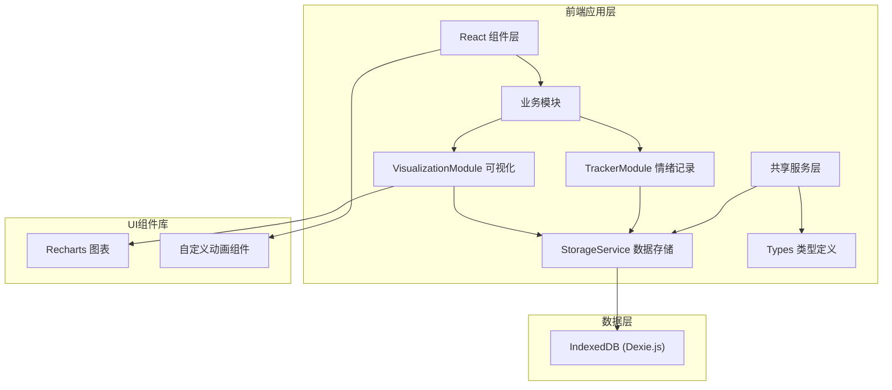

## 1. 架构设计



## 2. 技术栈说明

- **前端框架**：React 18 + TypeScript 5
- **构建工具**：Vite 5
- **数据存储**：IndexedDB + Dexie.js 3.x
- **图表库**：Recharts 2.x
- **工具库**：uuid 9.x
- **状态管理**：React Hooks (useState, useEffect, useMemo, useCallback)
- **样式方案**：CSS Modules + CSS Variables（避免Tailwind等第三方样式库，保持精简）

### 项目初始化
```bash
npm create vite@latest . -- --template react-ts
```

## 3. 目录结构

```
src/
├── main.tsx                    # React入口文件
├── App.tsx                     # 根组件
├── App.css                     # 全局样式
├── index.css                   # 基础样式和CSS变量
├── modules/
│   ├── tracker/
│   │   ├── TrackerModule.ts    # 情绪记录模块逻辑
│   │   ├── EmotionForm.tsx     # 情绪表单组件
│   │   └── EmotionCard.tsx     # 情绪卡片组件（带动画）
│   ├── visualization/
│   │   ├── VisualizationModule.ts  # 可视化模块逻辑
│   │   ├── CalendarHeatmap.tsx     # 日历热力图组件
│   │   ├── TrendChart.tsx          # 趋势图表组件
│   │   └── SuggestionCards.tsx     # 建议卡片组件
│   └── shared/
│       ├── types.ts            # 共享类型定义
│       └── storageService.ts   # IndexedDB数据服务
└── components/
    ├── GlassCard.tsx           # 毛玻璃卡片容器
    └── LoadingSpinner.tsx      # 加载动画组件
```

## 4. 数据模型

### 4.1 类型定义

```typescript
// src/modules/shared/types.ts

export type EmotionType = 'happy' | 'sad' | 'angry' | 'calm' | 'anxious' | 'surprised';

export interface EmotionConfig {
  emoji: string;
  color: string;
  label: string;
  intensity: number; // 情绪强度值 1-10
}

export interface EmotionRecord {
  id: string;
  emotion: EmotionType;
  tags: string[];
  note: string;
  timestamp: number;
  date: string; // YYYY-MM-DD 格式，用于索引
}

export interface DailyEmotionSummary {
  date: string;
  avgIntensity: number;
  records: EmotionRecord[];
  dominantEmotion: EmotionType;
}

export interface MoodTrend {
  date: string;
  avgIntensity: number;
  emotionCounts: Record<EmotionType, number>;
}

export interface Suggestion {
  id: string;
  title: string;
  description: string;
  icon: string;
  category: 'relaxation' | 'reflection' | 'activity';
}
```

### 4.2 IndexedDB Schema

使用Dexie.js定义数据库结构：

```typescript
// src/modules/shared/storageService.ts

import Dexie, { Table } from 'dexie';

export class EmotionDatabase extends Dexie {
  records!: Table<EmotionRecord, string>;

  constructor() {
    super('EmotionTrackerDB');
    this.version(1).stores({
      records: 'id, date, timestamp, emotion'
    });
  }
}
```

## 5. 核心模块接口

### 5.1 StorageService 接口

```typescript
interface IStorageService {
  addRecord(record: Omit<EmotionRecord, 'id'>): Promise<string>;
  getRecordsByDateRange(startDate: string, endDate: string): Promise<EmotionRecord[]>;
  getRecordsByMonth(year: number, month: number): Promise<EmotionRecord[]>;
  getRecordsByEmotion(emotion: EmotionType): Promise<EmotionRecord[]>;
  deleteRecord(id: string): Promise<void>;
  exportToJson(records: EmotionRecord[]): string;
}
```

### 5.2 TrackerModule 接口

```typescript
interface ITrackerModule {
  validateInput(emotion: EmotionType, tags: string[], note: string): ValidationResult;
  submitRecord(emotion: EmotionType, tags: string[], note: string): Promise<EmotionRecord>;
  getEmotionConfig(emotion: EmotionType): EmotionConfig;
  getAllEmotionConfigs(): Record<EmotionType, EmotionConfig>;
}
```

### 5.3 VisualizationModule 接口

```typescript
interface IVisualizationModule {
  getDailySummaries(year: number, month: number): Promise<DailyEmotionSummary[]>;
  getMoodTrends(days: number): Promise<MoodTrend[]>;
  generateSuggestions(records: EmotionRecord[]): Suggestion[];
  filterRecordsByEmotion(records: EmotionRecord[], emotion: EmotionType | null): EmotionRecord[];
}
```

## 6. 性能优化策略

### 6.1 渲染优化
- 使用 `useMemo` 缓存计算密集型数据（日历数据、趋势统计）
- 使用 `useCallback` 缓存事件处理函数，避免子组件不必要重渲染
- 长列表使用虚拟滚动（情绪记录历史）
- 图表数据更新使用 Recharts 内置动画，避免全量重绘

### 6.2 数据访问优化
- IndexedDB 查询使用日期索引，避免全表扫描
- 批量查询缓存结果，使用 React Query 或自定义缓存机制
- 大数据量分页加载

### 6.3 动画性能
- 优先使用 `transform` 和 `opacity` 属性触发 GPU 加速
- 使用 `will-change` 提示浏览器优化
- 避免在动画中触发重排（reflow）
- 使用 `requestAnimationFrame` 控制动画帧

## 7. 构建配置

### tsconfig.json
```json
{
  "compilerOptions": {
    "target": "ES2020",
    "useDefineForClassFields": true,
    "lib": ["ES2020", "DOM", "DOM.Iterable"],
    "module": "ESNext",
    "skipLibCheck": true,
    "moduleResolution": "bundler",
    "allowImportingTsExtensions": true,
    "resolveJsonModule": true,
    "isolatedModules": true,
    "noEmit": true,
    "jsx": "react-jsx",
    "strict": true,
    "noUnusedLocals": true,
    "noUnusedParameters": true,
    "noFallthroughCasesInSwitch": true,
    "baseUrl": ".",
    "paths": {
      "@/*": ["src/*"]
    }
  },
  "include": ["src"],
  "references": [{ "path": "./tsconfig.node.json" }]
}
```

### vite.config.ts
```typescript
import { defineConfig } from 'vite';
import react from '@vitejs/plugin-react';
import path from 'path';

export default defineConfig({
  plugins: [react()],
  resolve: {
    alias: {
      '@': path.resolve(__dirname, './src'),
    },
  },
  server: {
    port: 5173,
    open: true,
  },
});
```
