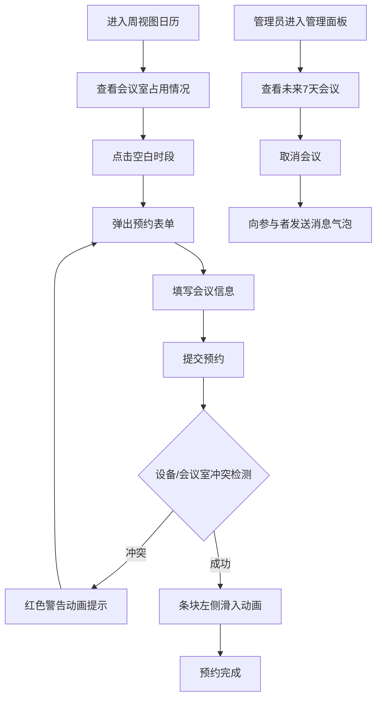

## 1. 产品概述

智能会议室预约与资源调度系统，解决公司内部会议室使用冲突、设备预约混乱及临时会议通知不及时的问题。面向企业员工和管理员，提供高效、直观的会议室与设备管理体验。

- 核心用户：公司员工（预约会议）、系统管理员（管理资源和会议）
- 产品价值：提升办公效率，减少资源浪费，优化协作体验

## 2. 核心功能

### 2.1 用户角色

| 角色 | 注册方式 | 核心权限 |
|------|---------|---------|
| 普通员工 | 系统账号 | 浏览日历、预约会议室、查看资源状态 |
| 管理员 | 系统账号 | 全部员工权限 + 管理设备状态、查看所有会议、导出/取消会议 |

### 2.2 功能模块

1. **周视图日历页**：按小时划分的周视图，会议室横向彩色条块，点击空白区域创建预约
2. **预约表单**：会议名称、参与人数、设备选择、备注、实时冲突检测
3. **资源管理面板**：会议室和设备列表，状态显示（空闲/占用/维护），维护模式开关
4. **管理员面板**：未来7天会议列表、CSV导出、手动取消会议、消息通知

### 2.3 页面详情

| 页面名称 | 模块名称 | 功能描述 |
|---------|---------|---------|
| 周视图日历 | 时间轴 | 周一至周日，8:00-20:00 按小时划分 |
| 周视图日历 | 会议室列 | 各会议室独立列，不同颜色区分 |
| 周视图日历 | 预约条块 | 已预约时段彩色条块，显示会议标题，左侧滑入动画 |
| 预约表单 | 表单字段 | 会议名称、参与人数、设备多选、备注 |
| 预约表单 | 冲突检测 | 提交时检查设备和会议室可用性，红色警告动画 |
| 资源管理面板 | 会议室列表 | 名称、容量、位置、状态 |
| 资源管理面板 | 设备列表 | 设备名、类型、状态、维护模式开关 |
| 资源管理面板 | 通知栏 | 设备状态变化时顶部淡入淡出提示 |
| 管理员面板 | 会议列表 | 未来7天会议表格，hover浅蓝渐变背景 |
| 管理员面板 | 操作按钮 | 导出CSV、取消会议（确认对话框） |
| 管理员面板 | 消息气泡 | 右下角弹出取消通知，点击跳转详情 |

## 3. 核心流程

用户登录后进入周视图日历 → 查看会议室可用性 → 点击空白时段弹出预约表单 → 填写信息并提交 → 系统检测冲突 → 预约成功（条块滑入动画）/ 冲突提示 → 管理员可在管理面板查看/取消会议 → 参与者收到消息气泡通知

## 4. 用户界面设计

### 4.1 设计风格

- **主色调**：深蓝 (#1e3a5f)、浅灰 (#f5f7fa)
- **辅助色**：浅蓝渐变 (#e8f0fe - #d4e4fc)、成功绿 (#52c41a)、警告红 (#ff4d4f)
- **按钮风格**：圆角 8px，主按钮深蓝填充，hover略浅
- **字体**：主字体 'Poppins'，中文回退 'PingFang SC' / 'Microsoft YaHei'
- **字体大小**：标题 18px/600，正文 14px/400，辅助文字 12px/400
- **布局风格**：侧边栏导航 + 主内容卡片式布局，顶栏用户信息
- **图标风格**：Lucide 线性图标，统一 16px/18px 尺寸
- **间距系统**：4/8/12/16/24/32 像素体系

### 4.2 页面设计概述

| 页面名称 | 模块名称 | UI元素 |
|---------|---------|--------|
| 主布局 | 侧边栏 | 圆角 16px，深蓝渐变背景，微光 hover 效果，4个导航项 |
| 主布局 | 顶栏 | 浅灰背景，搜索框，用户头像，通知铃铛 |
| 主布局 | 主内容区 | 圆角 12px 卡片，细分割线分隔，hover 轻微上浮 |
| 周视图日历 | 时间轴 | 浅灰背景，每小时高度 60px，当前时间红线指示 |
| 周视图日历 | 预约条块 | 对应会议室颜色，圆角 6px，半透明叠加，阴影柔和 |
| 预约表单 | 模态框 | 居中弹窗，背景模糊遮罩，表单输入框圆角 8px |
| 资源管理面板 | 设备卡片 | 1列布局，状态标签，开关按钮右对齐 |
| 管理员面板 | 数据表格 | 斑马纹基础 + hover浅蓝渐变，圆角边角 |
| 通用 | 通知提示 | 顶部固定，淡入淡出，成功绿/警告红边框 |
| 通用 | 消息气泡 | 右下角固定，从下往上滑入，5秒自动消失 |

### 4.3 响应式设计

- 桌面端优先设计（≥1280px）
- 平板端（≥768px）：侧边栏收起为图标导航
- 移动端（<768px）：简化日历为日视图，卡片单列布局

### 4.4 动画与交互

- **预约条块创建**：`slideInLeft` 0.3s ease-out
- **卡片 hover**：`translateY(-2px)` + `shadow-md` 过渡 0.2s
- **表格行 hover**：背景色从透明过渡到浅蓝渐变 0.25s
- **模态框弹出**：`scale(0.9)->scale(1)` + 淡入 0.2s
- **通知栏**：顶部 0.3s 淡入，停留 3s，淡出 0.3s
- **消息气泡**：从底部上移 40px -> 0 位置，停留 5s，淡出
