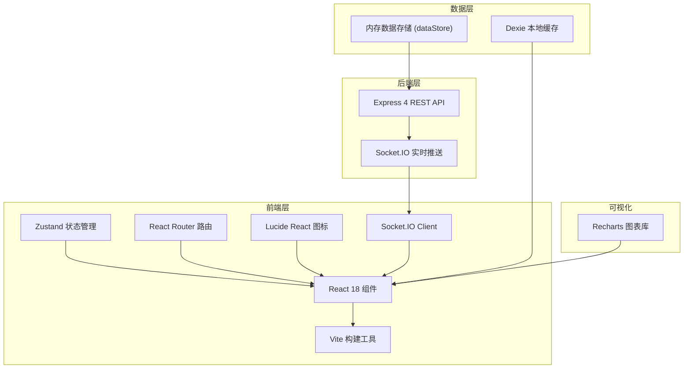
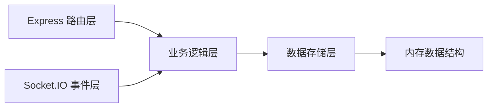
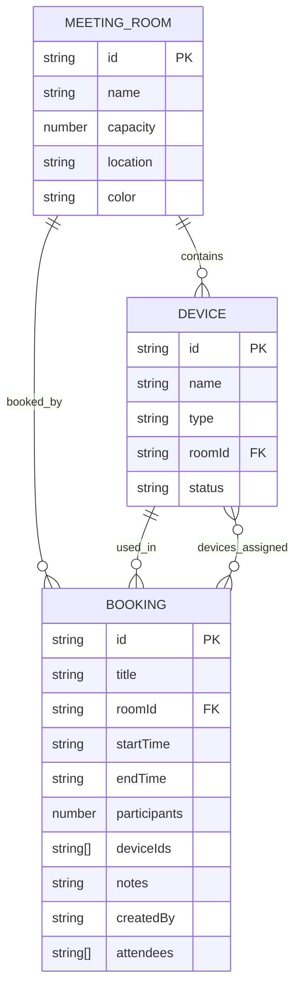

## 1. 架构设计



## 2. 技术说明

- **前端**：React 18 + TypeScript + Vite 5 + Zustand + TailwindCSS 3
- **后端**：Node.js + Express 4 + Socket.IO 4
- **状态管理**：Zustand（客户端状态），Socket.IO（服务端实时同步）
- **本地缓存**：Dexie（IndexedDB 封装）
- **图表可视化**：Recharts
- **唯一标识**：UUID

## 3. 路由定义

| 路由 | 用途 |
|------|------|
| / | 周视图日历（首页） |
| /resources | 资源管理面板 |
| /admin | 管理员面板 |

## 4. API 定义

### 4.1 类型定义

```typescript
interface MeetingRoom {
  id: string;
  name: string;
  capacity: number;
  location: string;
  color: string;
}

interface Device {
  id: string;
  name: string;
  type: 'projector' | 'whiteboard' | 'video_conference';
  roomId: string | null;
  status: 'idle' | 'occupied' | 'maintenance';
}

interface Booking {
  id: string;
  title: string;
  roomId: string;
  startTime: string;
  endTime: string;
  participants: number;
  deviceIds: string[];
  notes: string;
  createdBy: string;
  attendees: string[];
}

interface Notification {
  id: string;
  type: 'success' | 'error' | 'info' | 'warning';
  message: string;
  timestamp: number;
}
```

### 4.2 RESTful API 端点

| 方法 | 路径 | 描述 | 请求体 | 响应 |
|------|------|------|--------|------|
| GET | /api/rooms | 获取会议室列表 | - | MeetingRoom[] |
| GET | /api/devices | 获取设备列表 | - | Device[] |
| PUT | /api/devices/:id | 更新设备状态 | { status, roomId? } | Device |
| GET | /api/bookings | 获取预约列表 | query: { startDate, endDate } | Booking[] |
| POST | /api/bookings | 创建预约 | BookingCreateRequest | Booking \| { error: string } |
| DELETE | /api/bookings/:id | 取消预约 | - | { success: boolean } |
| GET | /api/bookings/export | 导出CSV | query: { days: 7 } | CSV文件流 |

### 4.3 Socket.IO 事件

| 事件名 | 方向 | 描述 | 数据 |
|--------|------|------|------|
| booking:created | Server→Client | 新预约创建 | Booking |
| booking:deleted | Server→Client | 预约被取消 | { id: string, reason?: string } |
| device:updated | Server→Client | 设备状态变更 | Device |
| notification | Server→Client | 通用通知 | Notification |

## 5. 服务端架构图



- **路由层**：处理 HTTP 请求参数校验和响应格式化
- **业务逻辑层**：预约冲突检测、设备可用性判断、通知广播
- **数据存储层**：操作内存中的会议室、设备、预约数据
- **Socket.IO 层**：实时事件广播，WebSocket 连接管理

## 6. 数据模型

### 6.1 ER 图



### 6.2 初始种子数据

- **会议室**：创新厅（10人，1F）、协作间（6人，2F）、董事会议室（20人，3F）、专注舱（4人，1F）、培训室（30人，B1）
- **设备**：每个会议室配备投影仪、白板，部分有视频会议系统
- **预约**：预设若干未来7天的示例预约数据
