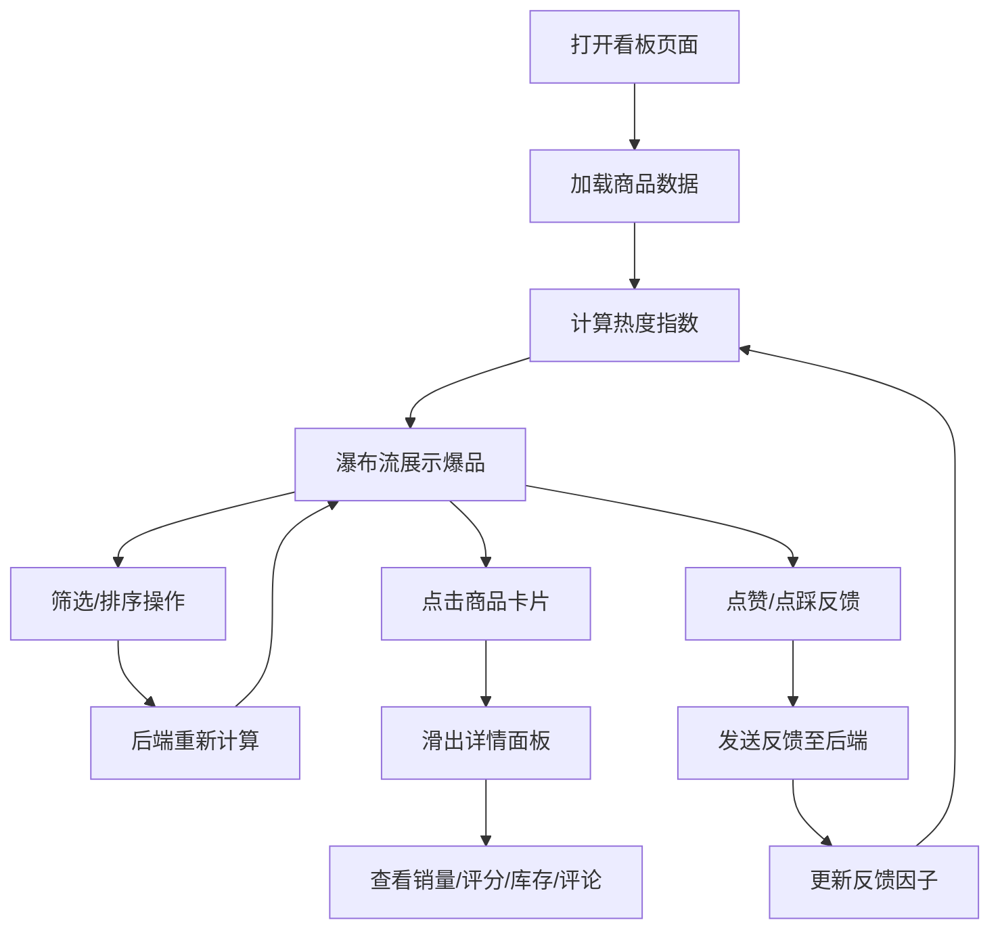

## 1. 产品概述

智能生鲜团购选品看板是一款面向采购团队的数据驱动决策工具，通过分析历史销量、用户评分和库存数据，动态推荐下一期爆品组合，帮助采购团队快速做出精准选品决策。

- 目标用户：生鲜团购平台采购团队
- 核心价值：基于多维度数据智能推荐爆品，提升选品效率与准确性
- 市场价值：降低滞销风险，提升库存周转率，增加团购活动收益

## 2. 核心功能

### 2.1 用户角色

| 角色 | 注册方式 | 核心权限 |
|------|----------|----------|
| 采购专员 | 系统账号 | 查看看板、筛选商品、提交反馈、查看详情 |

### 2.2 功能模块

1. **爆品看板主页**：瀑布流商品卡片展示、多维度筛选排序、实时热度排名
2. **商品详情面板**：销量趋势图、评分分布、库存预警、用户评论
3. **反馈互动系统**：点赞/点踩反馈、震动动画效果、实时影响排序

### 2.3 页面详情

| 页面名称 | 模块名称 | 功能描述 |
|----------|----------|----------|
| 爆品看板 | 筛选栏 | 品类筛选、价格区间、最低评分、排序开关 |
| 爆品看板 | 瀑布流卡片 | 商品名称、热度值、库存条、预估利润、反馈按钮 |
| 商品详情 | 侧边面板 | 销量折线图、评分直方图、库存预警、评论列表 |

## 3. 核心流程

采购专员打开看板后，系统自动加载爆品推荐列表。用户可通过筛选条件调整展示范围，点击商品查看详细数据，对感兴趣的商品点赞或点踩，系统实时根据反馈更新热度排名。

## 4. 用户界面设计

### 4.1 设计风格

- **主色调**：薄荷绿(#2ecc71) - 代表生鲜、新鲜、活力
- **辅助色**：深灰蓝(#2c3e50) - 代表商务、专业、稳重
- **卡片风格**：白色圆角矩形(16px圆角、2px灰色边框)，悬停上浮4px加深阴影，边框变薄荷绿
- **按钮风格**：圆角按钮，微妙弹簧效果动画
- **字体**：现代无衬线字体，清晰易读
- **布局风格**：卡片式瀑布流布局，最大宽度1200px居中显示

### 4.2 页面设计概述

| 页面名称 | 模块名称 | UI元素 |
|----------|----------|--------|
| 爆品看板 | 顶部筛选栏 | 下拉选择框、价格滑块、星级筛选、排序切换按钮 |
| 爆品看板 | 瀑布流网格 | 渐变商品图占位、商品名称标签、热度数值、库存进度条、利润百分比、点赞/点踩按钮 |
| 商品详情 | 侧边面板 | 30px圆角、阴影、从右滑入动画、销量折线图、评分直方图、库存预警条、评论滚动列表 |

### 4.3 响应式

- 桌面端(>768px)：多列瀑布流布局，筛选栏水平排列
- 移动端(≤768px)：单列布局，卡片宽度自适应，筛选栏垂直堆叠
- 触控优化：增大点击区域，优化手势交互

### 4.4 动效设计

- 卡片列表切换：淡入淡出过渡动画
- 卡片悬停：上浮4px + 阴影加深 + 边框变色 (0.3s transition)
- 反馈按钮：CSS关键帧震动动画 + 确认提示浮出
- 详情面板：右侧滑入(0.5s ease-out) + 30px圆角 + 阴影
- 库存预警：红色闪烁警告(库存<20%时)
- 按钮交互：微妙弹簧效果(spring easing)
