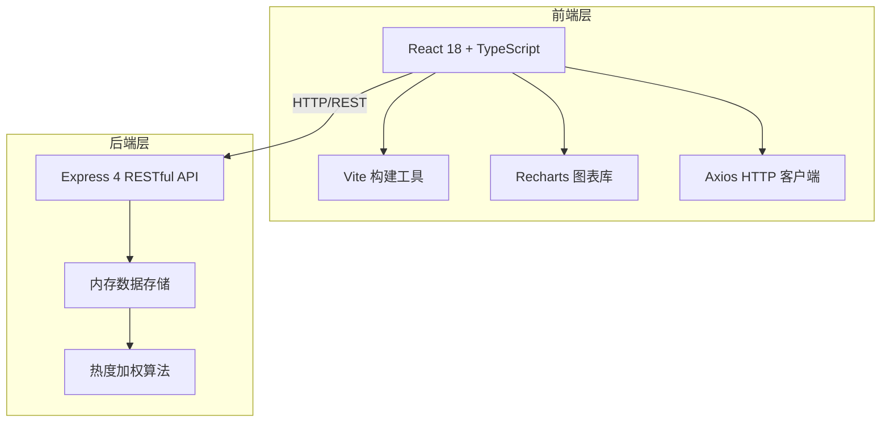
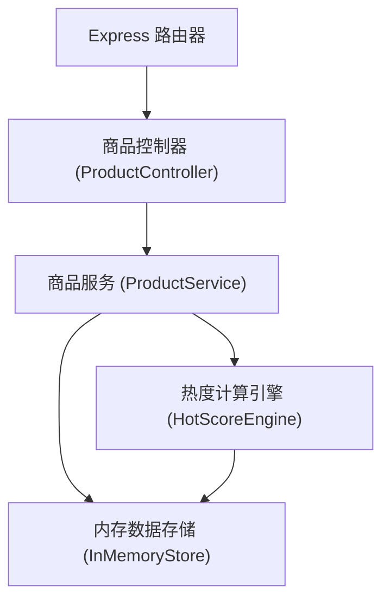
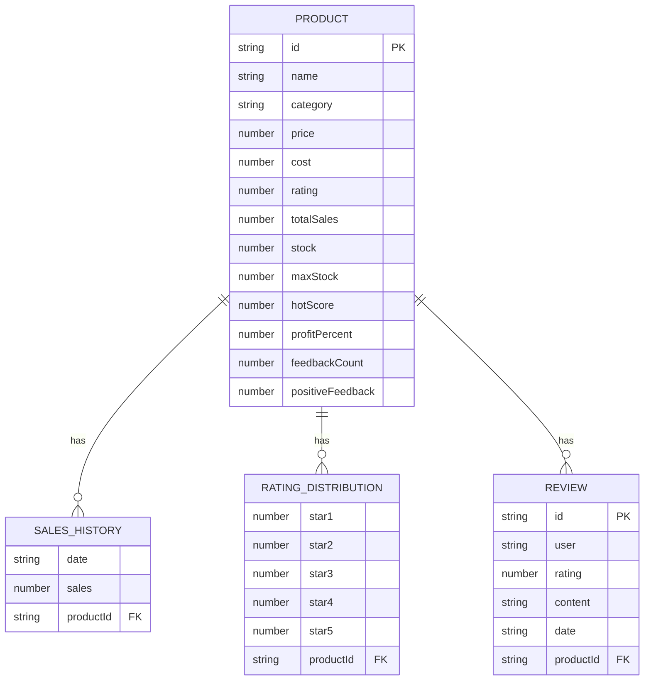

## 1. 架构设计



## 2. 技术描述

- **前端框架**：React 18 + TypeScript 5
- **构建工具**：Vite 5 + @vitejs/plugin-react
- **UI组件**：自定义CSS样式组件
- **图表库**：Recharts 2
- **HTTP客户端**：Axios 1
- **唯一ID生成**：uuid 9
- **后端框架**：Express 4
- **数据存储**：内存数组模拟
- **状态管理**：React Hooks (useState, useEffect)

## 3. 路由定义

| 路由 | 用途 |
|------|------|
| / | 爆品看板主页 |
| /product/:id | 商品详情（侧边面板） |

## 4. API 定义

### 4.1 获取商品列表

**GET /api/products**

请求参数：
```typescript
interface ProductQuery {
  category?: 'fruit' | 'vegetable' | 'meat' | 'seafood';
  minPrice?: number;
  maxPrice?: number;
  minRating?: number;
  sortBy?: 'hotScore' | 'sales' | 'rating' | 'profit';
  sortOrder?: 'asc' | 'desc';
}
```

响应数据：
```typescript
interface Product {
  id: string;
  name: string;
  category: 'fruit' | 'vegetable' | 'meat' | 'seafood';
  price: number;
  cost: number;
  rating: number;
  totalSales: number;
  stock: number;
  maxStock: number;
  hotScore: number;
  profitPercent: number;
  feedbackCount: number;
  positiveFeedback: number;
  salesHistory: { date: string; sales: number }[];
  ratingDistribution: number[];
  reviews: { id: string; user: string; rating: number; content: string; date: string }[];
}
```

### 4.2 提交反馈

**POST /api/products/:id/feedback**

请求参数：
```typescript
interface FeedbackRequest {
  type: 'like' | 'dislike';
}
```

响应数据：
```typescript
interface FeedbackResponse {
  success: boolean;
  productId: string;
  feedbackCount: number;
  positiveFeedback: number;
  hotScore: number;
}
```

### 4.3 获取商品详情

**GET /api/products/:id**

响应数据：同 Product 接口（完整数据）

## 5. 服务器架构图



## 6. 数据模型

### 6.1 数据模型定义



### 6.2 热度算法

热度指数加权计算：
- 销量因子 (30%)：归一化销量
- 评分因子 (25%)：平均评分 / 5
- 利润因子 (20%)：利润率归一化
- 库存因子 (15%)：库存健康度
- 反馈因子 (10%)：正反馈比例 × 反馈数归一化

### 6.3 初始数据

- 商品数量：50个以内（保证加载性能）
- 品类分布：水果、蔬菜、肉类、海鲜各若干
- 销量数据：过去30天每日销量
- 评分分布：1-5星分布
- 评论数据：每商品10条评论
