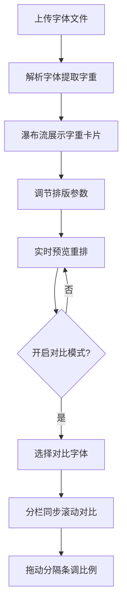

## 1. 产品概述

个人字体预览与排版测试工具，面向设计师和前端开发者，支持自定义字体文件上传、实时排版参数调节和多字体对比功能。

- 核心价值：让设计师和前端开发者快速预览字体在不同排版参数下的显示效果，对比多款字体的差异
- 目标用户：UI/UX设计师、前端开发工程师、字体爱好者

## 2. 核心功能

### 2.1 用户角色
| 角色 | 注册方式 | 核心权限 |
|------|----------|----------|
| 访客用户 | 无需注册 | 上传字体、调节排版参数、对比字体 |

### 2.2 功能模块
1. **字体上传模块**：拖拽/点击上传TTF/WOFF字体，自动解析字重信息，瀑布流展示字重卡片
2. **排版控制模块**：滑块调节字号、行高、字间距、段落宽度，中英文示例文本切换，自定义文本编辑
3. **字体对比模块**：分栏对比视图，同步滚动和缩放，可拖动分隔条调整宽度比例

### 2.3 页面详情
| 页面名称 | 模块名称 | 功能描述 |
|---------|---------|----------|
| 主页面 | 字体上传区 | 拖拽上传区域，支持TTF/WOFF格式，文件解析与字重提取 |
| 主页面 | 字重卡片网格 | 瀑布流布局，显示各字重预览段落，hover动效 |
| 主页面 | 排版控制面板 | 滑块/下拉菜单调节排版参数，实时显示CSS数值，中英文切换，文本编辑 |
| 主页面 | 对比视图 | 分栏对比，同步滚动，弹性阻尼分隔条，彩色字体标签 |

## 3. 核心流程

用户上传字体文件 → 系统解析字体并提取字重信息 → 以瀑布流卡片形式展示各字重预览 → 用户通过控制面板调节排版参数 → 所有预览实时重排更新 → 点击对比按钮开启分栏对比模式 → 选择对比字体 → 同步滚动查看差异 → 拖动分隔条调整宽度比例

## 4. 用户界面设计

### 4.1 设计风格
- 主色调：深邃蓝灰 (#1e2a38) 作为深色主题背景
- 背景色：柔和米白 (#faf8f5) 作为浅色区域背景
- 强调色：柠檬黄 (#ffd93d) 用于按钮和交互元素
- 卡片风格：圆角卡片，hover时上浮+阴影加深+边框渐变
- 字体：系统无衬线字体作为界面字体，预览区域使用用户上传字体
- 动画：所有过渡0.3秒ease-out缓动

### 4.2 页面设计概览
| 页面名称 | 模块名称 | UI元素 |
|---------|---------|--------|
| 主页面 | 上传区域 | 虚线边框，拖拽高亮，上传图标，提示文字 |
| 主页面 | 字重卡片 | 字体名称标签，预览段落，字重标识，hover动效 |
| 主页面 | 控制面板 | 滑块组件，数值显示，下拉菜单，文本编辑区，语言切换按钮 |
| 主页面 | 对比视图 | 左右分栏，顶部彩色标签，分隔条，同步滚动 |

### 4.3 响应式
- 桌面端（768px以上）：控制面板侧边展示，字重卡片多列瀑布流
- 移动端（768px以下）：控制面板折叠为悬浮按钮，点击弹出全屏菜单，字重卡片单列展示
- 触控优化：增大点击区域，支持触摸滑动

### 4.4 动效设计
- 卡片hover：0.3s ease-out 上浮4px + 阴影加深 + 边框颜色渐变
- 面板展开/收起：0.3s ease-out 高度过渡 + 透明度过渡
- 分隔条拖动：弹性阻尼效果，释放后回弹
- 排版参数变化：平滑过渡，避免突兀跳动
