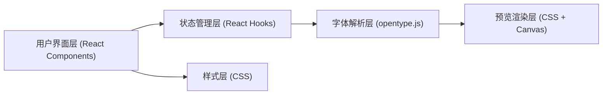

## 1. 架构设计



## 2. 技术说明

- 前端框架：React 18 + TypeScript
- 构建工具：Vite 5
- 字体解析：opentype.js
- 状态管理：React Hooks (useState, useRef, useEffect)
- 样式方案：原生CSS + CSS变量

## 3. 项目结构

```
src/
├── main.tsx              # React应用入口
├── App.tsx               # 主组件，状态管理
├── components/
│   ├── UploadPanel.tsx   # 字体上传组件
│   ├── EditorPanel.tsx   # 排版控制面板
│   └── PreviewArea.tsx   # 预览区域组件
└── styles.css            # 全局样式
```

## 4. 核心数据类型

```typescript
interface FontWeight {
  name: string;
  weight: number;
  style: string;
  fontUrl: string;
}

interface FontData {
  id: string;
  name: string;
  weights: FontWeight[];
  file: File;
}

interface TypographyParams {
  fontSize: number;
  lineHeight: number;
  letterSpacing: number;
  paragraphWidth: number;
  sampleText: string;
  language: 'zh' | 'en';
}

interface CompareState {
  enabled: boolean;
  compareFontId: string | null;
  splitRatio: number;
}
```

## 5. 性能优化策略

1. 使用 CSS `@font-face` 动态加载字体，避免重复解析
2. 排版参数变化使用 CSS transition 实现平滑过渡
3. 字体解析使用 Web Worker 或 requestIdleCallback 避免阻塞主线程
4. 瀑布流布局使用 CSS columns 或 grid 实现硬件加速
5. 对比模式同步滚动使用 requestAnimationFrame 节流

## 6. 组件职责划分

| 组件 | 职责 | Props |
|------|------|-------|
| App | 全局状态管理、组件组合 | - |
| UploadPanel | 文件拖拽上传、字体解析、字重提取 | onFontUpload: (font: FontData) => void |
| EditorPanel | 排版参数调节、文本编辑、语言切换 | params: TypographyParams, onChange: (params: TypographyParams) => void |
| PreviewArea | 字体预览渲染、对比模式、同步滚动 | fonts: FontData[], params: TypographyParams, compare: CompareState |
