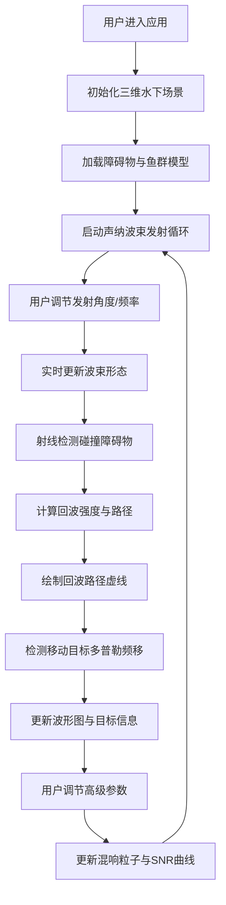

## 1. 产品概述

本产品是一个基于 WebGL 的水下声纳信号传播与物体探测三维可视化应用，旨在解决水下声纳探测实验难以直观展示声波反射、折射以及混响效果的教学与演示问题。面向海洋工程专业师生、声纳技术研究者及科普教育者，提供交互式、沉浸式的声纳物理现象模拟平台。

## 2. 核心功能

### 2.1 功能模块
1. **主场景视图**：三维水下场景渲染、声纳波束发射与传播模拟、障碍物与移动目标可视化
2. **声纳控制面板**：发射角度调节、频率调节、高级参数（混响衰减、噪声门限、PRF）控制
3. **数据可视化面板**：目标信息显示、回波波形图、信噪比曲线、俯视雷达图
4. **粒子效果系统**：悬浮颗粒混响模拟、回波路径可视化

### 2.2 页面详情
| 页面名称 | 模块名称 | 功能描述 |
|---------|---------|---------|
| 主应用页面 | 3D主场景 | 全屏幕三维水下环境，实时渲染声纳波束、障碍物、鱼群运动和回波路径 |
| 主应用页面 | 左侧控制面板 | 半透明磨砂玻璃样式，包含角度滑块、频率滑块、高级参数折叠面板 |
| 主应用页面 | 右上角雷达图 | 2D俯视图，显示目标方位角、距离刻度和声纳覆盖范围扇区 |
| 主应用页面 | 左下角波形图 | Canvas绘制的回波信号波形，实时叠加多普勒频移效果 |
| 主应用页面 | 右下角信噪比曲线 | 实时更新的SNR变化趋势图，响应参数调节 |

## 3. 核心流程

用户进入应用后，首先看到深海蓝黑渐变的三维水下场景，声纳探头位于场景中心向前发射锥形波束。用户通过左侧面板调节发射角度和频率，观察波束在水中传播、遇到障碍物产生反射回波的全过程。当波束扫描到移动的鱼群时，系统计算多普勒频移并在波形图中展示疏密变化。用户可展开高级参数面板调节混响衰减系数，观察背景粒子强度变化和信噪比曲线波动。

## 4. 用户界面设计

### 4.1 设计风格
- **主色调**：深海蓝黑渐变（#001a33 → #000510），辅以青色光晕（#00ffff）和警示红色（#ff3366）
- **按钮样式**：圆角矩形，半透明背景，hover时发光效果，滑块带微光晕
- **字体**：标题使用 Orbitron 科技感字体，正文使用 JetBrains Mono 等宽字体
- **布局风格**：非对称布局，主场景占70%屏幕，控件面板悬浮于边缘，磨砂玻璃效果（backdrop-filter: blur）
- **视觉元素**：光线透射纹理、漂浮粒子、扫描线效果、数据面板边框发光

### 4.2 页面设计概览
| 页面名称 | 模块名称 | UI元素 |
|---------|---------|--------|
| 主应用页面 | 3D主场景 | 全屏WebGL渲染，深海雾效，点光源模拟水下光束，半透明波束，虚线回波路径，颜色映射（红强蓝弱） |
| 主应用页面 | 左侧控制面板 | 宽度280px，半透明黑色背景（rgba(0,20,40,0.7)），毛玻璃模糊，标题发光，滑块带刻度，按钮悬停动画 |
| 主应用页面 | 雷达图 | 200x200px圆形Canvas，同心圆距离刻度，扇形扫描区，目标光点 |
| 主应用页面 | 波形图 | 宽度300px，高度120px，实时滚动波形，颜色渐变表示信号强度 |
| 主应用页面 | SNR曲线 | 宽度300px，高度100px，折线图带填充渐变，实时更新 |

### 4.3 响应式设计
- **桌面端（≥1280px）**：左侧面板280px固定宽度，雷达图右上角，波形图和SNR曲线左下角和右下角
- **iPad横屏（1024-1279px）**：左侧面板缩小至240px，数据面板适当缩小，保持3D场景主导
- **触摸优化**：滑块支持触摸拖动，提供更大的触摸热区，双击重置参数

### 4.4 3D场景指引
- **环境**：深海蓝黑渐变背景，指数雾效（FogExp2），密度0.015，营造深水压迫感
- **光照**：环境光（0.1强度白光）+ 两个点光源（青色光晕，模拟水下光束透射）
- **相机**：PerspectiveCamera，fov 60°，初始位置俯视声纳探头，支持鼠标轨道控制（OrbitControls）
- **构图**：声纳探头位于场景中心偏下，障碍物分布于中远距离，鱼群在波束范围内随机游动
- **交互**：鼠标拖拽旋转视角，滚轮缩放，右键平移；波束方向通过UI滑块精确控制
- **后期处理**：轻微Bloom效果增强光束和发光边缘，胶片颗粒模拟水下噪点
- **性能预算**：10000个混响粒子使用BufferGeometry + PointsMaterial，障碍物使用低面数模型，保持30fps以上
