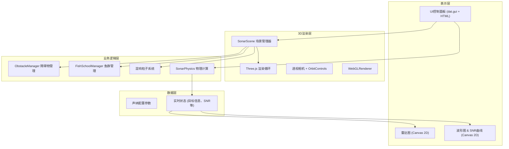

## 1. 架构设计



## 2. 技术选型

- **前端框架**: 原生 TypeScript + Three.js（无需React，保持轻量高性能）
- **构建工具**: Vite 5.x + TypeScript 插件
- **3D引擎**: three@0.160.x + @types/three
- **UI控件**: dat.gui + @types/dat.gui（轻量级参数控制面板）
- **2D可视化**: 原生 Canvas 2D API（雷达图、波形图、SNR曲线）
- **初始化方式**: npm create vite@latest 手动配置

## 3. 目录结构

```
auto48/
├── package.json
├── index.html
├── vite.config.js
├── tsconfig.json
└── src/
    ├── main.ts                    # 应用入口
    ├── scenes/
    │   └── SonarScene.ts          # 3D场景管理
    ├── utils/
    │   └── SonarPhysics.ts        # 声纳物理计算（纯函数）
    ├── managers/
    │   ├── ObstacleManager.ts     # 障碍物管理
    │   └── FishSchoolManager.ts   # 鱼群管理
    ├── renderers/
    │   ├── RadarRenderer.ts       # 雷达图渲染
    │   └── WaveformRenderer.ts    # 波形图渲染
    └── types/
        └── index.ts               # TypeScript 类型定义
```

## 4. 核心模块定义

### 4.1 类型定义

```typescript
// 声纳配置
interface SonarConfig {
  horizontalAngle: number;     // 水平角度 -90° ~ 90°
  verticalAngle: number;       // 俯仰角度 -45° ~ 45°
  frequency: number;           // 频率 5kHz ~ 50kHz
  reverbDecay: number;         // 混响衰减 0 ~ 1
  noiseThreshold: number;      // 噪声门限
  pulseRepetitionFreq: number; // 脉冲重复频率
}

// 检测目标
interface Target {
  id: string;
  position: THREE.Vector3;
  velocity: THREE.Vector3;
  distance: number;
  azimuth: number;
  elevation: number;
  echoStrength: number;
  dopplerShift: number;
  materialType: 'rock' | 'metal' | 'fish';
}

// 回波路径
interface EchoPath {
  start: THREE.Vector3;
  hitPoint: THREE.Vector3;
  end: THREE.Vector3;
  strength: number;
  timestamp: number;
}
```

### 4.2 SonarPhysics 核心函数

```typescript
// 声波传播衰减计算
function calculateAttenuation(distance: number, frequency: number): number

// 多普勒频移计算
function calculateDopplerShift(
  sourceFreq: number,
  targetVelocity: THREE.Vector3,
  waveDirection: THREE.Vector3,
  soundSpeed: number
): number

// 回波强度模拟
function calculateEchoStrength(
  distance: number,
  material: string,
  frequency: number,
  incidentAngle: number
): number

// 混响粒子生成
function generateReverbParticles(
  count: number,
  bounds: THREE.Box3,
  seed: number
): Array<{position: THREE.Vector3, intensity: number}>
```

### 4.3 性能优化策略

1. **粒子系统**: 使用 `BufferGeometry` + `PointsMaterial`，单次 draw call 渲染10000个粒子
2. **射线检测**: 使用 `Raycaster` 批量检测，限制每帧检测次数
3. **对象池**: 回波路径虚线使用对象池复用，避免频繁创建销毁
4. **帧率控制**: 物理计算与渲染分离，物理更新固定60Hz，渲染自适应
5. **LOD**: 远距离障碍物使用低面数模型
6. **视锥剔除**: 确保 Three.js 内置视锥剔除外，对粒子系统做区域可见性判断

## 5. 关键实现方案

### 5.1 声纳波束可视化
- 使用 `ConeGeometry` 创建半透明圆锥，`MeshBasicMaterial` 配合透明度动画
- 波束内使用 `LineSegments` 绘制扫描线，模拟声波扩散
- 通过 ShaderMaterial 实现距离衰减的颜色渐变（青色→透明）

### 5.2 回波路径渲染
- 碰撞点计算后，创建 `Line` 对象连接探头→碰撞点→探头
- 使用虚线样式（`LineDashedMaterial`），随时间推移淡出
- 颜色根据回波强度从红色（强）过渡到蓝色（弱）

### 5.3 多普勒效应波形图
- Canvas 2D 绘制滚动波形，使用 `requestAnimationFrame` 60fps 更新
- 根据多普勒频移调整波形频率：靠近时频率升高（波形变密），远离时降低（变疏）
- 使用渐变填充表现信号强度

### 5.4 混响粒子系统
- 10000个粒子使用 `BufferGeometry` 存储位置和颜色
- 顶点着色器实现粒子的微动效果（模拟悬浮颗粒）
- 片元着色器根据混响衰减系数调整粒子透明度
