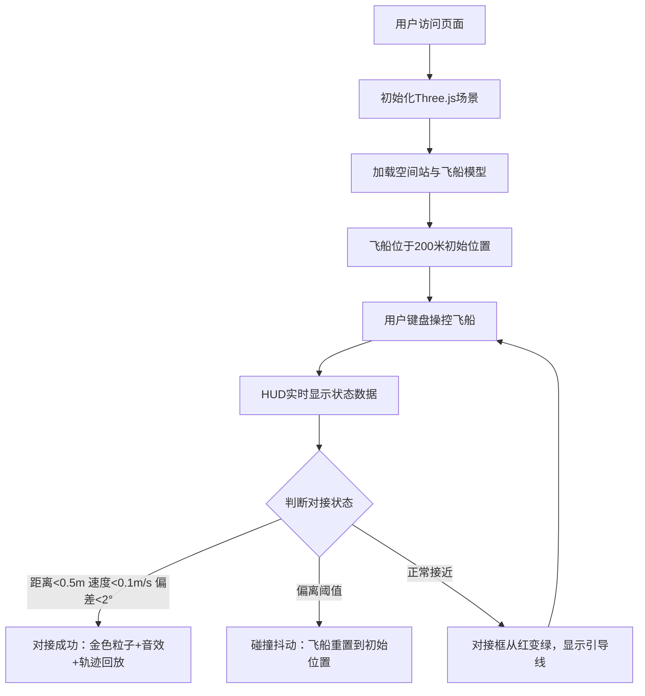

## 1. 产品概述

空间站对接物理模拟器是一款面向航天爱好者的交互式3D仿真应用，通过直观的可视化方式展示轨道力学原理和航天器对接操作的复杂性。用户可操控飞船从200米外完成与空间站的精准对接，体验六自由度姿态控制和RCS推进器操作。

- 核心价值：将抽象的轨道力学概念转化为可交互、可观察的沉浸式体验
- 目标用户：航天爱好者、学生、科普教育工作者

## 2. 核心功能

### 2.1 用户角色
| 角色 | 注册方式 | 核心权限 |
|------|---------|---------|
| 普通用户 | 无需注册，直接访问 | 完整操控飞船、观察对接过程、查看轨道数据 |

### 2.2 功能模块
1. **3D场景主视图**：空间站模型、飞船模型、太空背景、相机控制
2. **飞船操控系统**：六自由度姿态控制、RCS推进器粒子效果
3. **对接引导系统**：对接框、引导线、距离刻度、状态指示
4. **HUD数据面板**：距离、速度、姿态偏差实时显示
5. **轨道数据面板**：轨道参数展示、轨道俯视图绘制
6. **对接结果反馈**：成功粒子特效、音效、轨迹回放、碰撞重置

### 2.3 页面详情
| 页面名称 | 模块名称 | 功能描述 |
|---------|---------|---------|
| 主场景页 | 3D渲染区 | 全屏Three.js画布，WASD+鼠标旋转视角，实时渲染空间站和飞船 |
| 主场景页 | 顶部HUD | 毛玻璃面板，显示距离/相对速度/轴向偏差/翻滚角 |
| 主场景页 | 右下角轨道面板 | 半透明面板，显示轨道参数和2D轨道俯视图 |
| 主场景页 | 对接引导层 | 屏幕空间UI，对接框、箭头引导线、警告闪烁 |
| 主场景页 | 操作提示区 | 底部显示键盘操作说明 |

## 3. 核心流程

用户进入页面后，自动加载3D场景并初始化空间站与飞船位置。用户通过键盘操作飞船平移与姿态调整，HUD实时反馈状态。满足对接条件时触发成功动画与音效，偏离阈值则触发碰撞抖动并重置。

## 4. 用户界面设计

### 4.1 设计风格
- **主色调**：深空蓝(#0a0e27) → 深紫(#1a0b2e)径向渐变背景
- **强调色**：科技绿(#00ff9d)对接成功、警告红(#ff4757)超速警报、金色(#ffd700)成功粒子
- **HUD面板**：半透明毛玻璃效果(backdrop-filter: blur(12px))，白色文字带微光晕(text-shadow)
- **字体**：等宽科技风字体，数字使用Monospace增强仪表盘感
- **整体风格**：赛博朋克航天风，强调科技感与沉浸感

### 4.2 页面设计概览
| 页面名称 | 模块名称 | UI元素 |
|---------|---------|--------|
| 主场景页 | 3D场景 | 径向渐变背景+数百闪烁星星+高光材质空间站+发光对接口 |
| 主场景页 | 顶部HUD | 4个数据卡片横向排列，毛玻璃底色，数据实时刷新带数字跳动 |
| 主场景页 | 对接框 | 边角带距离刻度，红→绿渐变色，速度过快时红色闪烁 |
| 主场景页 | 轨道面板 | 右下角圆角面板，上方参数表格+下方Canvas轨道俯视图 |
| 主场景页 | 操作提示 | 底部居中半透明条，IJKL/UO/YH/WASD键位说明 |

### 4.3 响应式
- 桌面优先设计，画布自适应窗口大小
- HUD面板使用固定像素定位，避免小屏遮挡
- 移动端简化操作提示，保留核心数据显示

### 4.4 3D场景指导
- **环境**：纯太空背景，径向渐变从深蓝中心向紫色边缘过渡，500个随机大小亮度的闪烁星点
- **光照**：主方向光模拟太阳(强度1.2) + 环境光(强度0.3) + 对接口点光源(绿色光晕)
- **材质**：空间站和飞船使用MeshStandardMaterial(metalness: 0.9, roughness: 0.1)实现高光镜面感
- **相机**：PerspectiveCamera(fov: 60)，WASD平移+鼠标拖拽轨道控制，支持任意角度观察
- **粒子系统**：RCS推进器使用THREE.Points，每帧最多200个蓝色火焰粒子；成功烟花最多300个金色粒子；总粒子≤500
- **性能约束**：总三角面数<5万，每帧draw call<50，稳定60FPS
