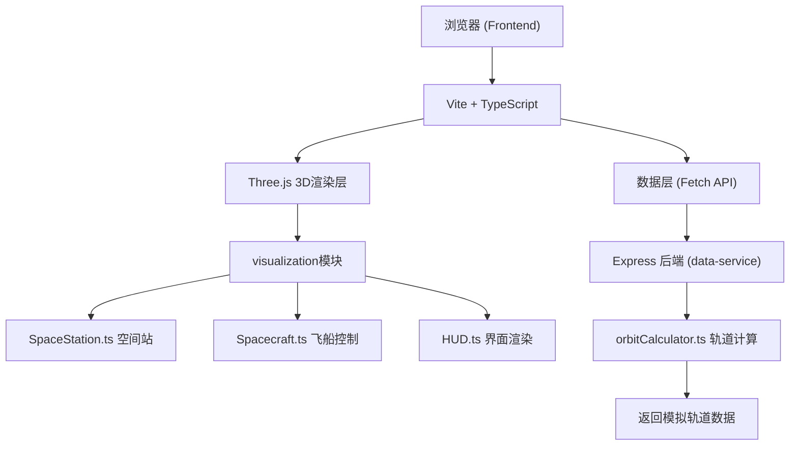

## 1. 架构设计



## 2. 技术说明

- **前端渲染**：Three.js r160 + TypeScript 5.x，原生ES模块
- **构建工具**：Vite 5.x（基础配置，无额外插件）
- **后端服务**：Express 4.x + TypeScript，提供轨道参数计算REST API
- **状态管理**：原生JavaScript类实例管理，无需额外状态库
- **音频处理**：Web Audio API生成对接成功上升音效

## 3. 文件结构定义

```
auto53/
├── package.json
├── vite.config.js
├── tsconfig.json
├── index.html
└── src/
    ├── main.ts                              # 应用入口
    ├── visualization/                       # 3D场景模块
    │   ├── SpaceStation.ts              # 空间站模型构建
    │   ├── Spacecraft.ts              # 飞船控制与粒子
    │   └── HUD.ts                     # HUD与UI渲染
    └── data-service/                       # 数据服务模块
        ├── server.ts                  # Express API服务器
        └── orbitCalculator.ts         # 轨道力学计算
```

## 4. API定义

### 4.1 GET /api/orbit-params
获取空间站当前模拟轨道参数

**响应Schema**:
```typescript
interface OrbitParams {
  altitude: number;          // 轨道高度(km)
  velocity: number;          // 轨道速度(km/s)
  inclination: number;       // 轨道倾角(度)
  raan: number;              // 升交点赤经(度)
  eccentricity: number;      // 偏心率
  argumentOfPerigee: number; // 近地点幅角(度)
  trueAnomaly: number;       // 真近点角(度)
  period: number;            // 轨道周期(分钟)
  orbitPath: { x: number; y: number }[]; // 俯视图路径点(100个)
}
```

### 4.2 GET /api/orbit-position
获取实时位置更新

**响应Schema**:
```typescript
interface OrbitPosition {
  stationPosition: { x: number; y: number };  // 空间站在轨道图中的位置
  spacecraftPosition: { x: number; y: number }; // 飞船在轨道图中的位置
  timestamp: number;
}
```

## 5. 核心类定义

### 5.1 SpaceStation 类
```typescript
class SpaceStation {
  constructor(scene: THREE.Scene)
  build(): void                     // 构建核心舱/实验舱/节点舱模型
  updateDockingStatus(status: DockingStatus): void
  getDockingPortWorldPosition(): THREE.Vector3
  getDockingPortWorldQuaternion(): THREE.Quaternion
}

enum DockingStatus { FAR, APPROACHING, NEAR, LOCKED }
```

### 5.2 Spacecraft 类
```typescript
class Spacecraft {
  constructor(scene: THREE.Scene)
  build(): void                     // 构建飞船和RCS推进器
  handleInput(input: InputState, delta: number): void
  update(delta: number): { position, velocity, attitude }
  emitRCSParticles(directions: RCSDirection[]): void
  resetPosition(): void
  triggerCollisionShake(): void
}

interface InputState {
  // 平移 IJKL
  translateI: boolean; translateK: boolean
  translateJ: boolean; translateL: boolean
  // 俯仰 U/O
  pitchU: boolean; pitchO: boolean
  // 偏航 Y/H
  yawY: boolean; yawH: boolean
}
```

### 5.3 HUD 类
```typescript
class HUD {
  constructor(container: HTMLElement)
  update(data: HUDData): void
  setDockingFrameColor(color: 'red' | 'yellow' | 'green'): void
  flashWarning(): void
  showDockingSuccess(trajectory: THREE.Vector3[]): Promise<void>
  updateOrbitView(params: OrbitParams, pos: OrbitPosition): void
}

interface HUDData {
  distance: number        // 0-200m
  velocity: number      // 0-2m/s
  axialDeviation: number // -5°~+5°
  rollAngle: number      // 翻滚角
}
```

### 5.4 orbitCalculator 模块
```typescript
export function calculateOrbitParams(semiMajorAxis: number): OrbitParams
export function generateOrbitPathPoints(count: number, params: OrbitParams): {x,y}[]
export function getPositionOnOrbit(timestamp: number, params: OrbitParams): {x,y}
```

## 6. 启动脚本说明

**package.json scripts**:
```json
{
  "scripts": {
    "dev": "concurrently \"npm run server\" \"npm run client\"",
    "client": "vite",
    "server": "ts-node src/data-service/server.ts",
    "build": "tsc && vite build"
  }
}
```

用户可通过 `npm install && npm run dev` 一次性启动后端API服务(端口3001)和前端Vite开发服务器(端口5173)。
