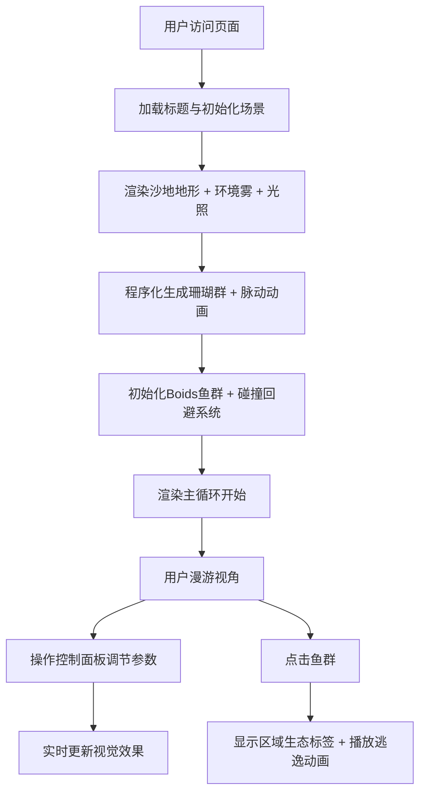

## 1. 产品概述

三维海底珊瑚礁生态模拟器，用户以潜水视角在程序化生成的珊瑚礁群中漫游，沉浸式观察珊瑚与鱼群的互动，并实时调节生态参数。

- 核心目的：提供可交互的深海生态可视化体验，帮助用户直观理解海洋环境参数对珊瑚礁生态的影响
- 目标用户：海洋生物爱好者、学生、教育工作者、科学展示场景

## 2. 核心功能

### 2.1 功能模块

1. **主场景模块**：深海3D场景渲染、程序化沙地地形、环境雾与光照
2. **珊瑚生成模块**：十几种程序化珊瑚（脑珊瑚、鹿角珊瑚、海葵等）、脉动水流动画、深度渐变着色
3. **鱼群模拟模块**：Boids算法鱼群游动、珊瑚碰撞回避、点击散开逃逸动画、区域生态信息展示
4. **控制面板模块**：洋流速度/光照强度/营养盐浓度滑块调节、实时参数反馈、磨砂玻璃UI
5. **性能监控模块**：右上角FPS显示、生态评分动画

### 2.2 页面详情

| 模块名称 | 子模块 | 功能描述 |
|----------|--------|----------|
| 主场景 | 沙地地形 | 起伏平面BufferGeometry、多层顶点位移噪声 |
| 主场景 | 环境雾 | 线性雾效根据深度密度变化、远景吞没效果 |
| 主场景 | 光照系统 | 方向光模拟阳光穿透、点光源模拟生物发光 |
| 主场景 | 洋流粒子 | 飘动粒子系统模拟水流方向 |
| 珊瑚生成 | 几何构造 | 圆环/锥体/球体组合程序化生成 |
| 珊瑚生成 | 脉动动画 | 正弦波缩放动画模拟水流呼吸感 |
| 珊瑚生成 | 深度着色 | 浅水荧光黄/粉 → 深水暗紫/蓝渐变 |
| 鱼群模拟 | Boids算法 | 分离/对齐/凝聚三原则 |
| 鱼群模拟 | 碰撞回避 | 珊瑚包围盒检测 + 转向力 |
| 鱼群模拟 | 逃逸动画 | 点击触发径向散开力、持续1.5秒 |
| 鱼群模拟 | 信息标签 | 珊瑚密度、水温、生态数据浮层 |
| 控制面板 | 参数滑块 | 洋流速度(0-5)、光照(0-100%)、营养盐(0-100%) |
| 控制面板 | 视觉反馈 | 调节时珊瑚饱和度/鱼速/雾浓度平滑过渡 |
| 性能监控 | FPS显示 | 实时帧率计数器 |
| 性能监控 | 生态评分 | 参数调节时评分数字跳动动画 |

## 3. 核心流程

## 4. 用户界面设计

### 4.1 设计风格

**色彩方案：**
- 主色：深海蓝 `#0a1628` → `#0f2847` 渐变背景
- 珊瑚色：浅水荧光黄 `#f9e076`、粉 `#ff8fa3`；深水暗紫 `#3d2c5c`、蓝 `#1e3a5f`
- 强调色：青色光晕 `#00e5ff`，用于UI边缘发光
- 文字色：半透明白 `rgba(255,255,255,0.9)`

**UI风格：**
- 控制面板：半透明磨砂玻璃 `backdrop-filter: blur(20px)`，背景 `rgba(10,30,60,0.35)`
- 边框：2px 渐变光晕（青色→蓝色），圆角16px
- 按钮：悬浮时外发光 `box-shadow: 0 0 20px rgba(0,229,255,0.5)`
- 滑块：自定义轨道渐变，thumb带发光环

**层次深度：**
- 前景珊瑚：清晰锐利，高饱和
- 中景：轻微模糊 `fog` 过渡
- 远景：强雾吞没，仅隐约可见轮廓

### 4.2 界面布局

| 区域 | 位置 | 元素 |
|------|------|------|
| 控制面板 | 左侧固定，宽度320px | 标题、3个参数滑块、参数数值、重置按钮 |
| FPS监控 | 右上角 | 帧率数字 + 生态评分圆环 |
| 鱼群信息 | 鱼群上方浮动 | 珊瑚密度、水温标签气泡 |
| 加载画面 | 全屏 | 深海渐变 + 标题文字淡入 |

### 4.3 响应式

- 桌面端为主：左侧固定面板，右侧全场景
- 小屏适配：控制面板切换为底部展开抽屉模式
- 触摸设备：双指缩放控制距离，单指拖拽旋转视角

### 4.4 3D场景指导

- **环境氛围**：深蓝水下散射光，caustics波纹投影（Shader实现），体积雾感
- **光照配置**：主方向光（白偏蓝，intensity 0.8）+ 半球光（天空蓝/海底暗蓝）+ 4-6个随机点光源模拟生物荧光
- **相机动画**：OrbitControls潜水视角，默认距地面8单位，俯角45°，支持平滑阻尼
- **构图要点**：珊瑚群分三层（前景大珊瑚、中景密集群、远景零散），鱼群高度分层
- **后处理**：Bloom泛光（珊瑚荧光色）+ 轻微色调映射，避免过曝
- **性能预算**：总三角形数 < 20万，draw call < 100，目标帧率 60FPS 下限 30FPS
