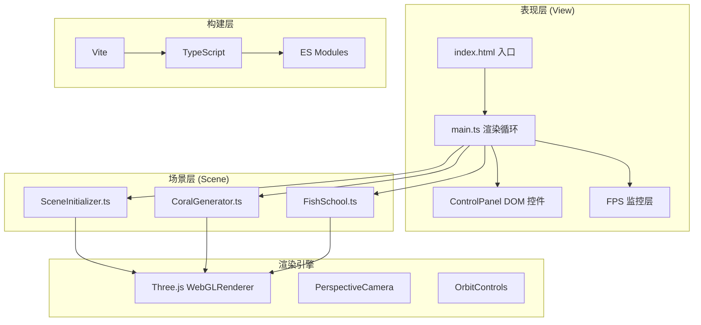

## 1. 架构设计



## 2. 技术描述

- **前端框架**：原生 TypeScript (非React/Vue，用户明确要求Three.js直接调用)
- **3D引擎**：Three.js ^0.160.0 + @types/three ^0.160.0
- **构建工具**：Vite ^5.0.0 + @types/node ^20.0.0
- **类型系统**：TypeScript ^5.3.0 严格模式
- **模块系统**：ES Modules (import/export)

## 3. 文件结构

```
auto55/
├── index.html                    全屏加载页面
├── package.json                  依赖与脚本
├── vite.config.js                Vite配置
├── tsconfig.json                 TS配置
└── src/
    ├── main.ts                   入口：场景/相机/渲染循环
    ├── SceneInitializer.ts       地形/雾/光照/洋流粒子
    ├── CoralGenerator.ts         珊瑚程序化生成 + 脉动
    ├── FishSchool.ts             Boids鱼群 + 碰撞 + 逃逸
    └── ControlPanel.ts           左侧DOM控制面板
```

## 4. 核心类与接口定义

### 4.1 CoralGenerator

```typescript
interface CoralData {
  mesh: THREE.Group;
  position: THREE.Vector3;
  boundingRadius: number;
  type: 'brain' | 'staghorn' | 'anemone' | 'plate' | 'tube' | 'mushroom' | ...;
  baseScale: number;
  phase: number;
  baseColor: THREE.Color;
}

class CoralGenerator {
  constructor(scene: THREE.Scene, count: number);
  generate(): CoralData[];
  update(time: number, params: EnvParams): void;
  getCoralPositions(): CoralData[];
}
```

### 4.2 FishSchool

```typescript
interface Fish {
  mesh: THREE.Group;
  position: THREE.Vector3;
  velocity: THREE.Vector3;
  acceleration: THREE.Vector3;
  scattering: boolean;
  scatterTimer: number;
}

interface RegionInfo {
  coralDensity: number;
  temperature: number;
  nutrients: number;
}

class FishSchool {
  constructor(scene: THREE.Scene, count: number, corals: CoralData[]);
  update(time: number, params: EnvParams): RegionInfo | null;
  handleClick(intersect: THREE.Intersection): void;
}
```

### 4.3 EnvironmentParams

```typescript
interface EnvParams {
  currentSpeed: number;      // 0-5 洋流速度
  lightIntensity: number;    // 0-100 光照强度%
  nutrientLevel: number;     // 0-100 营养盐浓度%
}
```

### 4.4 SceneInitializer

```typescript
class SceneInitializer {
  constructor(scene: THREE.Scene);
  createTerrain(): THREE.Mesh;
  setupFog(): THREE.FogExp2;
  setupLights(): void;
  createCurrentParticles(): THREE.Points;
  updateParticles(time: number, speed: number): void;
}
```

## 5. 关键算法实现

### 5.1 Boids 三大规则（单位质量假设）

```
分离(Separation)：对邻居内每条鱼施加反向推力，距离越近力越大
对齐(Alignment)：取邻居平均速度，差值作转向力
凝聚(Cohesion)：朝邻居质心加速
总加速度 = w1*分离 + w2*对齐 + w3*凝聚 + 避障力 + 边界力
```

### 5.2 珊瑚程序化几何

- 脑珊瑚：IcosahedronGeometry + 顶点噪声位移 + 皱纹法线扰动
- 鹿角珊瑚：多级分叉 CylinderGeometry，每级随机旋转缩小
- 海葵：TorusKnot + 触手 Cylinder 摆动动画
- 扇形珊瑚：LatheGeometry + 正弦波边缘

### 5.3 性能优化策略

- **InstanceMesh**：同类型珊瑚/鱼使用 InstancedMesh 批量绘制
- **LOD**：远景珊瑚降级为低多边形
- **视锥体剔除**：Three.js 内置 frustumCulled
- **GPU Skinning 替代**：ShaderMaterial 顶点脉动动画，避免JS逐顶点
- **碰撞检测**：空间哈希 / 距离阈值预筛选

### 5.4 珊瑚深度着色

```glsl
// vertex shader
varying float vDepth;
void main() {
  vDepth = (modelViewMatrix * vec4(position,1.0)).z;
  gl_Position = projectionMatrix * modelViewMatrix * vec4(position,1.0);
}
// fragment shader
uniform vec3 shallowColor; // 浅水色
uniform vec3 deepColor;    // 深水色
varying float vDepth;
void main() {
  float t = clamp(-vDepth / 50.0, 0.0, 1.0);
  vec3 color = mix(shallowColor, deepColor, t);
  gl_FragColor = vec4(color,1.0);
}
```
