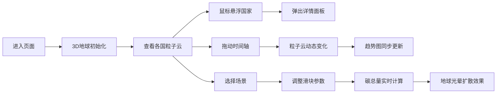

## 1. 产品概述

碳足迹互动可视化平台是一个科普类3D数据可视化项目，通过沉浸式的3D地球模型和交互界面，让用户直观了解全球各国人均碳排放数据，并模拟个人日常行为对碳足迹的影响。

- 核心目标：以可视化方式科普碳排放知识，提升公众环保意识
- 目标用户：学生、环保爱好者、科普教育工作者
- 产品价值：将抽象的碳排放数据转化为直观、可交互的3D视觉体验

## 2. 核心功能

### 2.1 用户角色
无角色区分，所有用户均可使用全部功能

### 2.2 功能模块
1. **3D地球粒子云**：各国碳排放强度可视化，鼠标悬浮详情面板
2. **场景模拟器**：交通、饮食、能源三大场景碳足迹模拟
3. **时间轴探索**：1990-2023年历史数据动态展示
4. **趋势图表**：全球碳排放趋势折线图

### 2.3 页面详情

| 页面名称 | 模块名称 | 功能描述 |
|---------|---------|---------|
| 主页面 | 3D地球画布 | 粒子云展示各国碳排放强度，鼠标交互 |
| 主页面 | 场景控制面板 | 交通/饮食/能源场景选择，滑块调整，实时碳总量 |
| 主页面 | 时间轴滑块 | 拖动切换年份，粒子云动态变化 |
| 主页面 | 趋势折线图 | 底部显示全球碳排放历史趋势 |

## 3. 核心流程

用户进入页面 → 查看3D地球展示当前年份全球碳排放分布 → 鼠标悬浮查看国家详情 → 拖动时间轴查看历史变化 → 选择场景调整滑块模拟个人碳足迹 → 查看实时碳总量变化和地球光晕效果

## 4. 用户界面设计

### 4.1 设计风格
- 主色调：蓝绿渐变（#00E5FF 到 #00FF88）
- 背景：深邃星空粒子动画，极简暗色风格
- 面板：毛玻璃半透明效果（backdrop-filter: blur）
- 交互元素：柔和光晕反馈，平滑过渡动画
- 字体：现代无衬线字体，清晰易读

### 4.2 页面设计概述

| 页面名称 | 模块名称 | UI元素 |
|---------|---------|-------|
| 主页面 | 3D地球 | 星空背景，粒子云，光晕动效 |
| 主页面 | 右侧面板 | 毛玻璃卡片，场景切换，滑块控件 |
| 主页面 | 时间轴 | 底部滑块，年份显示，光晕反馈 |
| 主页面 | 趋势图 | D3折线图，渐变填充，平滑动画 |

### 4.3 响应式
- 桌面端：左侧3D地球70%，右侧面板30%
- 移动端：垂直布局，地球占满宽度，面板置于下方
- 触控优化：增大点击区域

### 4.4 3D场景指引
- 环境：深邃星空背景，粒子点光源
- 光照：环境光 + 定向光模拟太阳光
- 相机：PerspectiveCamera，支持轨道控制器
- 粒子系统：每个国家5000-8000粒子，总计约15-24万粒子
- 交互：轨道旋转、缩放、悬浮检测
- 性能目标：30个国家粒子时帧率≥45fps
