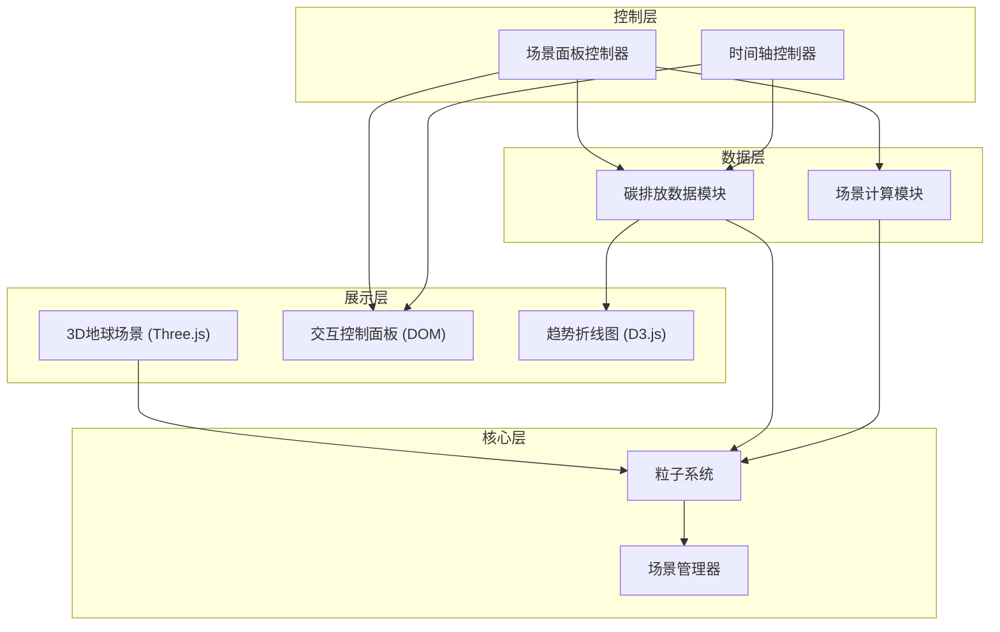

## 1. 架构设计



## 2. 技术描述

- 前端框架：原生 TypeScript + Vite
- 3D引擎：Three.js (three + @types/three
- 图表库：D3.js (d3 + @types/d3)
- 构建工具：Vite
- 样式：原生 CSS + CSS 变量
- 数据：内置 Mock 数据（各国碳排放历史数据）

## 3. 文件结构

```
src/
├── core/
│   ├── sceneManager.ts    # 场景、相机、渲染器、灯光初始化
│   └── earthParticles.ts # 地球粒子云管理
├── control/
│   ├── scenarioPanel.ts  # 场景选择和滑块UI
│   └── timeSlider.ts    # 时间轴滑块组件
├── data/
│   └── carbonData.ts    # 碳排放数据加载与计算
├── visualization/
│   └── chart.ts    # D3.js 折线图
└── main.ts            # 入口文件
```

## 4. 模块职责

| 模块 | 职责 | 对外接口 |
|-----|-----|---------|
| sceneManager | 初始化Three.js场景、相机、渲染器、灯光、星空背景 | init(), resize(), render() |
| earthParticles | 管理各国粒子云，根据数据更新粒子颜色/大小/位置 | init(), updateByYear(), updateByScenario(), onHover() |
| scenarioPanel | 生成场景选择和滑块UI，监听用户操作 | init(), onScenarioChange(), getTotalCarbon() |
| timeSlider | 时间轴控制，年份变化 | init(), getYear(), onYearChange() |
| carbonData | 加载历史数据，提供查询接口，场景计算 | getCountryData(), getGlobalTrend(), calculateScenario() |
| chart | D3折线图绘制与更新 | init(), update() |

## 5. 数据模型

### 5.1 国家碳排放数据
```typescript
interface CountryEmission {
  countryCode: string;
  countryName: string;
  lat: number;
  lng: number;
  emissions: Record<number, number>; // 年份 -> 人均碳排放 (吨CO2)
  population: number;
}
```

### 5.2 场景参数
```typescript
interface ScenarioParams {
  transport: {
    flightsPerMonth: number;
    carKmPerWeek: number;
  };
  diet: {
    redMeatPerWeek: number; // kg
    dairyPerWeek: number; // kg
  };
  energy: {
    electricityPerMonth: number; // kWh
  };
}
```

### 5.3 场景计算结果
```typescript
interface ScenarioResult {
  totalCarbon: number; // 年碳足迹 (吨CO2)
  breakdown: {
    transport: number;
    diet: number;
    energy: number;
  };
}
```

## 6. 性能优化策略

1. **粒子系统优化
   - 使用 BufferGeometry 批量渲染
   - 粒子着色器自定义着色
   - 视锥体剔除
   - 合理的粒子大小范围

2. **渲染优化
   - requestAnimationFrame 渲染循环
   - 按需渲染（交互时才更新粒子数据变更时才更新
   - 材质共享几何体复用

3. **数据优化
   - 年份数据预计算
   - 插值计算平滑过渡
   - 事件节流与防抖
