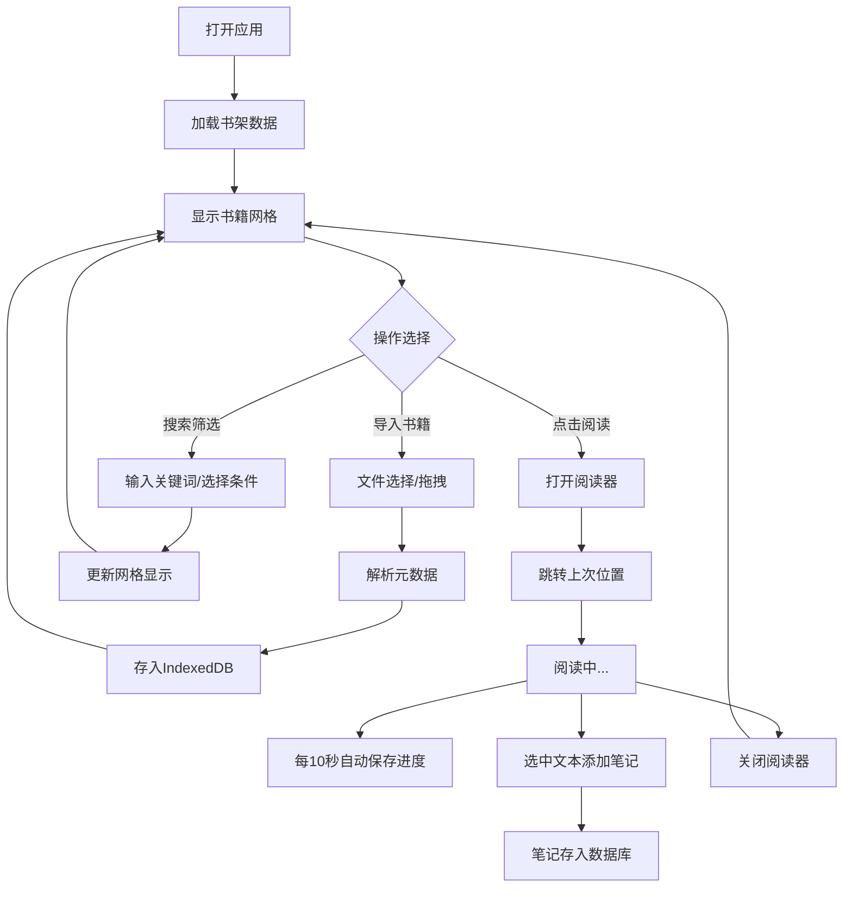

## 1. 产品概述
个人电子书库Web应用，帮助用户整理和浏览本地电子书文件，解决文件分散、元数据缺失、阅读进度难以管理的问题。
- 面向有大量本地电子书的阅读爱好者，提供一站式的书籍管理和阅读体验
- 打造温馨的木质书房阅读氛围，让数字阅读拥有纸质书的质感

## 2. 核心功能

### 2.1 用户角色
| 角色 | 注册方式 | 核心权限 |
|------|---------|---------|
| 普通用户 | 无需注册，本地使用 | 导入书籍、浏览书架、阅读书籍、管理笔记 |

### 2.2 功能模块
1. **书库导入页面**：文件选择器、拖拽上传、元数据解析进度
2. **书架浏览页面**：网格卡片展示、搜索筛选、进度条显示
3. **阅读器页面**：章节目录、正文渲染、阅读设置、笔记标注

### 2.3 页面详情
| 页面名称 | 模块名称 | 功能描述 |
|---------|---------|----------|
| 书架浏览页 | 顶部导航栏 | Logo展示、全局搜索框（毛玻璃背景）、导入按钮 |
| 书架浏览页 | 筛选工具栏 | 按作者筛选、按阅读状态筛选、按进度筛选 |
| 书架浏览页 | 书籍网格 | 4列卡片布局、封面缩略图、书名、进度条、悬停上浮效果 |
| 阅读器页面 | 章节目录 | 左侧目录树、当前章节高亮、点击跳转 |
| 阅读器页面 | 正文阅读区 | EPUB渲染为HTML、PDF用Canvas渲染、平滑滚动翻页 |
| 阅读器页面 | 阅读设置 | 字号调节、主题切换（护眼/深色/羊皮纸） |
| 阅读器页面 | 笔记面板 | 选中文本高亮、添加笔记、侧边栏汇总展示 |

## 3. 核心流程
用户打开应用 → 查看书架已有书籍 → 点击筛选/搜索快速定位 → 点击书籍卡片进入阅读 → 自动跳转上次阅读位置 → 阅读中自动保存进度 → 选中文本添加高亮笔记 → 关闭阅读器返回书架

## 4. 用户界面设计

### 4.1 设计风格
- **主色调**：胡桃木色 `#8B5E3C`、米白色 `#F5F0E8`
- **背景**：仿木纹渐变纹理，营造温馨书房氛围
- **卡片风格**：微拟物阴影，悬停时上浮效果（`transform: translateY(-4px)` + 阴影加深，过渡0.3s）
- **按钮风格**：圆角8px，木纹质感边框，点击涟漪效果
- **字体**：标题使用衬线字体（Playfair Display），正文使用易读无衬线字体（Noto Sans SC）
- **图标**：线性简约风格，与木质主题协调

### 4.2 页面设计概述
| 页面名称 | 模块名称 | UI元素 |
|---------|---------|--------|
| 书架浏览页 | 顶部导航栏 | 固定定位，毛玻璃模糊背景，Logo左侧，搜索框居中，导入按钮右侧 |
| 书架浏览页 | 筛选工具栏 | 下拉选择器样式统一，胡桃木色边框，米白背景 |
| 书架浏览页 | 书籍网格 | 每行4列，卡片间距16px，封面占比60%，底部显示书名和进度条 |
| 阅读器页面 | 双栏布局 | 左侧目录树25%宽度，右侧阅读区75%宽度 |
| 阅读器页面 | 章节切换动画 | 内容淡入+左滑过渡效果，时长0.3s |
| 阅读器页面 | 笔记面板 | 右侧抽屉式滑出，笔记卡片按颜色分类 |

### 4.3 响应式
- 桌面端（≥1024px）：书架4列，阅读器双栏布局
- 平板端（768px-1024px）：书架2列，阅读器双栏但目录可折叠
- 移动端（<768px）：书架1列，阅读器单栏，目录改为底部抽屉

### 4.4 动画与交互
- 卡片悬停：上浮4px，阴影加深，过渡0.3s
- 筛选结果：淡入动画，`opacity: 0 → 1`，错开延迟
- 章节切换：左滑+淡入，`transform: translateX(20px) → 0`
- 按钮点击：涟漪扩散效果，轻微缩放 `scale(0.95) → 1`
- 进度条更新：平滑过渡动画
