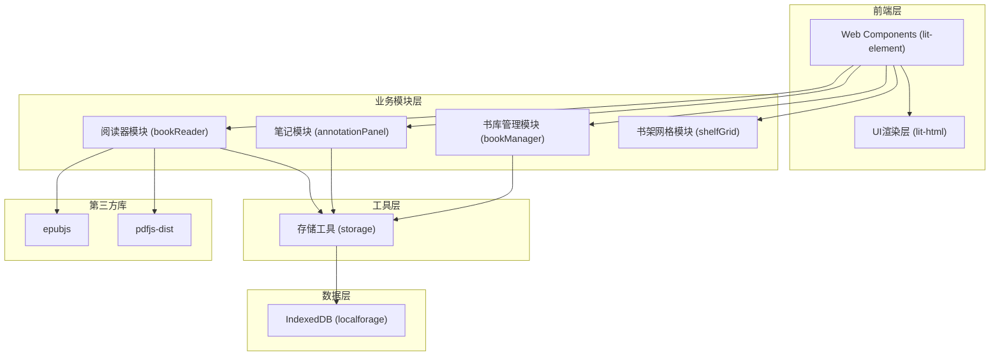
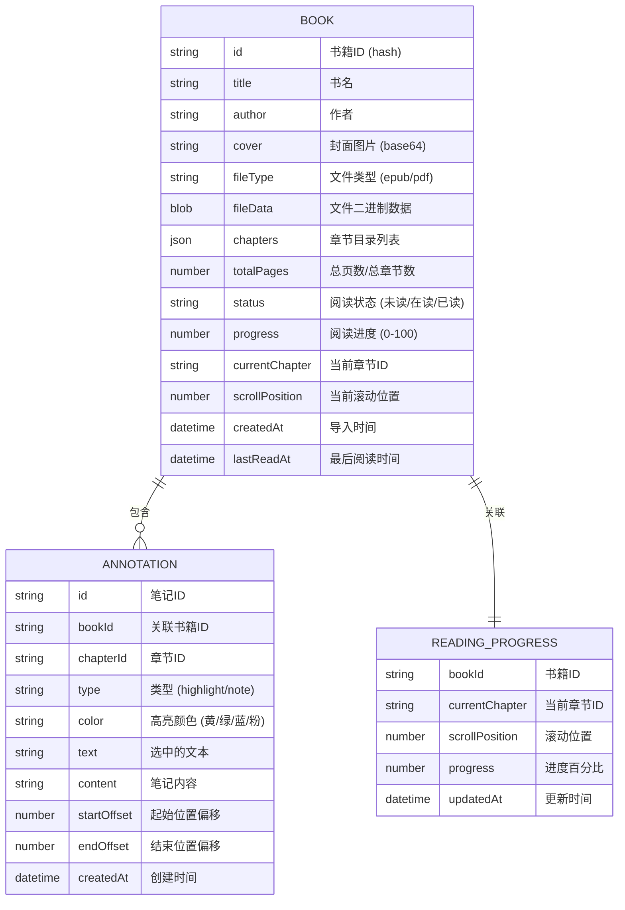

## 1. 架构设计



## 2. 技术描述
- **前端框架**：lit-element + lit-html（基于Web Components的轻量框架）
- **构建工具**：Vite + @vitejs/plugin-lit
- **语言**：TypeScript（严格模式，target ES2020）
- **电子书解析**：epubjs（EPUB渲染）、pdfjs-dist（PDF渲染）
- **数据存储**：localforage（IndexedDB封装）
- **无后端**：纯前端应用，数据全部存储在浏览器本地

## 3. 模块定义

| 模块 | 文件路径 | 职责 |
|-----|---------|-----|
| 阅读器模块 | `src/reader/bookReader.ts` | 渲染EPUB/PDF内容，管理章节切换、字号、主题，暴露阅读状态 |
| 笔记模块 | `src/reader/annotationPanel.ts` | 管理高亮和笔记CRUD，显示笔记侧边栏，与阅读器交互 |
| 书库管理模块 | `src/library/bookManager.ts` | 文件导入、元数据解析、IndexedDB持久化、数据查询筛选 |
| 书架网格模块 | `src/library/shelfGrid.ts` | 渲染网格卡片，管理筛选搜索状态，触发阅读事件 |
| 存储工具 | `src/utils/storage.ts` | 封装localforage，提供书籍和进度的通用CRUD |
| 类型声明 | `src/utils/localforage.d.ts` | 扩展localforage类型定义 |

## 4. 数据模型

### 4.1 数据模型定义



### 4.2 TypeScript 类型定义

```typescript
interface Book {
  id: string;
  title: string;
  author: string;
  cover: string;
  fileType: 'epub' | 'pdf';
  fileData: ArrayBuffer;
  chapters: Chapter[];
  totalPages: number;
  status: 'unread' | 'reading' | 'finished';
  progress: number;
  currentChapter: string;
  scrollPosition: number;
  createdAt: Date;
  lastReadAt: Date;
}

interface Chapter {
  id: string;
  title: string;
  href?: string;
  pageStart?: number;
  pageEnd?: number;
}

interface Annotation {
  id: string;
  bookId: string;
  chapterId: string;
  type: 'highlight' | 'note';
  color: 'yellow' | 'green' | 'blue' | 'pink';
  text: string;
  content: string;
  startOffset: number;
  endOffset: number;
  createdAt: Date;
}

interface ReadingProgress {
  bookId: string;
  currentChapter: string;
  scrollPosition: number;
  progress: number;
  updatedAt: Date;
}
```

## 5. 性能优化策略

### 5.1 书架加载性能
- 使用虚拟滚动：仅渲染可视区域的书籍卡片
- 封面图片懒加载：使用 `IntersectionObserver`
- 元数据预解析：导入时一次性解析完成，避免渲染时重复解析
- IndexedDB分页查询：按批次加载数据

### 5.2 翻页响应性能
- 预渲染相邻章节：阅读当前章节时预加载前后章节
- 使用 DocumentFragment 批量DOM操作
- CSS硬件加速：翻页动画使用 `transform` 和 `opacity`
- 文本内容缓存：已渲染章节内容缓存到内存

### 5.3 存储性能
- 文件分片存储：大文件分块存入IndexedDB
- 封面压缩：导入时生成缩略图（最大宽度300px）
- 读写分离：读取操作优先走内存缓存

## 6. 构建配置

### 6.1 package.json 依赖
```json
{
  "dependencies": {
    "lit-html": "^3.0.0",
    "lit-element": "^4.0.0",
    "pdfjs-dist": "^3.11.174",
    "epubjs": "^0.3.93",
    "localforage": "^1.10.0"
  },
  "devDependencies": {
    "vite": "^5.0.0",
    "@vitejs/plugin-lit": "^2.0.0",
    "typescript": "^5.3.0"
  }
}
```

### 6.2 vite.config.js 关键配置
- 使用 `@vitejs/plugin-lit` 处理 Web Components
- 配置 pdfjs worker 路径
- 优化资源打包策略
