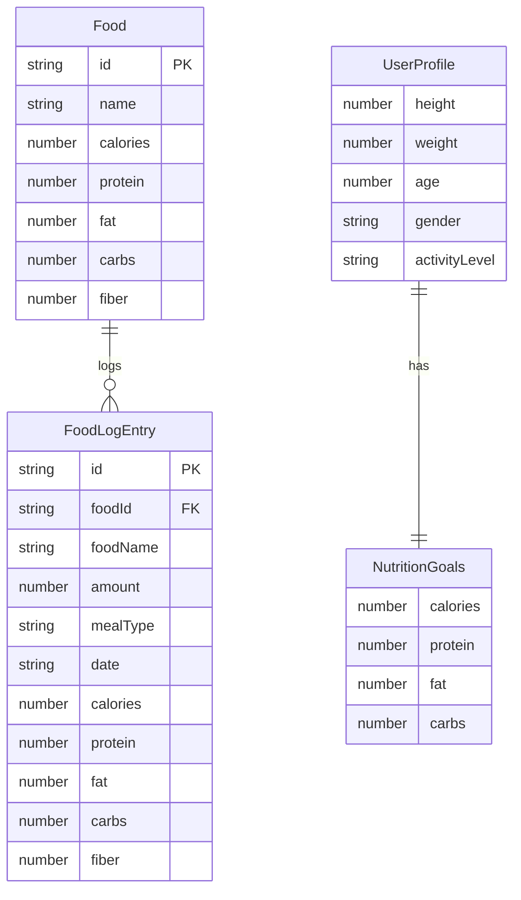

## 1. 架构设计

```mermaid
graph TB
    "前端 React+Vite" --> "Express RESTful API"
    "Express RESTful API" --> "内存数据存储(Map)"
    "前端 React+Vite" --> "Recharts 图表渲染"
    "前端 React+Vite" --> "Zustand 状态管理"
```

## 2. 技术说明

- 前端：React 18 + TypeScript + Tailwind CSS + Vite
- 初始化工具：vite-init（react-express-ts模板）
- 后端：Express 4 + TypeScript（ESM格式）
- 数据库：内存Map对象模拟，包含预置50+种食物种子数据
- 状态管理：Zustand
- 图表库：Recharts
- HTTP客户端：Axios

## 3. 路由定义

| 路由 | 用途 |
|------|------|
| / | 主页仪表盘，整合日志列表、营养图表和推荐卡片 |
| /search | 食物搜索与添加页面 |
| /settings | 个人信息与营养目标设置页面 |
| /report | 饮食报告与历史趋势页面 |

## 4. API定义

### 4.1 食物相关API

```typescript
interface Food {
  id: string;
  name: string;
  calories: number;      // kcal per 100g
  protein: number;       // g per 100g
  fat: number;           // g per 100g
  carbs: number;         // g per 100g
  fiber: number;         // g per 100g
}

interface FoodLogEntry {
  id: string;
  foodId: string;
  foodName: string;
  amount: number;        // grams
  mealType: "breakfast" | "lunch" | "dinner" | "snack";
  date: string;          // YYYY-MM-DD
  calories: number;
  protein: number;
  fat: number;
  carbs: number;
  fiber: number;
}

// GET /api/foods/search?q=鸡胸肉 - 搜索食物
// Request: query string q
// Response: Food[]

// GET /api/foods - 获取所有食物
// Response: Food[]

// POST /api/foods/log - 添加饮食记录
// Request: { foodId, amount, mealType, date }
// Response: FoodLogEntry

// GET /api/foods/log?date=2024-01-01 - 获取某日饮食日志
// Response: FoodLogEntry[]

// DELETE /api/foods/log/:id - 删除饮食记录
// Response: { success: boolean }

// PUT /api/foods/log/:id - 编辑饮食记录
// Request: { amount, mealType }
// Response: FoodLogEntry
```

### 4.2 用户目标API

```typescript
interface UserProfile {
  height: number;        // cm
  weight: number;        // kg
  age: number;
  gender: "male" | "female";
  activityLevel: "sedentary" | "light" | "moderate" | "active" | "veryActive";
}

interface NutritionGoals {
  calories: number;      // kcal
  protein: number;       // g
  fat: number;           // g
  carbs: number;         // g
}

// GET /api/profile - 获取用户信息
// Response: UserProfile | null

// POST /api/profile - 保存用户信息
// Request: UserProfile
// Response: UserProfile & { bmr: number, tdee: number }

// GET /api/goals - 获取营养目标
// Response: NutritionGoals

// PUT /api/goals - 更新营养目标
// Request: NutritionGoals
// Response: NutritionGoals
```

## 5. 服务器架构图

```mermaid
graph LR
    "Router (foodRoutes)" --> "Controller (server.ts)"
    "Controller (server.ts)" --> "Data Store (内存Map)"
```

## 6. 数据模型

### 6.1 数据模型定义



### 6.2 数据定义

内存数据结构：
- `foods: Map<string, Food>` — 预置50+种常见食物
- `foodLogs: Map<string, FoodLogEntry>` — 饮食日志
- `userProfile: UserProfile | null` — 用户信息
- `nutritionGoals: NutritionGoals | null` — 营养目标

种子数据包含：鸡胸肉、三文鱼、牛排、猪里脊、鸡蛋、牛奶、酸奶、豆腐、米饭、面条、面包、燕麦、红薯、西兰花、菠菜、胡萝卜、番茄、黄瓜、苹果、香蕉、橙子、葡萄、西瓜、草莓、蓝莓、核桃、杏仁、花生、橄榄油、黄油、奶酪、鳕鱼、虾、鸡腿肉、鸭胸、羊肉、玉米、土豆、南瓜、蘑菇、洋葱、青椒、卷心菜、芹菜、茄子、豆角、豆浆、全麦面包、糙米等50+种食物。
