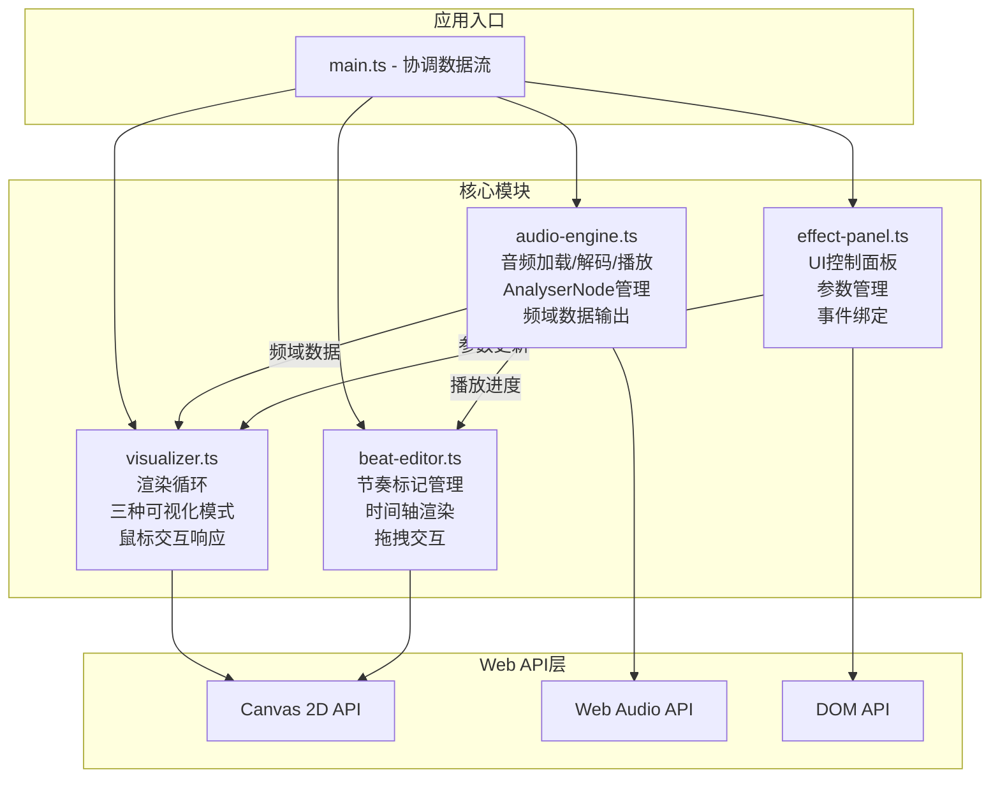
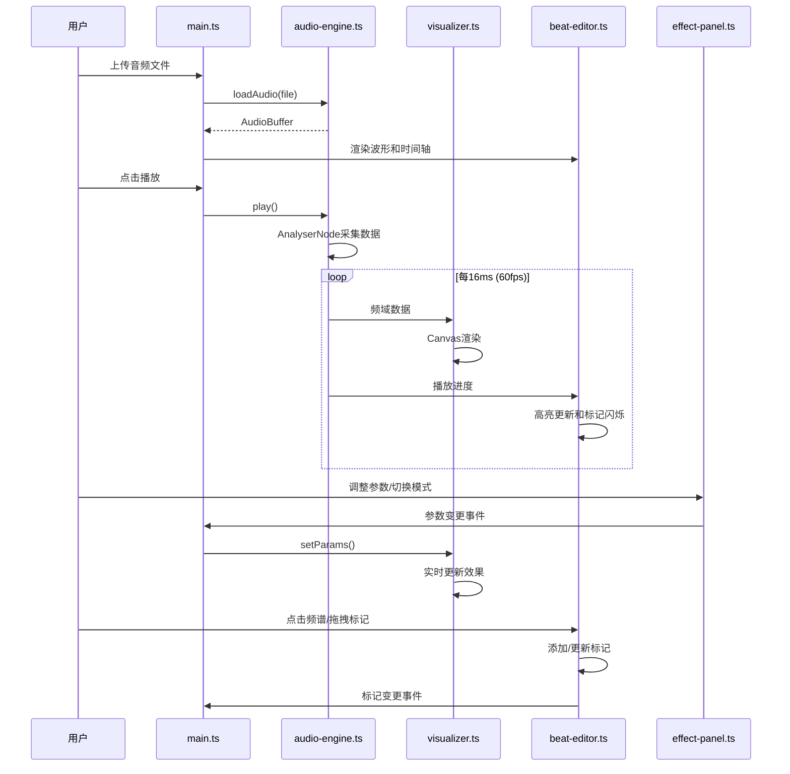

## 1. 架构设计



## 2. 技术描述

- **前端**: TypeScript + 原生 Web API (Canvas 2D + Web Audio API)
- **构建工具**: Vite 5.x
- **不使用框架**: 无 React/Vue，保持轻量
- **依赖**: typescript, vite

## 3. 文件结构

```
d:\P\tasks\auto60\
├── package.json          # 项目配置与依赖
├── index.html            # 入口HTML
├── tsconfig.json         # TypeScript严格模式配置
├── vite.config.js        # Vite配置
├── .trae/
│   └── documents/
│       ├── prd.md
│       └── architecture.md
└── src/
    ├── main.ts           # 应用入口，协调所有模块
    ├── audio-engine.ts   # 音频引擎模块
    ├── visualizer.ts     # 可视化渲染模块
    ├── beat-editor.ts    # 节奏标记编辑模块
    └── effect-panel.ts   # 特效控制面板模块
```

## 4. 模块接口定义

### 4.1 AudioEngine 接口

```typescript
interface AudioEngine {
  loadAudio(file: File): Promise<AudioBuffer>;
  play(): void;
  pause(): void;
  stop(): void;
  getFrequencyData(): Uint8Array;
  getTimeDomainData(): Uint8Array;
  getCurrentTime(): number;
  getDuration(): number;
  isPlaying(): boolean;
  onProgress(callback: (time: number) => void): void;
}
```

### 4.2 Visualizer 接口

```typescript
type VisualMode = 'particles' | 'bars' | 'stars';

interface VisualizerParams {
  mode: VisualMode;
  particleCount: number;
  particleSize: number;
  speed: number;
  colorSaturation: number;
  backgroundBlur: number;
}

interface Visualizer {
  setParams(params: Partial<VisualizerParams>): void;
  start(): void;
  stop(): void;
  handleMouseMove(x: number, y: number): void;
  handleMouseClick(x: number, y: number): void;
}
```

### 4.3 BeatEditor 接口

```typescript
interface BeatMarker {
  id: string;
  time: number;
  color: 'red' | 'blue' | 'green' | null;
}

interface BeatEditor {
  addMarker(time: number): void;
  removeMarker(id: string): void;
  updateMarkerTime(id: string, time: number): void;
  setMarkerColor(id: string, color: 'red' | 'blue' | 'green'): void;
  getMarkers(): BeatMarker[];
  setZoom(level: number): void;
  setOffset(time: number): void;
}
```

### 4.4 EffectPanel 接口

```typescript
interface EffectPanel {
  onParamChange(callback: (params: Partial<VisualizerParams>) => void): void;
  onModeChange(callback: (mode: VisualMode) => void): void;
  updateParams(params: Partial<VisualizerParams>): void;
}
```

## 5. 数据流



## 6. 性能优化策略

| 优化点 | 技术方案 |
|--------|----------|
| 音频解码 | 使用 decodeAudioData 异步解码，避免阻塞主线程 |
| 渲染循环 | requestAnimationFrame + 时间差计算，保证稳定60fps |
| 粒子系统 | 对象池模式复用粒子实例，避免频繁GC |
| Canvas渲染 | 分层Canvas（背景层+动画层+UI层），离屏缓存静态波形 |
| 数据传递 | TypedArray 直接引用，避免数据拷贝 |
| 事件节流 | 鼠标移动事件使用 requestAnimationFrame 节流 |
| 响应式 | ResizeObserver 监听尺寸变化，debounce重绘 |
