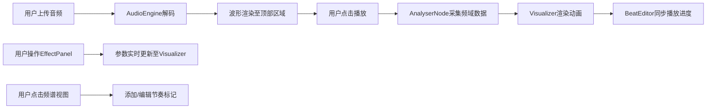

## 1. 产品概述

交互式音乐可视化与音效编辑器，让用户上传音频后实时渲染动态粒子/条纹/星空动画，并支持节奏标记编辑和视觉特效调整。面向音乐爱好者、视觉设计师和创意工作者，提供沉浸式的音画交互体验。

## 2. 核心功能

### 2.1 功能模块

1. **音频上传与解码模块**：支持本地音频文件上传，即时解码显示波形
2. **实时可视化模块**：三种可视化模式（粒子/条纹/星空），基于Web Audio API频域数据驱动
3. **节奏标记编辑模块**：手动添加/拖拽节奏标记，支持颜色标签和时间轴缩放
4. **特效控制面板模块**：参数实时调整，模式切换带过渡动画

### 2.3 页面详情

| 页面名称 | 模块名称 | 功能描述 |
|-----------|-------------|---------------------|
| 主应用页 | 音频上传区 | 拖拽或点击上传音频文件，显示文件信息 |
| 主应用页 | 波形显示区 | 顶部显示解码后的音频波形，播放时进度高亮跟随 |
| 主应用页 | 可视化画布 | 中央Canvas区域渲染粒子/条纹/星空动画 |
| 主应用页 | 节奏标记区 | 频谱视图上添加/拖拽/删除节奏标记，支持颜色标签 |
| 主应用页 | 时间轴控制区 | 时间码显示，缩放/拖动控制，播放进度 |
| 主应用页 | 特效控制面板 | 模式切换按钮，参数滑块组，实时响应 |

## 3. 核心流程

## 4. 用户界面设计

### 4.1 设计风格
- **主色调**：深色背景 (#0a0a0f)，霓虹渐变色系（洋红 #ff0080、青蓝 #00ffff、黄绿 #aaff00）
- **按钮样式**：圆角8px，发光边框，悬停时脉冲动画，0.25s过渡
- **字体**：Orbitron (标题) + JetBrains Mono (数据显示)，数字使用等宽字体
- **布局风格**：毛玻璃面板（backdrop-filter: blur(12px)），半透明背景，分层阴影
- **动效风格**：所有交互0.2-0.3秒平滑过渡，模式切换淡入淡出

### 4.2 页面设计概述

| 页面名称 | 模块名称 | UI Elements |
|-----------|-------------|-------------|
| 主应用页 | 整体布局 | 垂直三段式：顶部波形+时间码、中部可视化画布、底部控制面板 |
| 主应用页 | 波形显示区 | 静态波形灰显，播放区域霓虹高亮，进度线发光 |
| 主应用页 | 可视化画布 | 渐变色流动背景，粒子/条纹/星空动画，鼠标交互涟漪 |
| 主应用页 | 节奏标记区 | 垂直虚线标记，可拖拽，颜色标签，节拍闪烁 |
| 主应用页 | 时间轴控制区 | 缩放滑块，拖动按钮，时间码显示（HH:MM:SS.ms） |
| 主应用页 | 特效控制面板 | 模式切换按钮组，参数滑块（发光轨道），毛玻璃卡片 |

### 4.3 响应性
- 桌面端优先设计，Canvas自适应容器尺寸
- 控制面板固定底部宽度100%，参数滑块自适应排列
- 最小支持宽度1024px，低于此宽度显示提示

### 4.4 性能要求
- 全程60fps渲染，使用requestAnimationFrame
- 音频解码使用Web Worker避免阻塞主线程
- 粒子系统使用对象池管理，避免频繁GC
- Canvas分层渲染，静态元素离屏缓存
