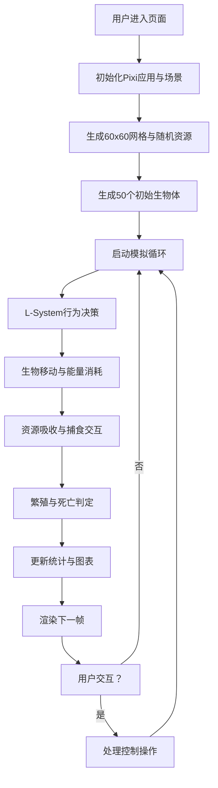

## 1. 产品概述

基于群体智能算法的虚拟生态系统模拟器，用户可观察不同生物种群在资源有限环境下的演化与竞争过程。
- 核心目的：通过可视化模拟展示遗传算法、L-System行为规则与生态竞争的动态演化过程
- 目标用户：对人工智能、人工生命、生态模拟感兴趣的学习者和研究者

## 2. 核心功能

### 2.1 功能模块

1. **生态世界模拟**：60x60网格地图，三种资源动态分布与再生，时间步进驱动世界演化
2. **生物遗传系统**：6基因位点生物体，繁殖时基因变异，表现型（颜色、速度、攻击等）由基因决定
3. **捕食与竞争**：基于L-System的行为规则，捕食、逃跑、资源吸收、能量消耗机制
4. **实时数据统计**：种群数量、平均能量、资源总量等实时统计与趋势折线图
5. **模拟控制面板**：开始/暂停、速度调节、重置功能
6. **后端API服务**：保存生态配置和统计报告的RESTful API

### 2.2 页面详情

| 页面名称 | 模块名称 | 功能描述 |
|---------|---------|---------|
| 主模拟页面 | 生态画布 | 全屏Canvas渲染60x60网格世界、资源块、生物体及特效 |
| 主模拟页面 | 左侧控制面板 | 控制按钮、速度滑块、实时数据统计 |
| 主模拟页面 | 统计图表 | 底部实时折线图展示种群数量和平均能量趋势 |
| 主模拟页面 | 生物信息弹窗 | 点击生物显示详细属性 |

## 3. 核心流程

用户打开页面后，生态系统自动初始化并开始运行。用户可通过控制面板调整模拟速度、暂停/继续、重置世界。系统每帧更新生物状态、资源再生和统计数据。

## 4. 用户界面设计

### 4.1 设计风格
- **主色调**：深蓝色渐变背景（顶部暗蓝 #0a1628 → 底部墨绿 #0d2818）
- **资源色**：植物绿 #4ade80、矿物金 #fbbf24、水源蓝 #38bdf8
- **毛玻璃效果**：控制面板背景模糊10px，半透明深色
- **发光效果**：资源方块柔和发光，生物移动拖尾渐变

### 4.2 页面设计概览

| 页面名称 | 模块名称 | UI元素 |
|---------|---------|-------|
| 主模拟页面 | 生态画布 | 网格线、资源方块（带发光）、三角形生物（带拖尾）、战斗特效 |
| 主模拟页面 | 控制面板 | 开始/暂停按钮、速度滑块(0.5x/1x/2x/4x)、重置按钮、统计数据 |
| 主模拟页面 | 统计图表 | 绿色渐变填充折线图，浅灰网格线，透明背景 |
| 主模拟页面 | 生物弹窗 | 基因型、能量值、速度等属性展示 |

### 4.3 响应式设计
- 桌面端：左侧控制面板 + 右侧画布
- 移动端（<768px）：底部横条控制面板，地图自适应缩放

### 4.4 动画与交互
- 按钮hover：轻微上浮 + 加深阴影，过渡0.2s
- 生物移动：尾部残影拖拽0.3秒渐隐
- 繁殖：子代缩放动画从0到1
- 战斗：0.2秒闪烁红色圆圈特效
- 整体帧率：稳定30FPS以上
