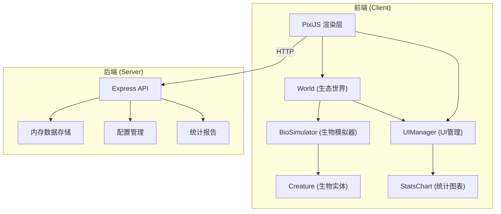

## 1. 架构设计



## 2. 技术选型

- **前端框架**：TypeScript + PixiJS@7 + Vite
- **后端框架**：Express@4
- **数据存储**：内存对象模拟
- **唯一ID**：uuid
- **构建工具**：Vite 5.x
- **类型系统**：TypeScript 5.x（严格模式）

## 3. 项目结构

```
auto61/
├── package.json
├── index.html
├── vite.config.js
├── tsconfig.json
├── server/
│   └── index.js          # Express API 服务
└── src/
    ├── main.ts           # 应用入口
    ├── ecosystem/
    │   ├── World.ts      # 生态世界管理
    │   ├── BioSimulator.ts # 生物模拟器
    │   └── Creature.ts   # 生物实体类
    └── ui/
        ├── UIManager.ts  # UI管理器
        └── StatsChart.ts # 统计图表
```

## 4. API 定义

### 4.1 保存生态配置

**POST** `/api/configs`

请求体：
```typescript
interface EcoConfig {
  id: string;
  name: string;
  gridSize: number;
  initialCreatures: number;
  resourceDensity: { plant: number; mineral: number; water: number };
  createdAt: number;
}
```

响应：`{ success: boolean; id: string }`

### 4.2 获取配置列表

**GET** `/api/configs`

响应：`EcoConfig[]`

### 4.3 保存统计报告

**POST** `/api/reports`

请求体：
```typescript
interface StatsReport {
  id: string;
  configId: string;
  timestamp: number;
  duration: number;
  populationHistory: number[];
  energyHistory: number[];
  finalPopulation: number;
  avgEnergy: number;
}
```

响应：`{ success: boolean; id: string }`

### 4.4 获取报告列表

**GET** `/api/reports`

响应：`StatsReport[]`

## 5. 核心数据模型

### 5.1 基因型 (Genotype)

```typescript
interface Genotype {
  attack: number;      // 攻击力 0-100
  defense: number;     // 防御力 0-100
  speed: number;       // 速度 1-5
  perception: number;  // 感知半径 20-100
  breedThreshold: number; // 繁殖阈值 50-200
  colorPreference: number; // 颜色偏好 0-360
}
```

### 5.2 生物实体 (Creature)

```typescript
interface Creature {
  id: string;
  x: number;
  y: number;
  energy: number;
  genotype: Genotype;
  age: number;
  isAlive: boolean;
  trail: { x: number; y: number; alpha: number }[];
}
```

### 5.3 资源 (Resource)

```typescript
interface Resource {
  id: string;
  x: number;
  y: number;
  type: 'plant' | 'mineral' | 'water';
  value: number;
}
```

### 5.4 世界状态 (WorldState)

```typescript
interface WorldState {
  gridSize: number;
  creatures: Creature[];
  resources: Resource[];
  tick: number;
  isPaused: boolean;
  speed: number;
}
```

## 6. 空间哈希优化

使用空间哈希网格加速生物感知计算：
- 将世界划分为固定大小的网格单元
- 每个生物只需要检查相邻网格单元的生物
- 时间复杂度从 O(n²) 优化到 O(n)

## 7. 对象池设计

- 粒子特效对象池：复用战斗闪烁、繁殖动画等特效实例
- 拖尾轨迹对象池：复用生物移动尾部残影
- 资源块对象池：复用资源渲染精灵

## 8. 性能指标

- 目标帧率：30FPS+
- 最大生物体：200
- 最大资源块：300
- 内存控制：避免频繁GC，使用对象池
