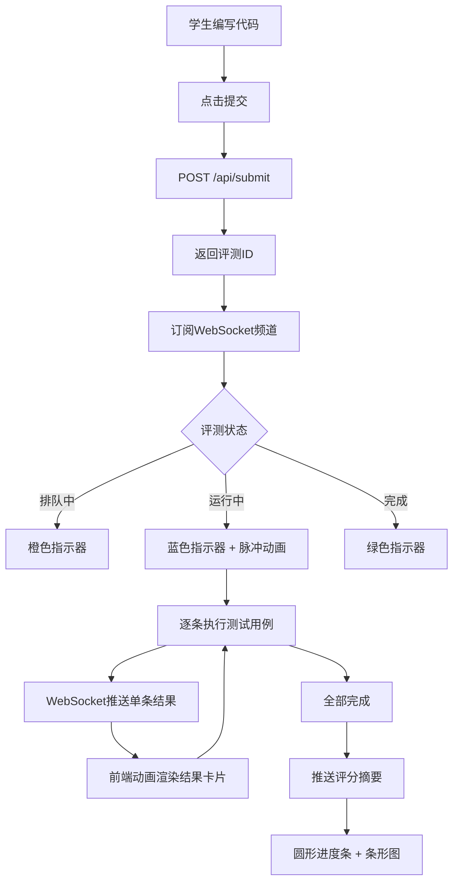

## 1. 产品概述

在线编程作业评测平台，面向在线教育场景，允许学生提交代码并自动执行沙箱评测，实时反馈测试用例结果、代码差异对比和评分统计。目标用户为在线教育平台的教师和学生，核心价值在于自动化批改、即时反馈和可视化分析。

## 2. 核心功能

### 2.1 用户角色

| 角色 | 使用方式 | 核心权限 |
|------|----------|----------|
| 学生 | 直接使用 | 提交代码、查看评测报告 |
| 教师 | 后台配置 | 查看评测结果、管理测试用例（本版本模拟） |

### 2.2 功能模块

1. **编程作业评测页**：代码编辑器、提交面板、实时评测进度、测试用例反馈、代码差异对比、评分统计摘要

### 2.3 页面详情

| 页面名称 | 模块名称 | 功能描述 |
|----------|----------|----------|
| 评测主页 | 代码编辑器区 | CodeMirror语法高亮编辑器，支持JavaScript/Python切换，实时表单验证，提交按钮 |
| 评测主页 | 提交面板 | 提交代码至后端，返回评测ID后订阅WebSocket获取实时进度（排队→运行→完成），状态指示器带颜色和脉冲动画 |
| 评测主页 | 测试用例列表 | 逐条卡片展示用例名称、输入、预期输出、实际输出、通过/失败图标，失败卡片自动展开错误详情，背景渐变浅红，带抖动反馈 |
| 评测主页 | 代码差异对比 | 学生代码与参考答案差异视图，添加行绿色、删除行红色、修改行黄色，每行差异旁显示修改建议气泡 |
| 评测主页 | 评分统计摘要 | 圆形进度条动画显示百分制分数，通过数/总数、耗时(ms)、内存(KB)，条形图展示各用例耗时分布 |

## 3. 核心流程

学生打开评测页面 → 在代码编辑器中编写代码 → 点击提交按钮 → 前端POST /api/submit → 后端返回评测ID → 前端订阅WebSocket频道 → 后端将评测任务加入队列 → 沙箱逐条执行测试用例 → WebSocket实时推送每条用例结果 → 前端逐条动画展示结果卡片 → 全部完成后推送评分摘要 → 前端展示圆形进度条分数和耗时分布图

## 4. 用户界面设计

### 4.1 设计风格

- 主色调：浅蓝灰(#f0f4f8)配深蓝(#1a3a5c)和珊瑚色(#ff7f50)
- 按钮风格：圆角按钮，提交按钮为珊瑚色，功能按钮为深蓝色
- 字体：Segoe UI系统字体族
- 布局风格：左右两栏布局，左侧60%代码编辑器，右侧40%评测面板，中间可拖拽分隔条
- 图标风格：Lucide线性图标
- 状态指示：橙色排队、蓝色运行（脉冲）、绿色完成

### 4.2 页面设计概览

| 页面名称 | 模块名称 | UI元素 |
|----------|----------|--------|
| 评测主页 | 代码编辑器区 | CodeMirror编辑器、语言切换下拉、提交按钮（珊瑚色）、输入验证提示 |
| 评测主页 | 评测进度条 | 三段状态指示器（排队/运行/完成），运行时脉冲动画 |
| 评测主页 | 测试用例卡片 | 单行卡片、通过绿勾/失败红叉、失败自动展开、浅红渐变背景、抖动动画 |
| 评测主页 | 代码差异面板 | 三色高亮（绿/红/黄）、修改建议气泡 |
| 评测主页 | 评分摘要卡片 | 圆形进度条（0→分数动画）、统计数据、条形图（各用例耗时） |

### 4.3 响应式设计

- 桌面端：左右两栏布局，可拖拽分隔条
- 平板端（≤1024px）：切换为上下滚动布局，编辑器在上、评测面板在下
- 评测结果卡片逐条从底部滑入（stagger动画，间隔0.15秒）

### 4.4 动画设计

- 结果卡片入场：从底部向上滑入，每条间隔0.15秒
- 失败用例卡片：轻微抖动反馈
- 圆形进度条：从0旋转到最终分数
- 运行中状态：脉冲加载动画
- 分隔条拖拽：实时调整左右栏宽度
