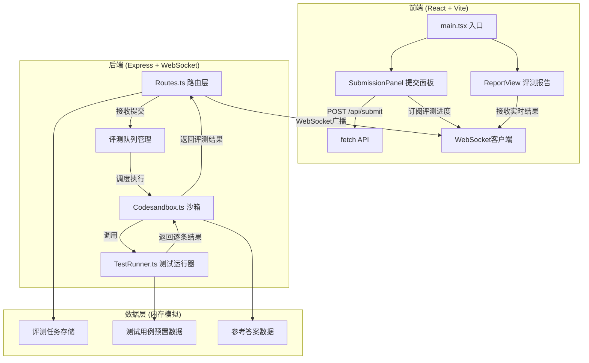
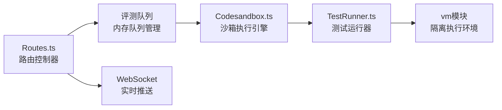
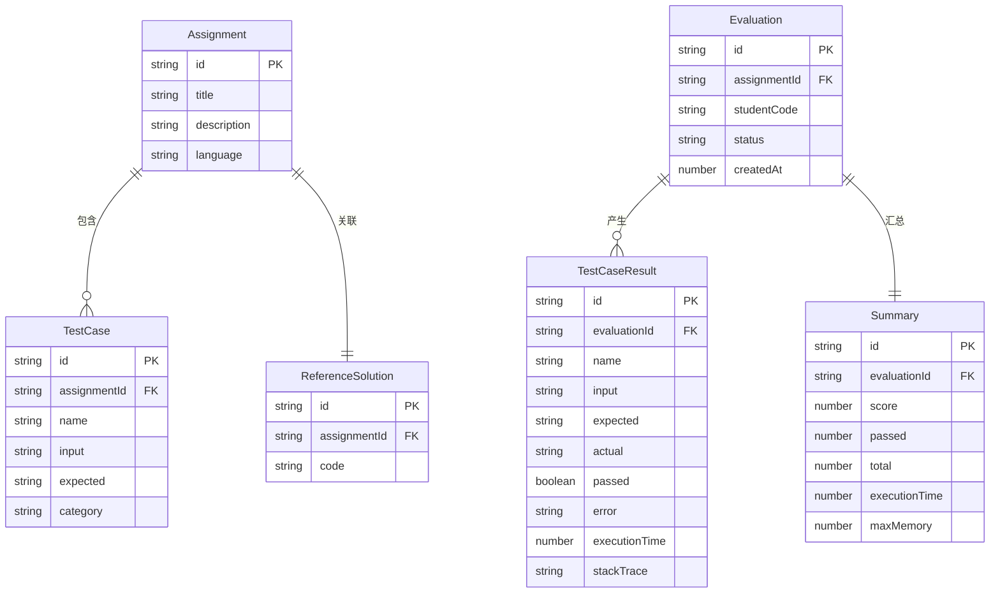

## 1. 架构设计



## 2. 技术说明

- 前端：React@18 + TypeScript + Vite + Tailwind CSS + Zustand
- 初始化工具：vite-init (react-express-ts模板)
- 后端：Express@4 + ws (WebSocket) + vm (沙箱执行)
- 数据库：无，使用内存对象模拟
- 代码编辑器：CodeMirror 6
- 图表：纯CSS/SVG实现条形图和圆形进度条
- 图标：lucide-react

## 3. 路由定义

| 路由 | 用途 |
|------|------|
| / | 评测主页，包含代码编辑器和评测面板 |

## 4. API定义

### 4.1 RESTful API

```typescript
// POST /api/submit - 提交代码评测
interface SubmitRequest {
  code: string;
  language: "javascript" | "python";
  assignmentId: string;
}

interface SubmitResponse {
  evaluationId: string;
  status: "queued";
}

// GET /api/result/:evaluationId - 获取评测结果
interface EvaluationResult {
  evaluationId: string;
  status: "queued" | "running" | "completed";
  testCases: TestCaseResult[];
  summary: {
    score: number;
    passed: number;
    total: number;
    executionTime: number;
    maxMemory: number;
  };
  diff?: CodeDiff[];
}

interface TestCaseResult {
  name: string;
  input: string;
  expected: string;
  actual: string;
  passed: boolean;
  error?: string;
  executionTime: number;
  stackTrace?: string;
}

interface CodeDiff {
  lineNumber: number;
  type: "added" | "removed" | "modified";
  content: string;
  suggestion?: string;
}
```

### 4.2 WebSocket事件

```typescript
// 客户端 → 服务器
interface WsSubscribe {
  type: "subscribe";
  evaluationId: string;
}

// 服务器 → 客户端
interface WsStatusUpdate {
  type: "status";
  evaluationId: string;
  status: "queued" | "running" | "completed";
}

interface WsTestCaseResult {
  type: "testResult";
  evaluationId: string;
  testCase: TestCaseResult;
  index: number;
}

interface WsSummary {
  type: "summary";
  evaluationId: string;
  summary: EvaluationResult["summary"];
  diff?: CodeDiff[];
}
```

## 5. 服务器架构图



## 6. 数据模型

### 6.1 数据模型定义



### 6.2 预置测试用例数据

内存中预置一个编程作业（例如：实现一个阶乘函数），包含6-8个测试用例：
- 基本功能：factorial(5) = 120
- 边界值：factorial(0) = 1, factorial(1) = 1
- 大数：factorial(10) = 3628800
- 异常：factorial(-1) 应抛出错误
- 类型检查：factorial("abc") 应抛出类型错误
- 浮点数：factorial(5.5) 应抛出错误或取整
