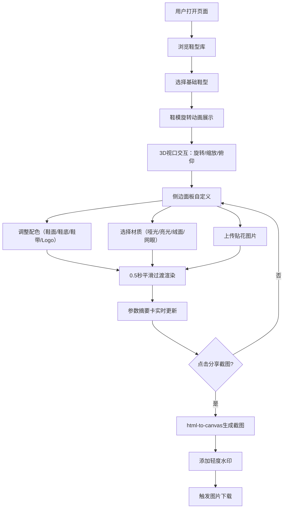

## 1. 产品概述

交互式3D运动鞋配置器——让用户在浏览器中实时自定义运动鞋外观（配色、材质、贴花），通过Three.js渲染3D鞋模并生成带水印的分享截图。面向运动鞋爱好者、设计师和电商用户，提供沉浸式产品定制体验。

## 2. 核心功能

### 2.1 用户角色

| 角色 | 注册方式 | 核心权限 |
|------|----------|----------|
| 访客用户 | 无需注册 | 浏览鞋型、自定义配色/材质/贴花、生成分享截图 |

### 2.2 功能模块

1. **3D鞋模展示页**：鞋型选择、3D渲染与交互、自定义控制面板、参数摘要与截图

### 2.3 页面详情

| 页面名称 | 模块名称 | 功能描述 |
|----------|----------|----------|
| 3D配置器 | 鞋型选择器 | 从3款预设鞋型中选择基础鞋模，选中后以平滑旋转动画展示 |
| 3D配置器 | 3D视口 | Three.js渲染鞋模，支持鼠标拖拽旋转/缩放/俯仰，60fps流畅帧率 |
| 3D配置器 | 侧边控制面板 | 颜色选择器（鞋面/鞋底/鞋带/Logo四区域）、材质下拉（哑光/亮光/绒面/网眼）、贴花上传 |
| 3D配置器 | 参数摘要卡片 | 右下角固定显示当前配色与材质组合，背景色跟随主配色，分享截图按钮 |
| 3D配置器 | 截图功能 | html-to-canvas截取3D视图+参数卡为图片，含轻度水印，触发下载 |

## 3. 核心流程

用户打开页面 → 浏览3款鞋型并选择 → 鞋模以旋转动画展示 → 通过侧边面板调整配色/材质/贴花 → 每次调整0.5秒平滑过渡 → 右下角参数卡实时同步 → 点击分享截图生成带水印图片下载

## 4. 用户界面设计

### 4.1 设计风格

- **主色调**：深灰蓝 #1a1d2e，霓虹蓝 #00d4ff 作为强调色
- **风格**：深色磨砂玻璃主题（Frosted Glass / Glassmorphism）
- **毛玻璃效果**：backdrop-filter: blur 应用于控制面板和参数卡片
- **按钮样式**：圆角按钮，悬停时霓虹蓝描边发光动画
- **字体**：Orbitron（科技感展示字体）+ Exo 2（清晰UI字体）
- **布局**：桌面端左侧3D视口+右侧控制面板，移动端控制面板折叠为底部抽屉
- **动画**：所有交互反馈0.3秒缓动过渡，底部抽屉弹性滑动动画

### 4.2 页面设计概览

| 页面名称 | 模块名称 | UI元素 |
|----------|----------|--------|
| 3D配置器 | 鞋型选择器 | 顶部3个鞋型卡片，选中高亮+霓虹蓝边框，悬停放大 |
| 3D配置器 | 3D视口 | 全屏3D Canvas，占据主区域，金属折射光晕后处理 |
| 3D配置器 | 侧边控制面板 | 毛玻璃半透明背景，4组颜色选择器+材质下拉+贴花上传区 |
| 3D配置器 | 参数摘要卡 | 右下角固定定位，背景色随主配色变化，显示当前所有配置 |
| 3D配置器 | 分享截图按钮 | 参数卡内，霓虹蓝渐变按钮，点击触发截图+下载 |

### 4.3 响应式设计

- **桌面端（≥1024px）**：自适应居中布局，3D视口+侧边面板并排
- **平板端（768px~1023px）**：3D视口全宽，控制面板叠层
- **移动端（<768px）**：3D视口全屏，控制面板折叠为底部抽屉，抽屉拉出带弹性滑动动画

### 4.4 3D场景指导

- **环境/氛围**：深色场景，环境光偏冷蓝，聚光灯营造高光
- **灯光设置**：1个环境光（AmbientLight）+ 2个聚光灯（SpotLight），主光从右上方投射，辅光从左下方补光
- **相机设置**：PerspectiveCamera，FOV 45°，初始距离5，目标点(0,0,0)
- **交互**：OrbitControls实现旋转/缩放/俯仰，自动旋转展示
- **后处理**：微弱金属折射光晕效果
- **性能**：目标60fps，几何体面数控制在合理范围
- **资产来源**：程序化生成鞋型几何体（BoxGeometry/CylinderGeometry组合），无需外部模型文件
