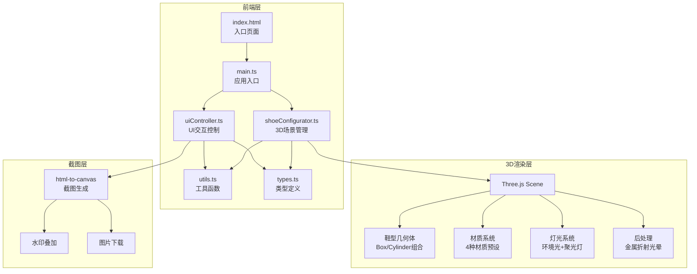

## 1. 架构设计



## 2. 技术说明

- **前端**：原生 TypeScript + HTML/CSS（不使用React/Vue框架）
- **3D渲染**：Three.js（通过npm依赖引入，由Vite打包）
- **截图**：html-to-canvas
- **构建工具**：Vite + TypeScript插件
- **无后端**：纯前端项目，所有逻辑在浏览器端完成

## 3. 文件结构

| 文件路径 | 职责 |
|----------|------|
| package.json | 依赖：three、@types/three、typescript、vite、html-to-canvas；脚本：npm run dev |
| index.html | 入口页面，3D容器与UI元素 |
| vite.config.js | Vite基础配置，启用TypeScript插件和ES模块 |
| tsconfig.json | 严格模式，target ES2020，module ESNext |
| src/main.ts | 应用入口，实例化shoeConfigurator和uiController，挂载场景到DOM |
| src/shoeConfigurator.ts | 核心3D场景：Three.js场景/相机/灯光/轨道控制；3款鞋型程序化建模；updateColor/updateTexture/updateMaterial方法；截图功能 |
| src/uiController.ts | 控制面板：颜色选择器/材质下拉/贴花上传监听；参数摘要卡片；截图按钮；移动端抽屉 |
| src/utils.ts | 工具函数：颜色转换、材质预设定义、贴花纹理辅助 |
| src/types.ts | 类型定义：ShoeConfig、ShoeModel接口 |

## 4. 核心模块API

### shoeConfigurator.ts

```typescript
class ShoeConfigurator {
  constructor(container: HTMLElement)
  updateColor(partName: string, color: string): void
  updateTexture(partName: string, texture: HTMLImageElement): void
  updateMaterial(partName: string, type: MaterialType): void
  switchShoeModel(modelId: number): void
  captureScreenshot(): Promise<void>
  dispose(): void
}
```

### uiController.ts

```typescript
class UIController {
  constructor(configurator: ShoeConfigurator)
  init(): void
  updateSummaryCard(config: ShoeConfig): void
  dispose(): void
}
```

### types.ts

```typescript
type MaterialType = 'matte' | 'glossy' | 'suede' | 'mesh'

interface ShoeConfig {
  upperColor: string
  soleColor: string
  laceColor: string
  logoColor: string
  upperMaterial: MaterialType
  soleMaterial: MaterialType
  laceMaterial: MaterialType
  logoMaterial: MaterialType
  decalImage: string | null
  shoeModel: number
}

interface ShoeModel {
  id: number
  name: string
  buildGeometry: () => THREE.Group
  defaultConfig: Partial<ShoeConfig>
}
```

### utils.ts

```typescript
function hexToThreeColor(hex: string): THREE.Color
function getMaterialPreset(type: MaterialType): THREE.MeshPhysicalMaterialParameters
function createDecalTexture(image: HTMLImageElement): THREE.Texture
function lerpColor(a: THREE.Color, b: THREE.Color, t: number): THREE.Color
```

## 5. 鞋型程序化建模方案

三款鞋型均使用BoxGeometry和CylinderGeometry组合构建：

1. **跑鞋型（Runner）**：流线型轮廓，修长鞋身，弧形鞋底
2. **篮球鞋型（High-Top）**：高帮轮廓，宽大鞋底，厚实鞋身
3. **滑板鞋型（Skate）**：低帮扁平轮廓，宽平底鞋底

每个鞋型由以下部件组构成：
- **鞋面（upper）**：主体BoxGeometry变形
- **鞋底（sole）**：CylinderGeometry/BoxGeometry组合
- **鞋带（lace）**：细长BoxGeometry
- **Logo区域（logo）**：平面BoxGeometry贴附于鞋面

## 6. 材质预设定义

| 材质类型 | Three.js参数 |
|----------|-------------|
| 哑光（matte） | roughness: 0.9, metalness: 0.0, clearcoat: 0 |
| 亮光（glossy） | roughness: 0.1, metalness: 0.3, clearcoat: 1.0, clearcoatRoughness: 0.1 |
| 绒面（suede） | roughness: 1.0, metalness: 0.0, clearcoat: 0, sheen: 1.0, sheenRoughness: 0.8 |
| 网眼（mesh） | roughness: 0.7, metalness: 0.1, clearcoat: 0.2, transmission: 0.1 |

## 7. 性能目标

- 3D场景渲染：60fps（主流浏览器Chrome/Firefox/Edge）
- 外观切换过渡：0.5秒平滑动画
- 交互反馈延迟：0.3秒缓动
- 截图生成时间：< 1秒
