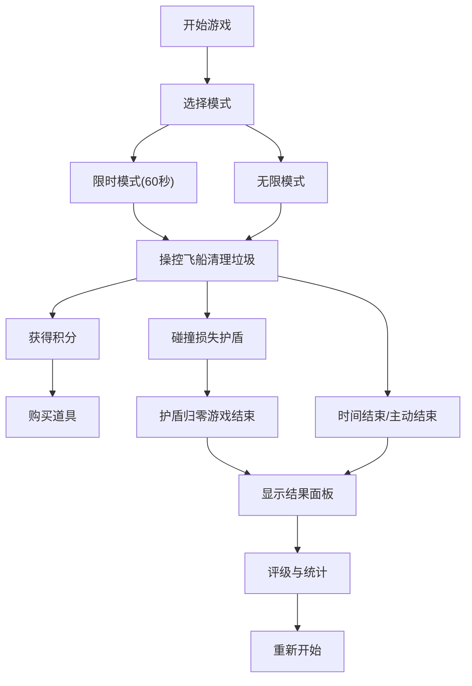

## 1. 产品概述

本产品是一款太空垃圾清理策略游戏，通过互动式体验让玩家直观了解太空碎片问题并实践清理策略。玩家操控回收飞船在2D星图上清除太空垃圾，体验轨道博弈与资源管理的乐趣。

- **解决问题**：当前太空碎片日益增多，但公共教育中缺少直观互动式清理策略体验
- **目标用户**：对太空探索、环境保护感兴趣的玩家，以及需要科普教育工具的机构
- **市场价值**：寓教于乐，通过游戏化方式提升公众对太空环境问题的认知

## 2. 核心特性

### 2.1 功能模块

1. **主游戏场景**：2D星图、飞船控制、激光射击、垃圾生成与运动
2. **游戏模式**：限时模式（60秒倒计时）、无限模式（垃圾持续生成）
3. **道具系统**：护盾回复、引力波、时间减缓三种道具
4. **碰撞与护盾**：垃圾碰撞检测、护盾值管理、自动恢复机制
5. **轨道群系统**：垃圾连成轨道群、整群清除奖励、连锁爆炸特效
6. **结果评级**：游戏结束统计、S/A/B/C四级评级系统
7. **UI界面**：右侧信息面板、底部道具栏、结果弹窗

### 2.2 页面详情

| 页面名称 | 模块名称 | 功能描述 |
|-----------|-------------|---------------------|
| 游戏主页面 | 2D星图渲染 | 深空背景、星光粒子层、垃圾与飞船绘制 |
| 游戏主页面 | 飞船控制 | WASD键盘移动、鼠标左键射击 |
| 游戏主页面 | 垃圾系统 | 50块随机生成、漂移运动、高风险垃圾标识 |
| 游戏主页面 | 道具系统 | 积分购买、Q/W/E快捷键、视觉效果 |
| 游戏主页面 | 信息面板 | 模式显示、倒计时、护盾进度条、积分显示 |
| 游戏主页面 | 结果弹窗 | 总分、清理数量、碰撞次数、评级展示 |

## 3. 核心流程

玩家进入游戏后，选择游戏模式（限时/无限），操控飞船清理太空垃圾获得积分，使用积分购买道具增强能力，避免与垃圾碰撞损失护盾。限时模式下需在60秒内清除80%以上垃圾且碰撞少于3次才能通关。

## 4. 用户界面设计

### 4.1 设计风格

- **主色调**：深空蓝 #0a0e27（背景）、青色 #00e5ff（飞船）、黄色 #ffff00（激光）
- **辅助色**：红色 #ff1744（警告/高风险）、绿色 #00ff00（护盾满）、灰色 #888888-#aaaaaa（垃圾）
- **字体**：等宽字体，增强科技感
- **视觉风格**：磨砂玻璃面板、霓虹渐变按钮、粒子特效
- **按钮风格**：霓虹红到深红渐变，悬停时外发光
- **面板风格**：背景半透明 #ffffff20，圆角8px，磨砂玻璃效果

### 4.2 页面设计概览

| 页面名称 | 模块名称 | UI 元素 |
|-----------|-------------|-------------|
| 游戏主页面 | 2D星图 | 深空背景、漂移星光粒子、多边形垃圾、三角形飞船 |
| 游戏主页面 | 右侧信息面板 | 磨砂玻璃风格、模式文字、倒计时、护盾进度条、积分、快捷键提示 |
| 游戏主页面 | 底部道具栏 | 半透明圆形图标、悬停放大、点击闪烁效果、文字提示 |
| 游戏主页面 | 结果弹窗 | 背景模糊、统计数据、评级展示、霓虹渐变按钮 |

### 4.3 响应式设计

- **桌面优先**：最小支持分辨率1024x768
- **自适应布局**：Canvas全屏，信息面板右侧固定，道具栏底部居中
- **缩放处理**：游戏内容按比例缩放，保持显示完整

### 4.4 动画效果

- **星光粒子**：200个白点，透明度0.2-0.8循环，周期4-8秒
- **垃圾清理**：旋转加速（0.5秒0→360°/s）→ 缩小消失（0.3秒）
- **护盾回复**：绿色半透明圆环从中心向外膨胀消失（0.5秒）
- **引力波**：垃圾向中心加速移动并消失（3秒）
- **时间减缓**：全局速度降至0.3倍（5秒）
- **连锁爆炸**：橘色碎片飞散（0.8秒）
- **道具激活**：图标缩小闪烁（0.15秒）
- **警告闪烁**：护盾过低或倒计时最后10秒红色闪烁

## 5. 性能要求

- **稳定帧率**：主循环60FPS
- **特效帧率**：清理动画和粒子效果不低于55FPS
- **并发处理**：同时处理50块垃圾、200个星光粒子、激光和特效
