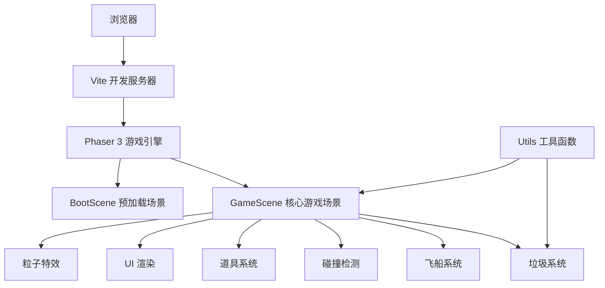

## 1. 架构设计



## 2. 技术描述

- **前端框架**：Phaser 3.80.1（纯Canvas 2D渲染）
- **开发语言**：TypeScript 5.x（严格模式）
- **构建工具**：Vite 5.x
- **物理引擎**：Arcade Physics（Phaser内置）
- **无额外UI框架**：所有UI元素通过Phaser Graphics和Text API直接绘制

### 项目依赖

```json
{
  "dependencies": {
    "phaser": "^3.80.1"
  },
  "devDependencies": {
    "typescript": "^5.4.0",
    "vite": "^5.2.0"
  }
}
```

## 3. 文件结构

| 文件路径 | 说明 |
|---------|------|
| `package.json` | 项目依赖配置，启动脚本 `npm run dev` |
| `vite.config.js` | Vite构建配置，启用TypeScript |
| `tsconfig.json` | TypeScript严格模式配置，ESNext模块 |
| `index.html` | 入口页面，全屏Canvas，深空背景 |
| `src/main.ts` | 游戏入口，初始化Phaser Game实例，加载场景 |
| `src/scenes/BootScene.ts` | 预加载场景，生成星空纹理，切换到GameScene |
| `src/scenes/GameScene.ts` | 核心游戏场景，所有游戏逻辑和UI |
| `src/utils/Utils.ts` | 工具函数，垃圾形状生成、碰撞计算等 |

## 4. 核心数据模型

### 4.1 垃圾对象 (Debris)

| 属性 | 类型 | 说明 |
|-----|------|------|
| `x` | number | X坐标 |
| `y` | number | Y坐标 |
| `vx` | number | X方向速度 |
| `vy` | number | Y方向速度 |
| `size` | number | 大小（6-18像素） |
| `rotation` | number | 当前旋转角度 |
| `rotationSpeed` | number | 旋转速度 |
| `isHighRisk` | boolean | 是否高风险（红色闪烁） |
| `points` | number | 分值（普通10，高风险20） |
| `isClearing` | boolean | 是否正在清理动画中 |
| `clearPhase` | 'rotating' \| 'shrinking' \| null | 清理阶段 |
| `clearTimer` | number | 清理动画计时器 |
| `scale` | number | 当前缩放比例 |
| `orbitGroup` | string \| null | 所属轨道群ID |
| `polygonPoints` | Phaser.Geom.Point[] | 多边形顶点 |

### 4.2 轨道群对象 (OrbitGroup)

| 属性 | 类型 | 说明 |
|-----|------|------|
| `id` | string | 轨道群ID |
| `centerX` | number | 中心X坐标 |
| `centerY` | number | 中心Y坐标 |
| `radius` | number | 轨道半径（60-100） |
| `angle` | number | 当前角度 |
| `speed` | number | 旋转速度 |
| `debrisIds` | string[] | 成员垃圾ID列表 |
| `ellipseRatio` | number | 椭圆比率 |

### 4.3 游戏状态 (GameState)

| 属性 | 类型 | 说明 |
|-----|------|------|
| `mode` | 'timed' \| 'infinite' | 游戏模式 |
| `score` | number | 当前积分 |
| `shield` | number | 护盾值（0-10） |
| `timeLeft` | number | 剩余时间（限时模式） |
| `collisions` | number | 碰撞次数 |
| `debrisCleared` | number | 已清理垃圾数 |
| `totalDebris` | number | 总垃圾数 |
| `isPaused` | boolean | 是否暂停 |
| `isGameOver` | boolean | 是否游戏结束 |
| `timeScale` | number | 时间缩放（1.0正常，0.3减缓） |
| `slowMotionTimer` | number | 时间减缓剩余时间 |
| `gravityWaveActive` | boolean | 引力波是否激活 |
| `gravityWaveTimer` | number | 引力波剩余时间 |
| `shieldRegenTimer` | number | 护盾恢复计时器 |
| `infiniteSpawnTimer` | number | 无限模式生成计时器 |

## 5. 核心算法

### 5.1 随机多边形生成

```typescript
function generatePolygon(size: number, sides: number = 6): Phaser.Geom.Point[] {
    const points: Phaser.Geom.Point[] = [];
    for (let i = 0; i < sides; i++) {
        const angle = (i / sides) * Math.PI * 2;
        const variance = 0.7 + Math.random() * 0.6;
        const r = size * variance;
        points.push(new Phaser.Geom.Point(
            Math.cos(angle) * r,
            Math.sin(angle) * r
        ));
    }
    return points;
}
```

### 5.2 椭圆轨道坐标计算

```typescript
function getOrbitPosition(
    centerX: number, centerY: number,
    radius: number, angle: number,
    ellipseRatio: number = 0.7
): { x: number; y: number } {
    return {
        x: centerX + Math.cos(angle) * radius,
        y: centerY + Math.sin(angle) * radius * ellipseRatio
    };
}
```

### 5.3 整群清除检测

```typescript
function checkOrbitGroupClear(
    group: OrbitGroup,
    debrisMap: Map<string, Debris>
): boolean {
    return group.debrisIds.every(id => {
        const debris = debrisMap.get(id);
        return debris && debris.isClearing;
    });
}
```

### 5.4 碰撞检测

使用Phaser Arcade Physics的圆形碰撞检测，垃圾半径为其大小的一半，飞船碰撞半径为15像素。

### 5.5 评级计算

| 评级 | 条件 |
|-----|------|
| S级 | 清理率 > 90% 且 碰撞 = 0 |
| A级 | 清理率 > 80% 且 碰撞 < 2 |
| B级 | 清理率 > 60% 且 碰撞 < 5 |
| C级 | 其他情况 |

## 6. 性能优化

1. **对象池**：垃圾对象重用，避免频繁创建销毁
2. **粒子系统**：使用Phaser内置粒子管理器，限制最大粒子数
3. **渲染优化**：
   - 静态星空背景预渲染为纹理
   - UI元素分层渲染
   - 离屏对象暂停更新
4. **碰撞优化**：
   - 使用空间分区减少碰撞检测次数
   - 清理动画中的垃圾跳过碰撞检测
5. **帧率控制**：固定时间步长更新，插值渲染
