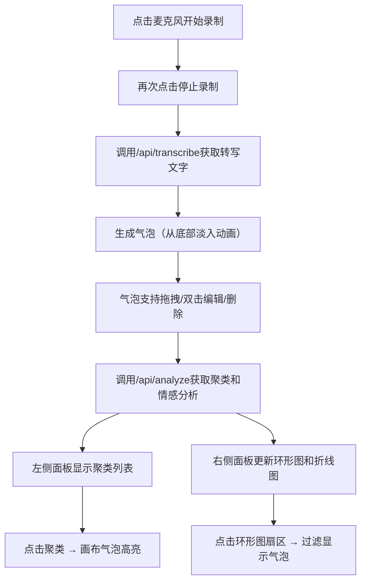

## 1. 产品概述
创意团队头脑风暴可视化看板，解决远程会议中创意难以被捕捉和结构化的痛点。通过语音/文字实时转写、思维气泡可视化、自动主题聚类和情感分析，帮助团队高效记录和整理创意。

- 核心功能：语音转文字气泡、气泡拖拽编辑、自动主题聚类、情感分析、实时统计图表
- 目标用户：创意团队、产品团队、远程协作团队
- 核心价值：将零散创意实时结构化，提升头脑风暴效率

## 2. 核心功能

### 2.1 功能模块
1. **主画布区域**：思维气泡展示、拖拽交互、编辑删除
2. **语音输入模块**：麦克风录制、实时转文字、气泡生成动画
3. **聚类面板（左侧）**：主题聚类列表、颜色编码、高亮筛选
4. **统计面板（右侧）**：聚类占比环形图、情感趋势折线图
5. **后端API服务**：语音转写模拟、聚类分析、情感分析接口

### 2.2 页面详情
| 页面名称 | 模块名称 | 功能描述 |
|---------|---------|---------|
| 主看板页面 | 语音输入按钮 | 麦克风图标，点击开始/停止录制，转写后生成气泡 |
| 主看板页面 | 气泡画布 | 气泡渲染、拖拽移动、双击编辑、删除动画 |
| 主看板页面 | 左侧聚类面板 | 可折叠聚类列表，点击高亮对应气泡，显示情感分值 |
| 主看板页面 | 右侧统计面板 | Canvas绘制环形图（聚类占比）和折线图（情感趋势） |

## 3. 核心流程

### 3.1 用户主流程
用户点击麦克风按钮开始语音录制 → 再次点击停止录制 → 调用转写API获取文字 → 气泡从底部淡入出现 → 气泡可拖拽/编辑/删除 → 系统自动调用分析API进行聚类和情感分析 → 左侧面板显示聚类结果 → 右侧面板实时更新统计图表 → 点击聚类高亮对应气泡 → 点击图表扇区过滤显示

## 4. 用户界面设计

### 4.1 设计风格
- 整体风格：深色科技风，专业简洁
- 主色调：背景#1e1e1e，面板分割线#333
- 聚类颜色：科技#4caf50、设计#ff9800、商业#2196f3
- 高亮色：编辑边框#2196f3，情感绿色正向、红色负向
- 气泡样式：半透明#ffffff88背景，圆角12px，宽高自适应
- 字体：现代无衬线字体，清晰可读
- 按钮交互：悬停缩放1.05倍+颜色加深，点击缩放0.95倍

### 4.2 页面设计概述
| 页面名称 | 模块名称 | UI元素 |
|---------|---------|---------|
| 主看板页面 | 布局 | 三栏布局：左220px + 中80% + 右220px，1px分割线 |
| 主看板页面 | 语音按钮 | 底部中央麦克风图标，录音状态有脉动动画 |
| 主看板页面 | 气泡 | 半透明白底，圆角12px，时间戳+来源标签，情感值显示 |
| 主看板页面 | 左侧面板 | 可折叠聚类色块列表，颜色编码标识 |
| 主看板页面 | 右侧面板 | Canvas图表，环形图可点击过滤 |

### 4.3 动画效果
- 气泡出现：0.3秒从底部向上淡入
- 气泡编辑：边框高亮蓝色，保存时0.2秒弹簧弹跳
- 气泡删除：0.3秒缩放缩小+渐隐
- 聚类高亮：0.5秒发光描边循环
- 按钮交互：悬停0.2秒缩放1.05倍，点击瞬间0.95倍

### 4.4 响应式设计
- 桌面端（>768px）：三栏固定布局
- 移动端（≤768px）：面板折叠为顶部底部布局，画布自适应
- 触控优化：增大按钮触控区域，支持触摸拖拽

### 4.5 性能要求
- 最多200个气泡时，拖拽/编辑帧率≥55fps
- 使用requestAnimationFrame驱动动画
- Canvas绘制图表，无第三方图表库
