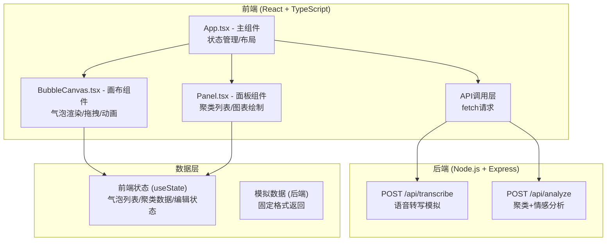

## 1. 架构设计



## 2. 技术描述

- **前端框架**: React@18 + TypeScript@5
- **构建工具**: Vite@5 + @vitejs/plugin-react
- **状态管理**: React useState/useRef (无需额外状态管理库)
- **后端框架**: Express@4 + cors
- **辅助工具**: uuid (生成唯一ID), concurrently (并行启动前后端)
- **图表绘制**: 原生Canvas API (无第三方图表库)
- **动画引擎**: requestAnimationFrame + CSS transitions

## 3. 数据类型定义

```typescript
// 气泡数据结构
interface Bubble {
  id: string;
  content: string;
  source: 'voice' | 'text';
  timestamp: number;
  x: number;
  y: number;
  cluster?: string;
  sentiment?: number;
  isEditing?: boolean;
  isDeleting?: boolean;
  isBouncing?: boolean;
  createdAt: number;
}

// 聚类数据结构
interface Cluster {
  name: string;
  color: string;
  count: number;
  bubbleIds: string[];
}

// 情感趋势点
interface SentimentPoint {
  time: number;
  value: number;
}

// API响应 - 转写
interface TranscribeResponse {
  text: string;
  confidence: number;
}

// API响应 - 分析
interface AnalyzeResponse {
  clusters: Cluster[];
  sentiments: { [bubbleId: string]: number };
}
```

## 4. API 定义

### 4.1 POST /api/transcribe
**功能**: 模拟语音转文字接口
- 请求: `FormData` 包含 `audio` blob字段
- 响应: `{ text: string, confidence: number }`
- 延迟: 模拟200ms

### 4.2 POST /api/analyze
**功能**: 聚类分析和情感分析接口
- 请求: `{ bubbles: Bubble[] }`
- 响应: 
  ```typescript
  {
    clusters: Array<{
      name: string;
      color: string;
      count: number;
      bubbleIds: string[];
    }>;
    sentiments: { [bubbleId: string]: number };
  }
  ```
- 延迟: 模拟200ms

## 5. 核心组件结构

### 5.1 App.tsx (主组件)
- **职责**: 布局管理、全局状态、API调用协调
- **状态**:
  - `bubbles: Bubble[]` - 气泡列表
  - `clusters: Cluster[]` - 聚类结果
  - `sentimentHistory: SentimentPoint[]` - 情感历史
  - `highlightedCluster: string | null` - 高亮聚类
  - `filteredCluster: string | null` - 过滤聚类
  - `isRecording: boolean` - 录音状态
- **核心方法**:
  - `startRecording()` / `stopRecording()` - 录音控制
  - `addBubble(content, source)` - 添加气泡
  - `updateBubble(id, updates)` - 更新气泡
  - `deleteBubble(id)` - 删除气泡
  - `analyzeBubbles()` - 调用分析API

### 5.2 BubbleCanvas.tsx (画布组件)
- **职责**: 气泡渲染、拖拽交互、动画帧更新
- **核心能力**:
  - requestAnimationFrame 动画循环
  - 气泡拖拽 (mousedown/touchstart → mousemove → mouseup)
  - 双击编辑 (contenteditable或input)
  - 删除动画控制
  - 高亮/过滤状态渲染
  - 气泡出现动画控制

### 5.3 Panel.tsx (面板组件)
- **职责**: 左侧聚类列表 + 右侧统计图表
- **左侧面板**:
  - 可折叠聚类列表
  - 颜色编码显示
  - 点击高亮交互
- **右侧面板**:
  - Canvas环形图 (聚类占比)
  - Canvas折线图 (情感趋势)
  - 点击扇区过滤气泡

## 6. 性能优化策略

### 6.1 渲染优化
- 使用 `React.memo` 包装气泡组件
- 拖拽时使用 `transform` 而非 `top/left`
- 批量状态更新避免重复渲染

### 6.2 动画优化
- 所有动画使用 CSS transforms + opacity (GPU加速)
- requestAnimationFrame 统一调度动画帧
- 200气泡时保持55fps+

### 6.3 Canvas优化
- 图表按需重绘 (数据变化时)
- 离屏Canvas预绘制静态元素
- 合理使用 `requestAnimationFrame` 而非定时器

## 7. 项目文件结构

```
root/
├── package.json
├── index.html
├── tsconfig.json
├── vite.config.js
├── client/
│   └── src/
│       ├── App.tsx
│       └── components/
│           ├── BubbleCanvas.tsx
│           └── Panel.tsx
└── server/
    └── index.js
```

## 8. 构建与启动

- **开发命令**: `npm run dev` - 同时启动前端(vite@5173)和后端(express@3001)
- **前端单独启动**: `npm run client`
- **后端单独启动**: `npm run server`
- **代理配置**: Vite代理 `/api` 请求到 `http://localhost:3001`
