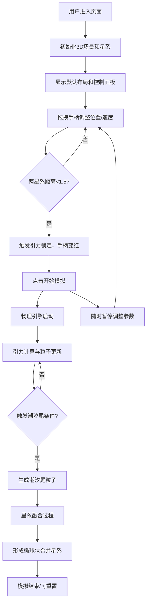

## 1. 产品概述

基于Web的交互式星系碰撞模拟器，让用户在浏览器中通过拖拽两个螺旋星系，实时观察引力扭曲、恒星抛射和潮汐尾形成的物理过程。

- **主要目的**：提供一个直观、可视化的天体物理碰撞模拟工具，让用户能够交互式地探索星系碰撞的动力学过程
- **目标用户**：天文爱好者、物理学生、教育工作者、对宇宙现象感兴趣的普通用户
- **市场价值**：将复杂的天体物理过程转化为可交互的可视化体验，具有教育和科普价值

## 2. 核心功能

### 2.1 功能模块

1. **主模拟场景**：Three.js渲染的3D星系碰撞场景，包含两个螺旋星系
2. **控制面板**：右侧参数调节面板，支持实时调整物理参数
3. **交互手柄**：两个可拖拽的控制手柄，用于设置星系初始位置和速度
4. **模拟引擎**：基于牛顿引力公式的N体物理模拟引擎
5. **可视化效果**：粒子系统、潮汐尾、轨迹线、核球等视觉效果

### 2.3 页面详情

| 页面名称 | 模块名称 | 功能描述 |
|-----------|-------------|---------------------|
| 主页面 | 3D场景渲染 | 使用Three.js渲染两个螺旋星系（各5000粒子+500核球粒子），支持OrbitControls视角控制 |
| 主页面 | 控制手柄 | 两个半透明圆环+箭头指示器，可拖拽调整星系位置（-10~10）和速度矢量（0~5） |
| 主页面 | 引力锁定 | 当两星系距离<1.5时触发，手柄变红并发光显示"Lock" |
| 主页面 | 模拟控制 | "开始/暂停模拟"按钮，控制模拟启停 |
| 主页面 | 碰撞效果 | 潮汐尾（约2000粒子）、星系融合、椭球状合并星系 |
| 主页面 | 控制面板 | 星系质量、引力常数G、模拟速度、粒子大小、轨迹开关等参数调节 |
| 主页面 | 状态显示 | 实时显示帧率、模拟时间、粒子总数、碰撞阶段 |

## 3. 核心流程

用户进入页面 → 查看默认星系布局 → 拖拽手柄调整位置和速度 → 观察引力锁定状态 → 点击开始模拟 → 观看碰撞过程（引力扭曲→潮汐尾形成→星系融合）→ 可随时暂停调整参数 → 重置或重新配置

## 4. 用户界面设计

### 4.1 设计风格
- **主色调**：深空背景 #0a0e27，搭配星空闪烁效果
- **强调色**：橙红渐变按钮 #ff6b35 → #f7931e，滑块手柄 #ffaa00
- **粒子配色**：星系中心黄色 #ffdd55 → 边缘蓝色 #4466ff，潮汐尾紫色 #aa66ff88，合并星系 #aa88cc
- **字体**：白色 #ffffff 无衬线字体
- **整体风格**：深空科幻风，半透明玻璃态控制面板，柔和的发光效果

### 4.2 页面设计概述

| 页面名称 | 模块名称 | UI Elements |
|-----------|-------------|-------------|
| 主页面 | 3D场景 | 全屏Canvas，深空背景，闪烁星星，两个彩色螺旋星系，半透明控制手柄 |
| 主页面 | 控制面板 | 右侧固定面板，半透明深色背景 #1a1a2ecc，圆角8px，内边距12px，参数滑块带数值标签 |
| 主页面 | 控制手柄 | 半透明圆环+箭头指示器，淡入动画0.3s ease-out，锁定时红色发光 |
| 主页面 | 按钮 | 渐变色 #ff6b35→#f7931e，圆角6px，hover亮度+20%，外发光 #ff6b3566，过渡0.2s |
| 主页面 | 滑块 | 轨道 #333344，手柄 #ffaa00，0.15s ease-out动画过渡 |

### 4.3 响应式
- 桌面端优先设计
- 控制面板固定在右侧，宽度约280px
- 3D场景自适应窗口大小
- 窗口resize时自动调整渲染器尺寸和相机宽高比

### 4.4 3D场景引导
- **环境**：深空背景 #0a0e27，随机闪烁的背景星星（亮度0.3-1.0，周期2-5秒）
- **光照**：AmbientLight + PointLight（星系中心），粒子自发光
- **相机**：PerspectiveCamera，fov 60，初始位置 (0, 8, 15)，OrbitControls 阻尼0.1
- **粒子系统**：Points + BufferGeometry，圆形渐变发光贴图（程序生成）
- **动画**：星系自转角速度0.02 rad/s，潮汐尾0.5秒渐入渐出，粒子淡出效果
- **性能**：空间哈希网格（网格大小0.5单位）加速邻近检测，粒子数≤12000，目标FPS≥30
