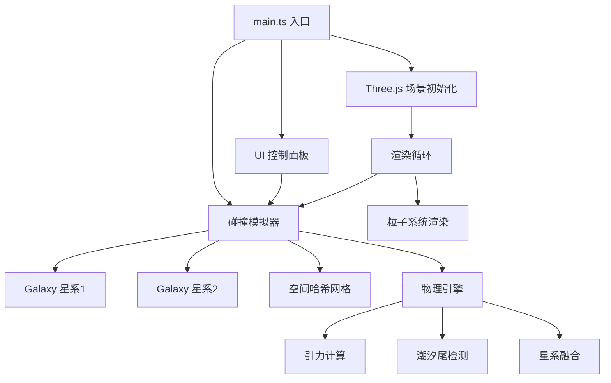

## 1. 架构设计



## 2. 技术描述

- **前端**：TypeScript + Three.js + Vite
- **构建工具**：Vite
- **物理引擎**：自定义N体近似模拟，空间哈希网格优化
- **UI框架**：原生DOM + CSS，不引入额外UI框架
- **3D渲染**：Three.js，Points粒子系统，BufferGeometry

### 依赖包
- `three`: ^0.160.0
- `@types/three`: ^0.160.0
- `typescript`: ^5.3.0
- `vite`: ^5.0.0

## 3. 目录结构

```
.
├── index.html
├── package.json
├── vite.config.js
├── tsconfig.json
└── src/
    ├── main.ts              # 入口文件
    ├── Galaxy.ts            # 星系类
    ├── CollisionSimulator.ts # 碰撞模拟器
    └── UI.ts                # UI控制面板
```

## 4. 核心类定义

### 4.1 Galaxy 类

```typescript
interface GalaxyParams {
  particleCount: number;     // 5000
  coreParticleCount: number; // 500
  radius: number;            // 2.5 (直径5)
  thickness: number;         // 0.4
  armCount: number;          // 2
  pitch: number;             // 1.2
  armDensityRatio: number;   // 3
  angularVelocity: number;   // 0.02 rad/s
  particleSize: number;      // 0.08
  mass: number;              // 太阳质量
}

class Galaxy {
  public position: THREE.Vector3;
  public velocity: THREE.Vector3;
  public mass: number;
  public particles: THREE.Points;
  public coreParticles: THREE.Points;
  public geometry: THREE.BufferGeometry;
  public positions: Float32Array;
  public velocities: Float32Array;
  public colors: Float32Array;
  public trailPositions: Float32Array[]; // 轨迹历史
  
  constructor(params: GalaxyParams);
  public generateParticles(): void;
  public update(delta: number, gravityForce?: THREE.Vector3): void;
  public applyGravity(force: THREE.Vector3, perturbation: number): void;
  public getCenterOfMass(): THREE.Vector3;
  public showTrails(enabled: boolean): void;
  public dispose(): void;
}
```

### 4.2 CollisionSimulator 类

```typescript
interface SimulatorParams {
  G: number;                  // 引力常数 0.05
  simulationSpeed: number;    // 1.0
  particleSize: number;       // 0.08
  showTrails: boolean;        // false
}

interface SimulatorState {
  particleCount: number;
  fps: number;
  stage: 'idle' | 'approaching' | 'colliding' | 'merging' | 'merged';
  simulationTime: number;
  isLocked: boolean;
}

class CollisionSimulator {
  public galaxy1: Galaxy;
  public galaxy2: Galaxy;
  public tidalTailParticles: THREE.Points[];
  public isRunning: boolean;
  
  constructor(scene: THREE.Scene, params: SimulatorParams);
  public setGalaxy1Position(pos: THREE.Vector3): void;
  public setGalaxy2Position(pos: THREE.Vector3): void;
  public setGalaxy1Velocity(vel: THREE.Vector3): void;
  public setGalaxy2Velocity(vel: THREE.Vector3): void;
  public setGalaxy1Mass(mass: number): void;
  public setGalaxy2Mass(mass: number): void;
  public setG(value: number): void;
  public setSimulationSpeed(speed: number): void;
  public setParticleSize(size: number): void;
  public setShowTrails(enabled: boolean): void;
  public checkLock(): boolean;
  public start(): void;
  public stop(): void;
  public reset(): void;
  public update(delta: number): SimulatorState;
  private computeGravity(): void;
  private buildSpatialHash(): Map<string, number[]>;
  private detectTidalTails(): void;
  private createTidalTailParticle(position: THREE.Vector3, color: THREE.Color): void;
  private checkMergeStage(): void;
  private mergeGalaxies(): void;
}
```

### 4.3 UI 类

```typescript
interface UIParams {
  simulator: CollisionSimulator;
  onStartStop: () => void;
}

class UI {
  private panel: HTMLElement;
  private handle1: HTMLElement;
  private handle2: HTMLElement;
  private arrow1: HTMLElement;
  private arrow2: HTMLElement;
  
  constructor(params: UIParams);
  public createPanel(): void;
  public createHandles(): void;
  public bindEvents(): void;
  public updateState(state: SimulatorState): void;
  public updateHandlePositions(): void;
  public setLockState(locked: boolean): void;
  public setButtonState(running: boolean): void;
  private createSlider(
    label: string, min: number, max: number, 
    step: number, value: number,
    onChange: (v: number) => void
  ): HTMLElement;
  private animateSlider(element: HTMLInputElement, oldValue: number, newValue: number): void;
}
```

## 5. 性能优化策略

### 5.1 空间哈希网格
- 网格大小：0.5单位
- 每帧重建网格，加速邻近粒子检测
- 仅对邻近粒子应用引力扰动

### 5.2 N体近似
- 主引力：星系质心间的牛顿引力 F = G*m1*m2/r²
- 粒子扰动：基于空间哈希的邻近粒子小扰动
- 潮汐尾粒子：单独管理，独立更新

### 5.3 渲染优化
- 粒子数上限：12000（5500×2 + 1000潮汐尾）
- BufferGeometry 批量更新，避免逐粒子操作
- 粒子纹理：程序生成圆形渐变，减少纹理切换
- 像素比限制：Math.min(window.devicePixelRatio, 2)

### 5.4 动画优化
- 轨迹线：环形缓冲区，复用100个历史位置
- 潮汐尾：粒子池复用，避免频繁创建销毁
- 滑块动画：requestAnimationFrame 平滑过渡 0.15s

## 6. 关键算法

### 6.1 对数螺旋生成
```
r(θ) = a * e^(b*θ)
其中 b = pitch / (2π)
```

### 6.2 旋臂粒子密度分布
- 生成粒子时，75%概率放在旋臂区域，25%放在臂间
- 旋臂内角度偏移：`θ ± (0.15 * random)`

### 6.3 颜色映射
- 基于粒子到中心距离 `d`（0~1）
- HSL插值：H从50°(黄)到220°(蓝)，S=0.8，L=0.6

### 6.4 引力锁定检测
- 两星系质心距离 < 1.5 单位时触发

### 6.5 潮汐尾触发条件
- 粒子距离另一星系质心 < 1.2
- 粒子速度大小 > 2
- 标记为潮汐尾粒子，附加尾迹

### 6.6 合并判定
- 模拟时间 > 3秒 且 两星系距离 < 2单位
- 3-5秒内完成融合，颜色混合为 #aa88cc
